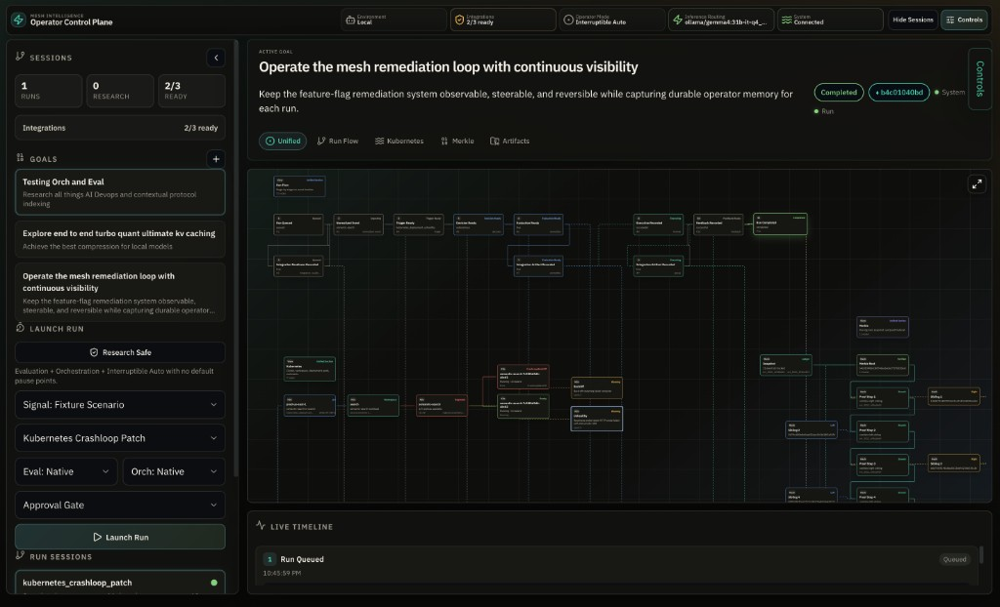

# Mesh Intelligence

`mesh-intelligence` is a **local, policy-guided operator control plane** for **bounded** closed-loop remediation. It ingests infrastructure signals, decides on a remediation path, evaluates the decision against policy and quality gates, pauses for **operator steering** before actuation by default, executes through a bounded orchestration layer, records feedback, persists run memory into an Obsidian-compatible vault, and exposes continuous Merkle roots and proofs for the run log.

## Positioning and scope

**What Mesh is:** a remediation **orchestration and safety layer** between **signals** (fixtures, custom JSON, live Kubernetes harvest) and **bounded actions** (feature flags, incidents, Kubernetes rollouts). It makes runs **structured, steerable, and auditable**: explicit stages, evaluation gates, steering commands, and (for supported paths) Merkle-backed event history.

**What Mesh is not:** a replacement for observability/monitoring, ITSM, or your general-purpose automation engine (Ansible, Terraform, etc.) taken as a whole. It does not replace **detection**; it structures **decision → evaluation → execution → feedback** for remediation-shaped workloads you drive through this control plane.

**External messaging:** Prefer **policy-guided**, **bounded**, and **intent-driven** remediation. Avoid hype terms such as **“self-healing”** or generic **“AI-powered”**; Mesh runs are **operator-steerable** and **evaluation-gated** unless you explicitly choose interruptible auto mode.

## Kubernetes rollback scope (live execution)

When `MESH_KUBERNETES_LIVE_EXECUTION_ENABLED` is set and allowlists permit the target, **`rollback_deployment`** maps to **`kubectl rollout undo`** for the Deployment (previous revision). That **only** moves the Deployment’s rollout back; it does **not** by itself restore full arbitrary application state beyond what the workload’s images and ReplicaSet history imply. **`restart_deployment`** maps to **`kubectl rollout restart`**. Both are additionally constrained by **`MESH_KUBERNETES_ALLOWED_CONTEXTS`** and **`MESH_KUBERNETES_ALLOWED_NAMESPACES`**.

## Rubric (repository-aligned, publicly defensible)

These are the dimensions this codebase is built to support; they match a disciplined launch narrative without unverifiable “#1” claims:

| Dimension | Mesh behavior |
|-----------|----------------|
| Execution safety | Approval gate by default; optional interruptible auto; Kubernetes live execution off by default; allowlists when live |
| Policy / evaluation | Dedicated evaluation stage; native or Promptfoo evaluation; overrides re-enter evaluation before execution |
| Operator control | Steering surface (approve, cancel, override decision/parameters, pause, notes) |
| Auditability | Merkle roots and per-event proofs; vault mirroring of run memory |

---

## Tldr
Ingress: client starts run via POST /api/runs using signal_payload or scenario_key.
Ingest stage: IngestService.normalize_signal(...) creates normalized event envelope.
Trigger stage: TriggerService.detect(...) decides if signal is actionable.
no trigger -> run ends no_trigger/completed
Decision stage: DecisionService.decide(...) picks bounded action (no_action, reduce_rollout, disable_flag, escalate, etc.).
Evaluation stage: EvaluationService.evaluate(...) applies policy/business/quality checks (Promptfoo when enabled).
Operator gate: enters awaiting_operator if required by steering mode/pause points.
Execution stage: OrchestratorService.execute(...) calls native path or Goose bridge/adapter.
Feedback stage: FeedbackService.record(...) writes outcome signals (10m/30m observations, recurrence/guardrails).
Persistence/streaming: each stage emits typed events, persisted + streamed over SSE, mirrored to vault, Merkle updated.
---

The system now ships with two operator surfaces:

- Browser-first control plane served by `run_server.py`
- Curses TUI served by `run_tui.py` for terminal-native inspection

The browser UI is the primary interface.

## What It Does

- Runs the existing feature-flag remediation loop end to end
- Streams stage-by-stage run updates through HTTP + SSE
- Pauses at the approval gate before execution by default
- In `interruptible_auto`, can launch a bounded child retry when the gate fails for recoverable evidence blockers
- Supports bounded steering commands while a run is in progress
- Persists goals, runs, notes, and artifact state in structured runtime storage
- Mirrors that memory into a fixed Obsidian-compatible vault layout
- Computes Merkle roots for canonical run events and returns proofs per event
- Integrates with a local code/process inspection surface for repository context
- Supports two evaluation modes:
  - `native`
  - `promptfoo`
- Supports three orchestration modes:
  - `native`
  - `goose`
  - `hermes`
- Reports proposal-lane readiness for Evo and supports explicit operator-triggered Evo bootstrap/status for bounded repo patch runs.

## Runtime Model

Each run advances through explicit stages:

1. `queued`
2. `ingesting`
3. `trigger_ready` or `no_trigger`
4. `decision_ready`
5. `evaluation_ready`
6. `awaiting_operator`
7. `executing`
8. `feedback_ready`
9. `completed`, `failed`, `cancelled`, or `recovery_spawned`

Steering is bounded. Supported commands are:

- `approve`
- `cancel`
- `pause_after_stage`
- `resume`
- `set_auto_mode`
- `override_decision`
- `override_execution_parameters`
- `attach_note`

Overrides always re-enter evaluation before execution. Approval never bypasses policy validation or rollback constraints.
Recoverable blockers such as low confidence or Promptfoo failures can trigger one or more bounded child retries in `interruptible_auto`. Terminal blockers still stop at human review.

## Runtime Modes

Runs choose one evaluation mode and one orchestration mode.

### Evaluation: `native`

Default local evaluation path. Uses in-process policy and contract validation without external CLIs.

### Evaluation: `promptfoo`

CLI-backed evaluation mode. `setup_integrations.py` resolves this to a bridge command that runs a real Promptfoo eval and returns the Mesh evaluation contract. Readiness is reported explicitly through the API and UI.

### Orchestration: `native`

Default local orchestration path. Uses in-process bounded actuators with the same audit and persistence semantics as the bridged modes.

### Orchestration: `goose`

CLI-backed orchestration mode. `setup_integrations.py` resolves this to a bridge command that runs a real Goose review step before bounded local actuation. Installed Ollama models are not auto-probed; provider inference only selects the OpenAI-compatible route when an endpoint such as `OPENAI_BASE_URL` is configured. Readiness is reported explicitly through the API and UI.

### Orchestration: `hermes`

CLI-backed orchestration mode. `setup_integrations.py` resolves this to a bridge command that runs a real Hermes review step before bounded local actuation. The default image bundles the Hermes CLI, so the control plane can offer Hermes without a Docker socket or separate sidecar.

### Proposal lane: `evo`

Evo is not an orchestration mode. Mesh probes the configured Evo CLI with `--version`, requires the output to identify `evo-hq-cli`, and records an agent-task recommendation for bounded code-remediation runs. Normal run progression does not invoke Evo. A separate operator steering command can launch a bounded Evo bootstrap or status check for eligible repo patch runs.

## Repository Layout

```text
mesh-intelligence/
├── Dockerfile                       # production image (Vite UI + Python server)
├── docker-compose.yml               # persisted state volume + health checks
├── docker-compose.stack.yml         # all-in-one local Mesh + sidecars + k3s + smoke stack
├── .env.example                     # configuration template
├── control_plane_server.py          # local HTTP + SSE server
├── run_server.py                    # browser control-plane entrypoint
├── run_first_slice.py               # synchronous stdin/stdout loop runner
├── run_tui.py                       # terminal UI entrypoint
├── setup_integrations.py            # bootstrap Promptfoo / Goose / Hermes / Evo config
├── swarmclaw/                       # optional Next.js operator stack (separate surface)
├── services/
│   ├── control_plane.py             # long-lived coordinator and steering logic
│   ├── runtime.py                   # shared stage primitives used by pipeline + coordinator
│   ├── pipeline.py                  # synchronous convenience wrapper
│   ├── evaluation/
│   ├── orchestrator/
│   ├── feedback/
│   ├── decision/
│   ├── trigger/
│   └── ingest/
├── shared/mesh_runtime/
│   ├── config.py
│   ├── control_plane_models.py
│   ├── control_plane_state.py
│   ├── integrations.py
│   ├── merkle.py
│   ├── vault.py
│   └── state.py
├── web/                             # React/Vite browser control plane
├── fixtures/
├── policies/
└── tests/
```

## Quick Start

### One-command full stack

Use this path when you want Mesh, the local sidecars, a live Kubernetes cluster, and an automated smoke run in one environment:

```bash
docker compose -f docker-compose.stack.yml up --build
```

This starts Mesh, a dedicated Hermes sidecar, embedded k3s, a bootstrap job that seeds `search/semantic-search`, and `mesh-smoke`, which seeds a CrashLoop and launches a live Mesh recovery run. The control plane is available at `http://127.0.0.1:8787`.

Optional lanes:

```bash
COMPOSE_PROFILES=latentmas MESH_STACK_ENABLE_LATENTMAS=1 docker compose -f docker-compose.stack.yml up --build
MESH_STACK_AGENT_FABRIC_MODE=deepagents OPENAI_API_KEY=... docker compose -f docker-compose.stack.yml up --build
```

Full runbook: [`docs/all-in-one-compose-stack.md`](./docs/all-in-one-compose-stack.md).

Manual local server path:

### 1. Install and verify integrations

```bash
python3 setup_integrations.py
```

Optional install attempt for supported dependencies:

```bash
python3 setup_integrations.py --install-missing
```

This writes integration configuration to:

```text
.mesh-runtime-state/integrations.json
```

The saved commands point at bridge entrypoints inside `mesh-intelligence`, not raw vendor binaries. That keeps the control plane contract stable while still exercising the real Promptfoo, Goose, and Hermes CLIs. Evo is resolved as a proposal-lane CLI only; use `MESH_EVO_COMMAND=evo` for a global `evo-hq-cli` install or `MESH_EVO_COMMAND="uv run --project /workspace/mesh-intelligence/evo/plugins/evo evo"` for the vendored source when `uv` is available.

### 2. Install the browser UI dependencies

```bash
cd web
npm install
npm run build
cd ..
```

### 3. Start the local control plane

```bash
python3 run_server.py
```

Default server address:

```text
http://127.0.0.1:8787
```

### 4. Open the browser

Point the browser at:

```text
http://127.0.0.1:8787
```

### 5. Launch a run

Use the left rail to:

- select or create a goal
- choose a fixture scenario or paste a raw signal JSON payload
- select an evaluation mode: `native` or `promptfoo`
- select an orchestration mode: `native`, `goose`, or `hermes`
- choose `approval_gate` or `interruptible_auto`

## Web Control Plane

The browser UI is a React/Vite application under [`web/`](./web) using:

- a dense operator shell and graph-driven center stage inspired by `mesh-llm`
- server connection, status, and side-panel patterns tuned for the operator workflow

**Unified canvas** (center stage) composes run flow, Kubernetes context, Merkle, and artifacts on one graph; the graph panel has a **fullscreen** control (top-right) for focused inspection. Below: local control plane with the **Unified** tab active (example scenario `kubernetes_crashloop_patch`).



The layout is:

- Left rail
  - goals
  - scenarios
  - integration readiness
  - launch run
  - run queue (Mesh pipeline runs)
  - research sessions (MiniMax / Goose autoresearch artifacts under `.mesh-runtime-state/research/`; not pipeline runs)
- Center
  - active goal
  - live run graph
  - steering console
  - timeline
- Right inspector
  - overview
  - evidence
  - policy
  - execution
  - feedback
  - vault preview
  - Merkle proof
  - code/process context

The active run is preserved in URL state with `?run=<run_id>`.

## HTTP API

Implemented routes:

- `GET /api/health`
- `GET /api/readiness`
- `GET /api/scenarios`
- `GET /api/goals`
- `POST /api/goals`
- `GET /api/runs`
- `POST /api/runs`
- `GET /api/runs/:id`
- `POST /api/runs/:id/steer`
- `GET /api/runs/:id/events`
- `GET /api/runs/:id/merkle`
- `GET /api/runs/:id/merkle/proof/:event_id`
- `GET /api/stream/runs/:id`
- `GET /api/stream/system`
- `GET /api/vault/tree`
- `GET /api/vault/document`
- `GET /api/research-sessions` (filesystem autoresearch sessions; same `state_directory` as the server)
- `GET /api/research-sessions/:session_id` (manifest + `synthesis/final-report.md` when present)
- `GET /api/research-corpus` (aggregate grounding and drift assessment across research sessions)

### Create Goal

```json
{
  "title": "Protect search latency",
  "objective": "Pause every risky remediation before execution.",
  "success_criteria": ["approval gate pauses", "vault notes written"]
}
```

### Create Run

```json
{
  "goal_id": "goal_default",
  "scenario_key": "search_latency_regression",
  "evaluation_mode": "native",
  "orchestration_mode": "native",
  "steering_mode": "approval_gate"
}
```

Raw signal payloads are also supported:

```json
{
  "goal_id": "goal_default",
  "signal_payload": {
    "...": "full signal payload"
  },
  "evaluation_mode": "native",
  "orchestration_mode": "native",
  "steering_mode": "interruptible_auto",
  "pause_points": []
}
```

Live Kubernetes deployment harvesting is also supported:

```json
{
  "goal_id": "goal_default",
  "evaluation_mode": "native",
  "orchestration_mode": "native",
  "steering_mode": "interruptible_auto",
  "live_signal": {
    "source": "kubernetes",
    "deployment_name": "semantic-search",
    "namespace": "search",
    "kube_context": "k3d-mesh-e2e",
    "environment": "local"
  }
}
```

### Steering Command

```json
{
  "command": "override_execution_parameters",
  "parameters": {
    "rollout_pct": 5
  }
}
```

Evo can also be launched explicitly for an eligible repo patch run:

```json
{
  "command": "launch_evo",
  "target_path": "app/search.py",
  "benchmark_command": "python3 benchmark.py --target {target}",
  "instrumentation_mode": "inline",
  "metric": "max",
  "gate_command": "python3 -m unittest discover -s tests"
}
```

`launch_evo` is accepted only when a run is paused at `evaluation_ready` or after completion. It requires `evo.ready`, a `repo_patch_service` decision, explicit repo boundaries, and a clean git worktree before bootstrap.

## Vault Layout

Run and goal memory are mirrored to:

```text
.mesh-runtime-state/vault/
```

Fixed directories:

- `Goals/`
- `Runs/`
- `Decisions/`
- `Evaluations/`
- `Executions/`
- `Feedback/`
- `Evo/`
- `Merkle/`
- `Notes/`

Each run writes:

- a run note linking the goal and stage artifacts
- JSON-backed artifact notes for decision, evaluation, execution, and feedback
- operator notes
- Evo launch notes when present
- a Merkle note containing the current root and event IDs

## Merkle Event Ledger

Every canonical run event is hashed as a leaf. The server recomputes the root whenever a new event is appended. The API exposes:

- current root and event list
- per-event proofs for decision, evaluation, execution, and feedback events

This is intended for run inspection and auditability, not blockchain settlement.

## OpenTelemetry Consumer

Mesh accepts OpenTelemetry signals as a first-class input. Two paths:

**Push (OTLP/HTTP receiver)** — `POST /v1/metrics` accepts OTLP/HTTP JSON metric payloads; each creates a run with signal type `otel_metric_regression`.

```bash
export MESH_OTEL_RECEIVER_ENABLED=1
export MESH_OTEL_RECEIVER_TOKEN=a-strong-bearer-token  # optional
```

Senders can attach an optional `x-mesh-alert-context` JSON header naming the metric that tripped; without it the ingester falls back to heuristics.

**Pull (Prometheus queries)** — Point Mesh at any PromQL endpoint for feedback-stage verification with real metrics instead of stub observations.

```bash
export MESH_PROMETHEUS_URL=http://prometheus:9090
export MESH_FEEDBACK_PROMETHEUS_ENABLED=1
```

## Decision Layers

The decision stage handles OTel metric-regression signals through four composable layers:

| Layer | Coverage | Determinism | Enable |
|-------|----------|-------------|--------|
| 1. Curated action catalog | ~8 actions | Full | Always on |
| 2. Declarative rule matcher | ~70% of signals | Full | `policies/metric-actions.policy.json` |
| 3. LLM fallback (Goose) | +15% long-tail | Non-deterministic | `MESH_LLM_DECISION_FALLBACK_ENABLED=1` |
| 4. Rule learning from overrides | Grows over time | Human-reviewed | `MESH_RULE_LEARNING_ENABLED=1` |

**Layer 2 rules** match on metric-name patterns + OTel attributes and propose bounded actions. See `shared/mesh_runtime/metric_action_rules.py` for the format and `policies/metric-actions.policy.json` for starter rules (queue lag, CPU saturation, memory pressure, traffic spikes).

**Layer 3 LLM fallback** — when no rule matches, Goose proposes an action from a hardcoded allowlist. Outputs are schema-validated and numeric parameters clamped to bounds; LLM timeouts or invalid responses fall through to escalate with a named risk flag.

**Layer 4 rule learning** — every `override_decision` on an OTel signal is recorded against a stable fingerprint. When ≥5 overrides agree on an action with successful outcomes, a candidate rule surfaces at `GET /api/rules/suggestions`. Suggestions never auto-apply; operators review, edit, paste into the policy file.

## Bare-Metal Nodes (Solana, geth/reth, etc.)

Mesh runs the full closed-loop — ingest → trigger → decision → execution → feedback — against bare-metal blockchain nodes, not just Kubernetes workloads. This is how Solana/Agave validators, geth archival nodes, reth, lighthouse, and similar long-running services are typically operated.

### Architecture

```
Solana / geth / reth node (bare metal, systemd-managed)
          │                                       ▲
          │ JSON-RPC (getSlot, eth_syncing, ...)  │
          │ Prometheus scrape                     │ ssh sudo systemctl ...
          ▼                                       │
  ┌────────────────────────┐          ┌──────────────────────┐
  │ BareMetalNodeIngester  │─signal─▶ │ SystemdSshAdapter    │
  │ (SolanaNodeIngester,   │          │  (mock/live gated by │
  │  EthereumNodeIngester) │          │   safety envelope)   │
  └────────────┬───────────┘          └──────────┬───────────┘
               │                                 ▲
               ▼                                 │
         Mesh pipeline: Ingest → Trigger → Decision (4-layer engine)
                                                 │
                                                 └── policies/metric-actions.policy.json
```

### Safety envelope (non-negotiable)

Bare-metal actuation has no Kubernetes safety net. The SSH adapter enforces four overlapping constraints — every real SSH command must pass all four:

1. **Enable flag** — `MESH_SSH_EXECUTION_ENABLED=1`. Mock-by-default. Tests and CI run in mock mode.
2. **Host allowlist** — `MESH_SSH_ALLOWED_HOSTS=vault-prod-07,vault-prod-08`. Empty allowlist rejects every SSH.
3. **Service allowlist** — `MESH_SSH_ALLOWED_SERVICES=solana-validator.service,geth.service`. Prevents restarting `sshd` or `systemd-journald` by mistake.
4. **Command allowlist** — hardcoded in `services/actuators/systemd_ssh.py`. Only `systemctl restart|start|stop|status` + diagnostic reads (`df`, `free`, `uptime`). No arbitrary commands, ever.

### What the adapter does not do

- **No arbitrary shell.** `ssh host bash -c ...` is not available. The remote command is assembled from the command allowlist only.
- **No validator-specific operations.** Identity rotation, vote account changes, snapshot creation are out of scope — they carry data-loss risk and belong in a dedicated follow-up with stronger policy gates.
- **No config file patching.** `systemctl daemon-reload` is not in the allowlist. Configuration changes go through your existing config-management tool.
- **No credential handling.** SSH keys are managed by the host's SSH client; the adapter passes `-i` when `MESH_SSH_IDENTITY_FILE` is set but never reads or logs key material.

### Signal ingest

`services/ingest/bare_metal_node.py` builds Mesh signals from JSON-RPC:

| Node type | Primary metric | Related metrics |
|-----------|----------------|-----------------|
| Solana (Agave) | `solana.slot_lag` — slots behind reference cluster head | `solana.delinquent` (vote account status) |
| geth / reth | `geth.peer_count` (when < min) or `geth.block_lag` | `geth.syncing`, `geth.peer_count`, `geth.block_lag` |

Each signal carries `mesh.node.host` and `mesh.node.service` in `resource_attributes` so the metric-action rule engine can route to the correct SSH target.

### Starter rules

Two bare-metal rules ship in `policies/metric-actions.policy.json`:

| Rule | Fires on | Action | Risk |
|------|----------|--------|------|
| `restart on solana slot lag` | Validator > 128 slots behind | `restart_systemd_service` | medium (approval gate on) |
| `restart on geth peer starvation` | geth/reth peer count below min | `restart_systemd_service` | medium |

Both default to the approval gate — a validator restart during active voting can cost SOL, so a human signs off unless you've explicitly flipped the run to `interruptible_auto` and the operator has reviewed the context.

### Setup

```bash
# 1. Add the operator's SSH key to each bare-metal host's authorized_keys
#    The key must be able to `sudo systemctl restart <service>` without a password prompt
#    (configure via /etc/sudoers.d with NOPASSWD for exactly these commands).

# 2. Populate known_hosts on the Mesh host
ssh-keyscan vault-prod-07 vault-prod-08 >> ~/.ssh/known_hosts

# 3. Configure the safety envelope
export MESH_SSH_EXECUTION_ENABLED=1
export MESH_SSH_IDENTITY_FILE=/etc/mesh/id_ed25519
export MESH_SSH_ALLOWED_HOSTS=vault-prod-07,vault-prod-08
export MESH_SSH_ALLOWED_SERVICES=solana-validator.service,geth.service

# 4. (Optional) Register node targets for the ingester
export MESH_BARE_METAL_NODE_TARGETS='[
  {"name":"vault-prod-07","kind":"solana","rpc_url":"http://127.0.0.1:8899","host":"vault-prod-07","service":"solana-validator.service"},
  {"name":"eth-archival-02","kind":"geth","rpc_url":"http://127.0.0.1:8545","host":"eth-archival-02","service":"geth.service"}
]'
```

### Path to an agent-based alternative

SSH is the right first step because it reuses existing keypair infrastructure. An agent-based adapter (`SystemdAgentAdapter`) could land later without changing the decision or orchestrator layers — the adapter pattern keeps this swap contained.

## TUI

The TUI remains available as a local terminal companion:

```bash
python3 run_tui.py
```

Mode toggles now use:

- evaluation: `native` / `promptfoo`
- orchestration: `native` / `goose` / `hermes`

The TUI is no longer the primary operator interface.

## Environment Variables

Supported configuration variables:

- `MESH_ENVIRONMENT`
- `MESH_EVALUATION_MODE`
- `MESH_ORCHESTRATION_MODE`
- `MESH_STATE_BACKEND` — `file` (default) keeps local `.mesh-runtime-state`; `postgres` stores canonical run state in Postgres.
- `MESH_DATABASE_URL` — Postgres/Supabase connection string used when `MESH_STATE_BACKEND=postgres`.
- `MESH_STATE_DIRECTORY`
- `MESH_RESEARCH_DIRECTORY` — autoresearch import root for `/api/research-sessions` and `/api/research-corpus`; defaults to `<state>/research`.
- `MESH_SERVER_HOST`
- `MESH_SERVER_PORT`
- `MESH_WEB_ASSET_PATH`
- `MESH_VAULT_PATH`
- `MESH_INTEGRATIONS_CONFIG_PATH`
- `MESH_DEFAULT_STEERING_MODE`
- `MESH_DEFAULT_OPERATOR_PAUSE_POINT`
- `MESH_FEATURE_FLAG_CREDENTIALS_AVAILABLE`
- `MESH_INCIDENT_CREDENTIALS_AVAILABLE`
- `MESH_AUDIT_LOGGING_AVAILABLE`
- `MESH_MAX_TRANSIENT_RETRIES`
- `MESH_MAX_RETRY_WINDOW_SECONDS`
- `MESH_GOOSE_TIMEOUT_SECONDS`
- `MESH_PROMPTFOO_COMMAND`
- `MESH_HERMES_COMMAND`
- `MESH_HERMES_COMMAND_TIMEOUT_SECONDS`
- `MESH_GOOSE_COMMAND`
- `MESH_GOOSE_COMMAND_TIMEOUT_SECONDS`
- `MESH_EVO_COMMAND` — optional Evo proposal-lane command; must resolve to `evo-hq-cli`.
- `MESH_EVO_COMMAND_TIMEOUT_SECONDS` — timeout for the Evo `--version` readiness probe.
- `MESH_KUBERNETES_LIVE_EXECUTION_ENABLED` — when `1`/`true`, `kubernetes_service` actions use live `kubectl` execution instead of the default mock adapter.
- `MESH_KUBECTL_COMMAND` — override the `kubectl` command used for live Kubernetes execution.
- `MESH_KUBERNETES_ROLLOUT_TIMEOUT_SECONDS` — timeout for `kubectl rollout status` after restart/rollback actions.
- `MESH_KUBERNETES_ALLOWED_CONTEXTS` — comma-separated allowlist of kube contexts permitted for live execution.
- `MESH_KUBERNETES_ALLOWED_NAMESPACES` — comma-separated allowlist of namespaces permitted for live execution.
- `MESH_MAX_JSON_BODY_BYTES` — max `Content-Length` for JSON `POST` bodies (default `1048576`; use `0` to disable the limit).
- `MESH_SECURITY_HEADERS` — when `true` (default), sends `X-Content-Type-Options` and `Referrer-Policy` on HTTP responses.
- `MESH_ACCESS_LOG` — when `1`/`true`, enables access logging via Python’s logging module (configure handlers as needed for your environment).
- `MESH_STRUCTURED_LOGS` — when `1`/`true`, emits runtime events as JSON lines on stderr.
- `MESH_VAULT_AI_POSTPROCESS_ENABLED` — defaults off; when enabled, Goose may generate vault insights after runs.
- `MESH_BUILD_VERSION` and `MESH_BUILD_COMMIT` — surfaced by `/api/health` for release traceability.
- `MESH_IMAGE_TAG` and `GIT_COMMIT` — back-compat aliases used for `/api/health` when `MESH_BUILD_VERSION` / `MESH_BUILD_COMMIT` are unset.
- `MESH_GOOSE_RUN_TIMEOUT_SECONDS` — optional fixed timeout for each bridge-internal `goose run`; if unset, provider-specific `GOOSE_*_TIMEOUT_SECONDS` values apply.
- `MESH_HERMES_RUN_TIMEOUT_SECONDS` — optional fixed timeout for bridge-internal Hermes chat; defaults to `MESH_HERMES_COMMAND_TIMEOUT_SECONDS`.
- `GOOSE_PROVIDER`, `GOOSE_MODEL`, `GOOSE_PRIMARY_TIMEOUT_SECONDS`, `GOOSE_OLLAMA_TIMEOUT_SECONDS`, `GOOSE_FALLBACK_PROVIDER`, `GOOSE_FALLBACK_MODEL`, `GOOSE_FALLBACK_TIMEOUT_SECONDS`
- `OPENAI_BASE_URL`, `OPENAI_API_KEY`, `ANTHROPIC_BASE_URL`, `ANTHROPIC_API_KEY`, `GOOGLE_API_KEY`, `OPENROUTER_API_KEY`
- `MINIMAX_MODEL`, `MINIMAX_CHAT_TIMEOUT_SECONDS`, `MESH_MINIMAX_TIMEOUT_SECONDS`, `MINIMAX_WAVE3_TIMEOUT_SECONDS`

See [`.env.example`](./.env.example) for a ready-to-copy template.

Postgres-backed production persistence is documented in [`docs/postgres-persistence.md`](./docs/postgres-persistence.md).

### Live Kubernetes E2E

To drive a real local cluster instead of the mock Kubernetes adapter:

```bash
export MESH_KUBERNETES_LIVE_EXECUTION_ENABLED=1
export MESH_KUBECTL_COMMAND=kubectl
export MESH_KUBERNETES_ALLOWED_CONTEXTS=k3d-mesh-e2e
export MESH_KUBERNETES_ALLOWED_NAMESPACES=search
```

Harvest a live deployment into the mesh signal contract:

```bash
python3 scripts/collect_kubernetes_signal.py --deployment semantic-search --namespace search > /tmp/semantic-search-signal.json
```

Then run the first slice against that signal:

```bash
python3 run_first_slice.py < /tmp/semantic-search-signal.json
```

The browser UI can also launch a run directly from a live deployment now. In the launch form, change the signal source to `Live Kubernetes Deployment`, enter the deployment and namespace, and launch the run. The backend will harvest the deployment signal first, then execute the normal Mesh pipeline.

### Docker-Native Local E2E

Use the all-in-one stack for the current single-command local validation path:

```bash
docker compose -f docker-compose.stack.yml up --build
```

That path embeds k3s in Compose, starts the sidecars, seeds the `semantic-search` Deployment, and runs the smoke verifier automatically. See [`docs/all-in-one-compose-stack.md`](./docs/all-in-one-compose-stack.md).

The legacy host-driven loop remains available when you want manual `k3d` control and a host kubeconfig artifact:

1. Bring up the healthy baseline cluster and Mesh stack:

```bash
./scripts/e2e_up.sh
```

2. Seed a failure:

```bash
./scripts/e2e_seed_failure.sh imagepull
# or
./scripts/e2e_seed_failure.sh crashloop
```

3. Launch Mesh against the live cluster:

From the browser:

```text
http://127.0.0.1:8787
```

Choose `Signal: Live Kubernetes Deployment` and launch `search/semantic-search`.

Or from the CLI:

```bash
./scripts/e2e_run_mesh.sh
```

4. Tear everything down:

```bash
./scripts/e2e_down.sh
```

`e2e_up.sh` generates a container-safe kubeconfig under `.mesh-runtime-state/e2e/kubeconfig` and starts Compose with `docker-compose.e2e.yml`, which enables live Kubernetes execution inside the mesh container while keeping the allowed context and namespace bounded.
For local `k3d` use, that generated kubeconfig intentionally enables insecure TLS verification after rewriting the API server host for container access. Treat it as a disposable local-development artifact, not a production kubeconfig.

### Empirical showcase (multi-scenario pipeline digest)

Run the **same engine** the product uses (`FirstSlicePipeline`: ingest → trigger → decision → evaluation → orchestration → feedback) across **feature-flag**, **Kubernetes**, and **no-trigger** scenarios with isolated state per run. Produces structured metrics and a narrative insights file—useful for demos, investor drafts, or feeding MiniMax research.

```bash
python3 scripts/mesh_showcase_research.py
# Optional: chain MiniMax multi-wave synthesis (requires API keys; see goose-autoresearch skill)
python3 scripts/mesh_showcase_research.py --minimax
```

Output directory (default: `.mesh-runtime-state/research/<timestamp>-mesh-showcase/`):

- `data/run_summaries.json` — machine-readable metrics and stage chains
- `synthesis/showcase-insights.md` — grounded “why this architecture matters” bullets
- `manifest.json` — appears under **Research (MiniMax)** in the control plane UI when the server shares that `state_directory`

The control plane now computes a research-intelligence summary for every session. It scores whether a report is repo-grounded or off-domain, flags unsupported-superlative risk and evidence-scope limits, strips `<think>...</think>` reasoning blocks before UI/API display, and exposes a corpus-level summary at `/api/research-corpus`. See `docs/research-intelligence.md`.

For the full live Kubernetes production-like procedure, see `docs/production-live-runbook.md`.

## Production deployment

The mesh control plane is an **HTTP server without built-in authentication**. Put it behind a reverse proxy or private network, terminate TLS at the edge, and enforce auth at that layer before exposing it publicly.

### Container (recommended)

Use `docker-compose.prod.yml` for production-like deployments. It does not bind-mount the repo or Docker socket. It requires explicit platform-secret injection for `OPENAI_API_KEY`, a read-only kubeconfig host path, and narrow Kubernetes context/namespace allowlists:

```bash
export MESH_BUILD_VERSION="$(git describe --tags --always --dirty)"
export MESH_BUILD_COMMIT="$(git rev-parse HEAD)"
export MESH_KUBECONFIG_HOST_PATH=/etc/mesh/kubeconfig
export MESH_KUBERNETES_ALLOWED_CONTEXTS=prod-us-east-1
export MESH_KUBERNETES_ALLOWED_NAMESPACES=mesh-targets
export OPENAI_API_KEY=...
docker compose -f docker-compose.prod.yml up --build -d
./scripts/prod_smoke.sh
```

Secrets to inject through the target platform secret store:

- `OPENAI_API_KEY` for the default MiniMax OpenAI-compatible Goose route.
- `ANTHROPIC_API_KEY` only when using Anthropic-compatible MiniMax routes.
- `GOOGLE_API_KEY` and `OPENROUTER_API_KEY` only when those providers are explicitly selected.
- kubeconfig content at `MESH_KUBECONFIG_HOST_PATH`; mount it read-only.

Platform choice is intentionally not hard-coded. For a single VM, run this compose file behind Caddy/nginx with TLS and authentication. For AWS ECS, Fly.io, or Kubernetes, translate the same env contract, state volume, kubeconfig secret, health check, and `/api/health` probe into the platform’s native constructs.

For a single-command local environment that includes sidecars, a live Kubernetes cluster, and an automated end-to-end smoke run, use `docker-compose.stack.yml`:

```bash
docker compose -f docker-compose.stack.yml up --build
```

Full operational context, topology, variables, volumes, teardown, and troubleshooting live in [`docs/all-in-one-compose-stack.md`](./docs/all-in-one-compose-stack.md).

That stack starts:

1. **`k3s`** — local Kubernetes API on **6443** inside the compose graph.
2. **`postgres`** — local Postgres on **5432** for production-style persistence testing. Mesh still defaults to `MESH_STATE_BACKEND=file`; set `MESH_STATE_BACKEND=postgres` to use it.
3. **`mesh-kube-bootstrap`** — one-shot job that rewrites kubeconfig to `https://k3s:6443`, creates namespace `search`, deploys `semantic-search`, and normalizes the kube context to `mesh-compose`.
4. **`mesh`** — browser control plane and Python backend on **8787**, with live Kubernetes execution enabled and deterministic native agent-task lanes enabled by default in this topology.
5. **`hermes`** — dedicated Hermes runtime sidecar reached through `docker exec`.
6. **`mesh-smoke`** — one-shot verifier that checks readiness, seeds a CrashLoop, launches a live Mesh run, and exits non-zero if bounded recovery fails.

GitNexus is not started by this stack. Point `MESH_STACK_GITNEXUS_URL` at an external GitNexus sidecar if repository-context inspection is needed.

Optional GPU worker lane:

```bash
COMPOSE_PROFILES=latentmas MESH_STACK_ENABLE_LATENTMAS=1 docker compose -f docker-compose.stack.yml up --build
```

Optional Deep Agents proposal fabric:

```bash
MESH_STACK_AGENT_FABRIC_MODE=deepagents OPENAI_API_KEY=... docker compose -f docker-compose.stack.yml up --build
```

Smoke result:

```bash
docker compose -f docker-compose.stack.yml logs mesh-smoke
```

The default `docker-compose.yml` stack remains the lighter developer/manual stack. It starts:

1. **`mesh`** — browser control plane and Python backend on **8787**. The image bundles **Promptfoo** and **Goose**, writes `integrations.json` during container boot, emits structured runtime logs when enabled, and bind-mounts this repository at `/workspace/mesh-intelligence` so repo-patch style remediation can operate against the live checkout.
2. **Hermes in-image** — the same mesh container includes the Hermes CLI, with local Hermes state persisted in `hermes_home`.

```bash
docker compose up --build -d
```

Developer stack persistence:

- **Mesh** state: volume `mesh_runtime_state` → `/app/.mesh-runtime-state`
- **Hermes** local state: volume `hermes_home` → `/workspace/mesh-intelligence/.hermes-local`
- **Goose** profile/config: volume `goose_config` → `/root/.config/goose`
- **Workspace mirror**: bind mount `./` → `/workspace/mesh-intelligence`

Override ports if needed:

```bash
MESH_PUBLISH_PORT=18080 docker compose up --build -d
```

Real-time logs:

```bash
docker compose logs -f mesh
```

Inspect readiness from the running backend:

```bash
curl http://127.0.0.1:8787/api/readiness
```

By default, Promptfoo becomes ready automatically in the container. Hermes is installed in the image and reports ready when the configured `MESH_HERMES_COMMAND` can reach the CLI. Goose is installed in the image and reports ready after you provide a working provider configuration such as a MiniMax OpenAI-compatible route. Evo reports unavailable unless you provide `MESH_EVO_COMMAND`; Mesh does not auto-install Evo.

```bash
export MESH_COMPOSE_GOOSE_PROVIDER=openai
export MESH_COMPOSE_GOOSE_MODEL=MiniMax-M2.5
export OPENAI_BASE_URL=https://api.minimax.io/v1
export OPENAI_API_KEY=...
docker compose up --build -d
```

Ollama is opt-in only. Use it only if you explicitly want the local provider path:

```bash
export MESH_COMPOSE_GOOSE_PROVIDER=ollama
export MESH_COMPOSE_GOOSE_MODEL=gemma4:31b-it-q4_K_M
export MESH_COMPOSE_OLLAMA_HOST=http://host.docker.internal:11434
docker compose up --build -d
```

For repo-patch and Kubernetes/code-remediation style flows, use repo paths from inside the container namespace, for example:

```text
/workspace/mesh-intelligence/fixtures/codebases/search_service
```

Health: `GET /api/health` on mesh. `GET /api/readiness` is the integration probe and may take longer because it checks the configured CLIs.

`./scripts/prod_smoke.sh` uses `MESH_SMOKE_HTTP_TIMEOUT_SECONDS=30` by default because `/api/readiness` probes Goose, Hermes, and Promptfoo. Increase it for slow first-boot hosts; lower it only when readiness dependencies are already warm.

The image currently runs as root because the bundled Goose profile path and kubectl default config path are root-oriented. The production compose file compensates with read-only root filesystem, dropped Linux capabilities, `no-new-privileges`, and explicit volumes. Moving the image to a non-root UID requires validating Goose profile writes and kubectl config paths under that UID.

### Bare metal

1. Build the browser bundle: `cd web && npm ci && npm run build`.
2. Set `MESH_WEB_ASSET_PATH` to the absolute path of `web/dist` if it is not adjacent to the Python tree.
3. Bind `MESH_SERVER_HOST` to `0.0.0.0` only on trusted networks; otherwise keep the default loopback binding and front with a reverse proxy on the same host.
4. Enable access logs in production if desired: `MESH_ACCESS_LOG=1` (Python logging; ensure your process supervisor captures stdout/stderr).

## Development Commands

### Python

```bash
python3 -m unittest discover -s tests
python3 run_first_slice.py < fixtures/signals/search_latency_regression.json
```

### Web

```bash
cd web
npm test
npm run build
```

## Verification Status

The current implementation is verified by:

- Python unit and integration coverage across pipeline behavior and HTTP control-plane flows
- frontend unit tests for run graph generation
- production frontend build

The stable local path is:

1. `native` evaluation + `native` orchestration
2. browser operator approval gate
3. vault and Merkle inspection
4. optional Promptfoo / Goose / Hermes / Evo CLI enablement through `setup_integrations.py`

## Supporting Docs

- [architecture.md](./architecture.md)
- [docs/foundations.md](./docs/foundations.md)
- [docs/integrations.md](./docs/integrations.md)
- [docs/agent-mesh.md](./docs/agent-mesh.md)
- [docs/research-intelligence.md](./docs/research-intelligence.md)
- [docs/production-live-runbook.md](./docs/production-live-runbook.md)
- [docs/ui-auto-canvas-workspace.md](./docs/ui-auto-canvas-workspace.md)
- [docs/small-business-thesis.md](./docs/small-business-thesis.md)
- [first-closed-loop-contract.md](./first-closed-loop-contract.md)
- [docs/CODEX_RUN_SUMMARY.md](./docs/CODEX_RUN_SUMMARY.md)
