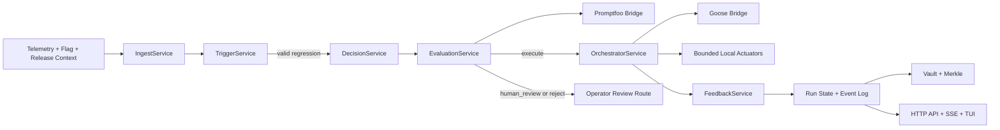
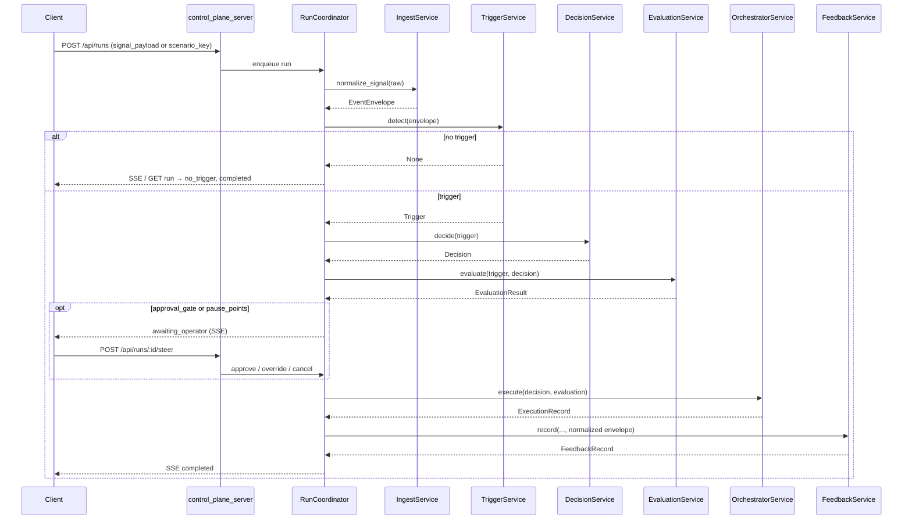

# Mesh Intelligence Architecture

## Scope

`mesh-intelligence` is a bounded closed-loop remediation system for feature-flag performance
regressions. It is an operator control plane with a fixed action surface, not a general autonomous
platform for arbitrary infra changes, code changes, or open-ended planning.

## Current Runtime Shape



## Main Layers

### 1. Core remediation loop

- `IngestService` normalizes raw telemetry, flag metadata, deployment context, segment context, and
  post-action observations into one event envelope.
- `TriggerService` emits a trigger only when evidence is recent, persistent, above thresholds, and
  not suppressed.
- `DecisionService` produces exactly one bounded decision from the allowed set:
  `no_action`, `reduce_rollout`, `disable_flag`, `escalate`.
- `EvaluationService` merges policy and business gates with Promptfoo-backed quality artifacts.
- `OrchestratorService` executes only approved actions and attaches Goose-backed review artifacts.
- `FeedbackService` evaluates `T+10m` and `T+30m` outcomes and writes bounded world-model updates.

### 2. Control plane

- `services/control_plane.py` coordinates long-lived runs, operator pauses, overrides, approvals,
  and run lifecycle state.
- `control_plane_server.py` exposes HTTP APIs plus SSE streams for run and system updates.
- `run_server.py` serves the browser UI; `run_tui.py` exposes the same system through the TUI.
- Runs persist to `.mesh-runtime-state/` and are mirrored into the Obsidian-compatible vault with
  Merkle roots and proofs.

#### HTTP API (singular calls)

There is **no** standalone `/api/ingest` route. **Telemetry** is supplied as JSON on run creation:
either `signal_payload` (full raw signal) or `scenario_key` (loads a fixture under
`fixtures/signals/`). When a run reaches the `ingesting` stage, `IngestService.normalize_signal`
runs **in-process** on that payload, then `TriggerService` and the rest of the loop execute.

| Method | Path | Role |
| --- | --- | --- |
| `GET` | `/api/health` | Liveness probe |
| `GET` | `/api/readiness` | Integration readiness (Promptfoo, Goose, GitNexus, etc.) |
| `GET` | `/api/scenarios` | List fixture-backed scenario keys |
| `GET` | `/api/goals` | List goals |
| `POST` | `/api/goals` | Create a goal |
| `GET` | `/api/runs` | List runs |
| `POST` | `/api/runs` | **Start a run** — body includes goal, modes, and **`signal_payload` or `scenario_key`** (ingest input) |
| `GET` | `/api/runs/:id` | Run snapshot |
| `POST` | `/api/runs/:id/steer` | Operator command (`approve`, `cancel`, overrides, etc.) |
| `GET` | `/api/runs/:id/events` | Paged run events (`?after=` sequence) |
| `GET` | `/api/runs/:id/merkle` | Merkle snapshot for the run |
| `GET` | `/api/runs/:id/merkle/proof/:event_id` | Proof for one event |
| `GET` | `/api/vault/tree` | Vault path tree |
| `GET` | `/api/vault/document?path=...` | Read one vault document |
| `GET` | `/api/stream/runs/:id` | **SSE** — live run events |
| `GET` | `/api/stream/system` | **SSE** — system-wide updates |

Static assets under the same server serve the browser operator UI (see `README.md` for defaults).

#### Telemetry in, services out (end-to-end flow)

Telemetry is **not** pushed service-by-service over HTTP. One **`POST /api/runs`** (or the equivalent action in the UI) carries the **raw signal** JSON (`signal_payload` or fixture from `scenario_key`). A background worker then runs **`MeshRuntimeEngine`** in-process inside `RunCoordinator._execute_run` (`services/control_plane.py`), which chains the same calls as `MeshRuntimeEngine.run_sync` (`services/runtime.py`).

**1. HTTP: admit work**

| Step | Caller → callee | What moves |
| --- | --- | --- |
| Start run | Client → `POST /api/runs` | Body: `goal_id`, `evaluation_mode`, `orchestration_mode`, `steering_mode`, optional `pause_points`, and **`signal_payload`** *or* **`scenario_key`** |
| Observe | Client → `GET /api/stream/runs/:id` (SSE) | Server pushes run events as stages advance |
| Inspect | Client → `GET /api/runs/:id`, `GET /api/runs/:id/events` | Snapshots and paged history |
| Steer | Client → `POST /api/runs/:id/steer` | `approve`, `cancel`, `override_*`, `resume`, etc., when the run is at `awaiting_operator` |

**2. In-process pipeline (single thread per run, after queue)**

| Order | Service / method | Input → output | Run stage surfaced |
| --- | --- | --- | --- |
| 1 | `IngestService.normalize_signal` | Raw signal dict → `EventEnvelope` | `ingesting` |
| 2 | `TriggerService.detect` | Envelope → `Trigger` or `None` | `trigger_ready` or `no_trigger` (then terminal if no trigger) |
| 3 | `DecisionService.decide` | `Trigger` → `Decision` | `decision_ready` |
| 4 | `EvaluationService.evaluate` | `Trigger`, `Decision` → `EvaluationResult` | `evaluation_ready` (may invoke Promptfoo bridge when not `native`) |
| — | *Operator gate* | If approval mode or failed auto conditions: **`awaiting_operator`** until `POST .../steer` | `awaiting_operator` |
| 5 | `OrchestratorService.execute` | `Decision`, `EvaluationResult` → `ExecutionRecord` | `executing` (may invoke Goose bridge when not `native`) |
| 6 | `FeedbackService.record` | Trigger, decision, execution, envelope → `FeedbackRecord` | `feedback_ready` (optional pause same as step 4) |
| 7 | Control plane | Session + artifacts + vault/Merkle | `completed` / `failed` / `cancelled` |

Overrides (`override_decision`, `override_execution_parameters`) cause **re-evaluation**: `decide` is not re-run from scratch in all cases, but evaluation is run again with the updated decision path before execution resumes.

**3. Non-HTTP entry (same pipeline)**

`run_first_slice.py` and tests call `MeshRuntimeEngine.run_sync(raw_signal, ...)` directly: same method chain as rows 1–6 above, without `POST /api/runs` or operator pauses.



### 3. Integration bridges

- `promptfoo` mode uses `services/evaluation/promptfoo_bridge.py` to run real `promptfoo eval`,
  parse exported JSON, and return structured evaluation artifacts.
- `goose` mode uses `services/orchestrator/goose_bridge.py` to run a real Goose review step,
  capture structured review metadata, and then perform bounded local actuation.
- `native` mode keeps everything local and in-process while using the same contracts and
  persistence model.

## Run Lifecycle

Each run advances through explicit stages:

1. `queued`
2. `ingesting`
3. `trigger_ready` or `no_trigger`
4. `decision_ready`
5. `evaluation_ready`
6. `awaiting_operator`
7. `executing`
8. `feedback_ready`
9. `completed`, `failed`, or `cancelled`

The control plane records typed run events for these transitions and stores artifact metadata such
as `artifact_key`, `integration_name`, and `status` so the existing event log can later back a real
event bus or projection layer.

## Persistence Model

The current durable backbone is local file-backed state under `.mesh-runtime-state/`:

- run sessions and goal records
- per-run event logs
- run snapshots
- duplicate-evaluation suppression state
- integration readiness snapshots
- vault documents and Merkle proofs

This is intentionally the short-term persistence layer. It is replay-friendly, but it is not yet a
broker/database-backed production event system.

## Execution Boundary

Allowed side effects:

- feature-flag rollout changes
- incident or ticket creation
- audit-log writes

Disallowed side effects:

- source-code changes
- infrastructure mutation
- direct production database writes
- arbitrary shell execution against production

## Contracts

Active shared contracts live in:

- `scaffold/contracts/schemas/trigger.schema.json`
- `scaffold/contracts/schemas/decision.schema.json`
- `scaffold/contracts/schemas/evaluation-result.schema.json`
- `scaffold/contracts/schemas/execution-record.schema.json`
- `scaffold/contracts/schemas/feedback-record.schema.json`

These schemas back the Python contract models in `shared/mesh_runtime/contracts.py`.

## Operator Surfaces

- Browser control plane: primary interface for goals, scenarios, run inspection, readiness, vault
  browsing, and Merkle proofs.
- TUI: terminal-native scenario runner and run-history inspector.
- Synchronous runner: `run_first_slice.py` for stdin/stdout execution of the same bounded loop.

## What Is Real Today

- Real Promptfoo CLI-backed evaluation bridge: yes
- Real Goose CLI-backed review bridge: yes
- Replay-friendly typed run-event log: yes
- Durable local run state and vault mirroring: yes
- External message bus or database projection: no
- Durable world-model store beyond bounded feedback updates: no
- Open-ended diagnosis/planning or arbitrary execution: no

## Verification

Primary verification command:

```bash
python3 -m unittest discover -s tests -v
```

Key test coverage includes:

- contract validation
- pipeline behavior
- integration bridge parsing
- control-plane HTTP flows
- TUI/controller behavior
