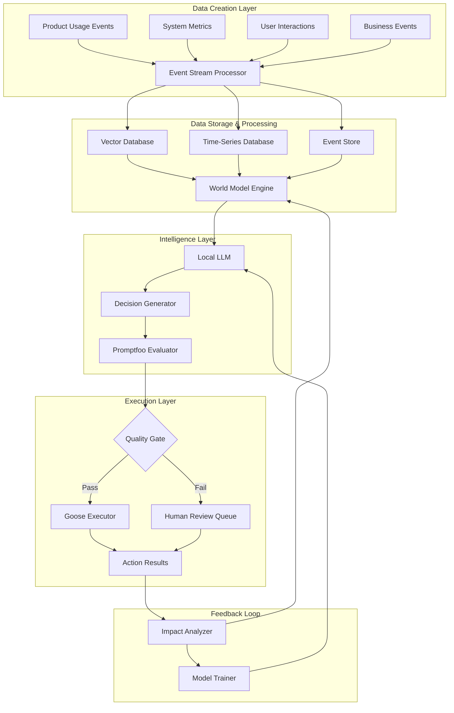

# Mesh Intelligence System Architecture

## System Overview



## Detailed Architecture

### 1. Data Creation Layer

#### Event Collection System
```yaml
components:
  event_collector:
    type: "streaming_ingestion"
    sources:
      - product_telemetry
      - user_interactions
      - system_metrics
      - business_events
    output_format: "structured_events"
    schema_validation: true

event_schema:
  user_action:
    timestamp: "ISO8601"
    user_id: "string"
    action_type: "enum"
    context: "json_object"
    metadata: "key_value_pairs"
  
  system_metric:
    timestamp: "ISO8601"
    service: "string"
    metric_name: "string"
    value: "float"
    tags: "key_value_pairs"
```

#### Stream Processing Pipeline
```yaml
kafka_config:
  topics:
    - user_events
    - system_metrics
    - business_events
  partitions: 12
  replication_factor: 3
  retention: "7_days"

stream_processors:
  enrichment_processor:
    input: "raw_events"
    functions:
      - user_context_enrichment
      - session_state_tracking
      - anomaly_detection
    output: "enriched_events"
  
  aggregation_processor:
    input: "enriched_events"
    functions:
      - real_time_metrics
      - feature_usage_stats
      - behavior_patterns
    output: "aggregated_insights"
```

### 2. World Model Engine

#### Data Storage Architecture
```yaml
vector_database:
  provider: "pinecone" # or chroma/weaviate
  dimensions: 1536
  indices:
    user_behavior:
      namespace: "user_patterns"
      metric: "cosine"
    feature_performance:
      namespace: "feature_metrics"
      metric: "euclidean"
    context_embeddings:
      namespace: "decision_context"
      metric: "cosine"

time_series_database:
  provider: "influxdb"
  buckets:
    metrics:
      retention: "30d"
      measurement_frequency: "1s"
    events:
      retention: "90d"
      measurement_frequency: "realtime"

graph_database:
  provider: "neo4j"
  schema:
    entities:
      - User
      - Feature
      - Action
      - Outcome
    relationships:
      - PERFORMED
      - RESULTED_IN
      - INFLUENCED
```

#### World Model Structure
```python
class WorldModel:
    def __init__(self):
        self.product_model = ProductWorldModel()
        self.business_model = BusinessWorldModel()
        self.context_engine = ContextEngine()
    
    def update(self, events: List[Event]):
        """Update world model with new events"""
        enriched_events = self.context_engine.enrich(events)
        self.product_model.update(enriched_events)
        self.business_model.update(enriched_events)
    
    def query(self, context: dict) -> WorldState:
        """Query current world state for decision making"""
        return WorldState(
            product_state=self.product_model.current_state(),
            business_state=self.business_model.current_state(),
            context=context
        )

class ProductWorldModel:
    def __init__(self):
        self.feature_performance = {}
        self.user_segments = {}
        self.system_health = {}
    
    def update(self, events: List[Event]):
        # Update product-specific metrics and states
        pass

class BusinessWorldModel:
    def __init__(self):
        self.revenue_trends = {}
        self.market_signals = {}
        self.competitive_landscape = {}
    
    def update(self, events: List[Event]):
        # Update business-specific metrics and states
        pass
```

### 3. Intelligence Layer

#### Local LLM Configuration
```yaml
llm_config:
  model: "llama-3-8b" # or mistral-7b
  deployment: "local"
  hardware_requirements:
    gpu_memory: "16GB"
    cpu_cores: 8
    ram: "32GB"
  
  optimization:
    quantization: "4bit"
    context_window: 8192
    batch_size: 4
  
  prompts:
    decision_generation:
      template: "decision_prompt.jinja2"
      max_tokens: 512
    impact_analysis:
      template: "impact_analysis.jinja2"
      max_tokens: 256
```

#### Decision Generation System
```python
class DecisionGenerator:
    def __init__(self, llm, world_model):
        self.llm = llm
        self.world_model = world_model
        self.decision_history = DecisionHistory()
    
    def generate_decision(self, trigger_event: Event) -> Decision:
        # Get current world state
        world_state = self.world_model.query(trigger_event.context)
        
        # Generate decision using LLM
        prompt = self._build_prompt(trigger_event, world_state)
        llm_response = self.llm.generate(prompt)
        
        # Parse and validate decision
        decision = self._parse_decision(llm_response)
        decision.confidence = self._calculate_confidence(decision, world_state)
        
        return decision
    
    def _build_prompt(self, event: Event, world_state: WorldState) -> str:
        return f"""
        Context: {world_state.to_json()}
        Event: {event.to_json()}
        History: {self.decision_history.relevant_decisions(event)}
        
        Generate a decision with:
        1. Action to take
        2. Reasoning
        3. Expected outcome
        4. Risk assessment
        """
```

### 4. Quality Assurance (Promptfoo Integration)

#### Promptfoo Configuration
```yaml
# promptfoo-config.yaml
description: "Mesh Intelligence Decision Evaluation"

providers:
  - id: local-llm
    config:
      type: ollama
      model: llama3:8b

prompts:
  - file://prompts/decision_generation.txt
  - file://prompts/impact_analysis.txt

tests:
  - vars:
      context: "user churn risk detected"
      user_segment: "enterprise"
    assert:
      - type: contains
        value: "retention"
      - type: javascript
        value: "output.confidence > 0.7"
      - type: llm-rubric
        value: "Decision is appropriate for enterprise user retention"

  - vars:
      context: "performance degradation"
      severity: "high"
    assert:
      - type: contains
        value: "scaling"
      - type: not-contains
        value: "delete"
      - type: cost
        threshold: 0.01

security:
  plugins:
    - prompt-injection
    - jailbreak
    - pii-detection
    - harmful-content

outputPath: ./evaluation-results
```

#### Quality Gate Implementation
```python
class QualityGate:
    def __init__(self, promptfoo_runner):
        self.promptfoo = promptfoo_runner
        self.security_scanner = SecurityScanner()
        self.impact_predictor = ImpactPredictor()
    
    def evaluate(self, decision: Decision) -> QualityResult:
        results = {
            'security': self._security_check(decision),
            'quality': self._quality_check(decision),
            'impact': self._impact_check(decision),
            'confidence': self._confidence_check(decision)
        }
        
        return QualityResult(
            passed=all(r.passed for r in results.values()),
            results=results,
            recommendation=self._get_recommendation(results)
        )
    
    def _security_check(self, decision: Decision) -> SecurityResult:
        # Run promptfoo security plugins
        return self.promptfoo.run_security_scan(decision)
    
    def _quality_check(self, decision: Decision) -> QualityResult:
        # Evaluate decision quality using promptfoo
        return self.promptfoo.evaluate_quality(decision)
```

### 5. Execution Layer (Goose Integration)

#### Goose Configuration
```yaml
# goose-config.yaml
name: "mesh-intelligence-executor"
runtime: "local"

capabilities:
  - code_execution
  - api_calls
  - file_system
  - database_operations
  - infrastructure_management

mcp_servers:
  - name: "deployment-server"
    transport: "stdio"
    command: "deployment-mcp"
  - name: "database-server"
    transport: "stdio"
    command: "db-mcp"

safety:
  sandboxed: true
  allowed_domains:
    - "api.internal.company.com"
    - "metrics.company.com"
  forbidden_operations:
    - "delete_user_data"
    - "drop_production_tables"

execution_limits:
  timeout: "300s"
  max_api_calls: 50
  max_file_operations: 20
```

#### Execution Engine
```python
class ExecutionEngine:
    def __init__(self, goose_client, safety_checker):
        self.goose = goose_client
        self.safety_checker = safety_checker
        self.execution_tracker = ExecutionTracker()
    
    def execute(self, decision: Decision) -> ExecutionResult:
        # Safety check before execution
        if not self.safety_checker.is_safe(decision):
            return ExecutionResult.rejected("Safety check failed")
        
        try:
            # Execute decision using Goose
            execution_id = self.execution_tracker.start(decision)
            result = self.goose.execute(decision.action_plan)
            
            # Track execution
            self.execution_tracker.complete(execution_id, result)
            
            return ExecutionResult.success(result)
        
        except Exception as e:
            self.execution_tracker.failed(execution_id, str(e))
            return ExecutionResult.error(str(e))
```

### 6. Feedback & Learning Loop

#### Impact Analysis System
```python
class ImpactAnalyzer:
    def __init__(self, world_model, metrics_collector):
        self.world_model = world_model
        self.metrics = metrics_collector
    
    def analyze_impact(self, decision: Decision, execution_result: ExecutionResult):
        # Collect metrics after execution
        post_execution_metrics = self.metrics.collect(
            timeframe=decision.expected_impact_window
        )
        
        # Compare with predictions
        impact = Impact(
            predicted=decision.expected_outcome,
            actual=post_execution_metrics,
            success_rate=self._calculate_success_rate(decision, post_execution_metrics),
            side_effects=self._detect_side_effects(decision, post_execution_metrics)
        )
        
        # Update world model with learnings
        self.world_model.incorporate_feedback(decision, impact)
        
        return impact
```

## Deployment Architecture

### Infrastructure Requirements
```yaml
kubernetes_deployment:
  namespaces:
    - mesh-intelligence-data
    - mesh-intelligence-ai
    - mesh-intelligence-execution
  
  data_layer:
    kafka:
      replicas: 3
      resources:
        cpu: "2"
        memory: "4Gi"
        storage: "100Gi"
    
    vector_db:
      replicas: 2
      resources:
        cpu: "4"
        memory: "16Gi"
        storage: "500Gi"
    
    timeseries_db:
      replicas: 1
      resources:
        cpu: "2"
        memory: "8Gi"
        storage: "1Ti"
  
  ai_layer:
    llm_service:
      replicas: 2
      resources:
        cpu: "8"
        memory: "32Gi"
        gpu: "1x A100"
    
    promptfoo:
      replicas: 1
      resources:
        cpu: "2"
        memory: "4Gi"
  
  execution_layer:
    goose_runners:
      replicas: 3
      resources:
        cpu: "4"
        memory: "8Gi"
```

### Security & Monitoring
```yaml
security:
  network_policies:
    - deny_all_ingress
    - allow_internal_communication
  
  rbac:
    service_accounts:
      - mesh-data-collector
      - mesh-ai-processor
      - mesh-executor
  
  secrets_management:
    provider: "vault"
    rotation_policy: "30d"

monitoring:
  metrics:
    - decision_latency
    - execution_success_rate
    - world_model_accuracy
    - resource_utilization
  
  alerts:
    - high_decision_failure_rate
    - llm_service_down
    - execution_queue_backlog
  
  dashboards:
    - system_health
    - decision_analytics
    - business_impact
```

This architecture provides a complete mesh intelligence system that can autonomously process product data, make informed decisions, and execute actions while maintaining quality and safety standards.