# Mesh Intelligence — Architecture

`mesh-intelligence` is an audited closed-loop SRE harness for the full
incident lifecycle: **detect → investigate → raise → keep history**. It
treats every inbound alert as a *lead*, not the truth. Each run
assembles an audited evidence pack, runs an LLM-driven investigation
loop over a typed read-only tool surface, ranks falsifiable hypotheses
with a deterministic floor, optionally invokes an LLM observer for a
second opinion, then applies a one-way safety promotion before the
orchestrator touches anything. The result is persisted with
Merkle-rooted audit trails so any run is independently replayable.

It is an **operator control plane with a bounded action surface**.
Not a general autonomous agent. Not a multi-tenant SaaS. Not a CLI
RCA tool.

Today it handles three regression classes:

1. **Kubernetes deployment regressions** — crash loops, OOM, image-pull
   failures, probe failures, scheduling errors, RBAC denials, service
   selector mismatches.
2. **Blockchain execution-node degradations** (Reth-class) — peer
   starvation, sync stall, RPC degradation, consensus disconnect, JWT
   misconfigurations, disk pressure.
3. **Feature-flag regressions** — latency / error / timeout deltas
   attributable to a flag flip.

---

## System diagram

```mermaid
flowchart LR
    subgraph DETECT[1. Detect]
        WH[Webhooks<br/>alertmanager · github · argocd]
        K8S[K8s watch + live signal]
        OTEL[OpenTelemetry]
        BARE[Bare-metal probes<br/>JSON-RPC + systemd]
        TRIG[TriggerService]
    end
    subgraph INVESTIGATE[2. Investigate]
        EV[EvidenceService<br/>field-level audit]
        TOPO[Topology populator<br/>InfraGraph per-run]
        HARN[Investigation harness<br/>planner → critic → loop]
        HE[HypothesisEngine<br/>falsifiable predicates]
        SCEN[ScenarioAnalysis]
        OBS[LlmObserver<br/>typed verdict]
    end
    subgraph RAISE[3. Raise]
        DEC[DecisionService<br/>bounded action set]
        AGM[Agent mesh<br/>multi-agent fanout]
        REC[Reconciliation]
        ACT[Actuators<br/>argocd · ssh · lb · repo_patch]
        OPER[Operator gate<br/>pause / approve / override]
    end
    subgraph HISTORY[4. History]
        SS[(StateStore<br/>Postgres or SQLite)]
        MERKLE[Merkle proofs<br/>per event]
        VAULT[(Vault<br/>Obsidian markdown)]
        SH[SignalHistory<br/>per-target temporal]
        CORPUS[(IncidentCorpus<br/>SQLite + FTS)]
        RB[ReasoningBank<br/>strategy memory]
    end
    DETECT ==> INVESTIGATE
    INVESTIGATE ==> RAISE
    RAISE ==> HISTORY
    HISTORY -.context.-> INVESTIGATE
```



Each arrow is a directed information flow. History only flows
backward into Investigate as *context*; nothing in History can demote
a Raise decision.

---

## Architectural invariants

Three invariants hold across every code change.

### 1. One-way safety promotion

Every layer (trigger thresholds → policy match → evidence sufficiency
→ hypothesis ranking → LLM observer) can only push the decision
**toward escalation**. None can demote.

A hallucinating LLM observer can promote `restart_systemd_service` to
`escalate`. It cannot demote an `escalate` to `approve`. The decision
service rejects any verdict that would reduce conservatism.

### 2. Deterministic posterior

The hypothesis engine's posterior is computed **only from
probe-evaluated predicates** — those whose `result` was set by a
probe runner against the evidence pack. RCA-derived predicates
(`kind="investigation_root_cause_candidate"`) are excluded from
posterior weight summation.

RCA influence reaches the engine via:

- synthetic `h_rca_*` hypotheses with prior anchored to RCA
  confidence (visible in ranking + UI), and
- `supporting_evidence` / `disconfirming_evidence` lists (visible to
  operator UI and the observer prompt) but unweighted in `_posterior`.

This blocks an LLM-confident-but-unverified RCA candidate from
inflating any other hypothesis past the 0.55 promotion threshold via
posterior math.

### 3. Single-tenant by design

A Mesh deployment monitors one operational fleet. The corpus stores
(`corpus_store.py`, `incident_corpus.py`, `monitoring_corpus.py`)
intentionally carry no tenant predicate. Multi-tenant isolation would
require growing a tenant-id parameter on every query in those modules
— that change is explicitly out of scope until a real multi-tenant
deployment shape exists.

---

## Runtime topology

### Production boundary

| Entry point | Role |
|---|---|
| `run_server.py` → `control_plane_server.py` | HTTP API (`/api/*`) + SSE streams + static web bundle |
| `setup_integrations.py` (Docker entrypoint) | Provisions Promptfoo / Goose / Hermes / Evo configs before the server starts |
| `run_tui.py` → `tui.py` | Local terminal UI over the same HTTP API |
| `MeshRuntimeEngine.run_sync` (in-process) | Direct pipeline runner used by tests, fixtures, and the benchmark harness — bypasses the HTTP control plane |

Trust posture:

- No built-in HTTP auth. Sit behind a reverse proxy or private network.
- LLM provider keys are process/container secrets (`MESH_OBSERVER_API_KEY`,
  `ANTHROPIC_API_KEY`, etc.).
- Kubeconfig is a read-only secret mount.
- Persistent state lives at `MESH_STATE_DIRECTORY` (defaults to
  `.mesh-runtime-state/`).
- Vault artifacts at `MESH_VAULT_PATH`.

### Local all-in-one stack

`docker-compose.stack.yml` is the whole system in one Compose project:
Mesh + a dedicated Hermes sidecar + embedded k3s + a one-shot
Kubernetes bootstrap job + a smoke verifier + optional LatentMAS
sidecar (via the `latentmas` profile). Used for end-to-end manual
testing; not the production template.

---

## Subsystems

### Ingest

| Module | Source |
|---|---|
| `services/ingest/webhook_service.py` | HTTP webhooks (alertmanager, GitHub, ArgoCD, custom) |
| `services/watchers/kubernetes.py` | K8s API `watch` daemon |
| `services/ingest/kubernetes_live_signal.py` | K8s pull-mode cluster snapshot |
| `services/ingest/otel_signal.py` | OpenTelemetry metric receiver |
| `services/ingest/bare_metal_node.py` | Reth/Lighthouse JSON-RPC + systemd state |

There is **no** `/api/ingest` route by design. Every detection becomes
a `POST /api/runs` with `signal_payload` or `scenario_key`, so every
inbound event gets a run ID and a full event log.

### Trigger

`services/trigger/service.py` admits a signal as a `Trigger` only when:

- evidence is recent (per-class freshness windows)
- the signature persists across consecutive ticks (no single-sample noise)
- thresholds are exceeded
- the signal isn't currently in the suppression set

Suppression state is in-memory + persisted; restarts pick it back up.

### Evidence

`services/evidence/service.py` promotes the inbound signal to an
audited *evidence pack* — never reads the raw inbound signal
downstream.

For Reth signals it stamps the snapshot as a separate run artifact
with **per-probe results** (`observed` / `timeout` / `not_attempted`),
runs the sufficiency check from `policies/reth-node.policy.json`, and
short-circuits to a **fast-path skip** for credential/exposure
signatures (`authrpc_exposed`, `rpc_exposed`, `jwt_missing`,
`db_corruption_suspected`, `jwt_secret_insecure_permissions`) so a
critical-credential leak doesn't wait for the full pipeline.

The probe runner is pluggable (`EvidenceService(probe_runner=...)`).
Today the default runner is configured via `build_configured_probe_runner`
and reads the inbound signal; a production runner attaching `kubectl get`,
`kubectl logs`, and live JSON-RPC is the roadmap follow-up.

### Investigation harness

`services/investigation/harness/` is the LLM-driven tool-loop RCA path
that fires on **every trigger**, not just CloudOps benchmark scenarios.
It's the most distinctive subsystem in Mesh.

Shape:

```
   ┌────────────────┐
   │  Rule pack     │   CloudOpsRulePack | RethRulePack | GenericRulePack
   │  (per trigger) │   carries domain heuristics + canonical RCA labels
   └────────┬───────┘
            │
   ┌────────▼───────┐
   │  Planner       │   selects next ToolCall from the registry
   │  Native + LLM  │   (LlmProbeSelector + ShadowProbeSelector blend)
   └────────┬───────┘
            │ ToolCall
   ┌────────▼───────┐
   │  Critic        │   rejects unknown / mutating / duplicate / invalid-arg
   └────────┬───────┘
            │
   ┌────────▼───────┐
   │  Tool registry │   reads-only by construction
   │  (root packs   │   always-on: prometheus / aws / kubectl / github / loki /
   │   + per-run    │              jaeger / postgres / mcp / topology
   │   overlays)    │   per-run:   cloudops (snapshot) / reth (live probes)
   └────────┬───────┘
            │ RawToolOutput
   ┌────────▼───────┐
   │  Loop          │   max_iterations + budget_cost guard
   └────────┬───────┘
            │
            ▼
   InvestigationReport
   {root_cause_candidates, ranked, tool_call_trace, ...}
```

Key contracts (`services/investigation/harness/contracts.py`):

- `ToolDefinition` — name, domain, args_schema, `mutation_class`,
  `timeout_seconds`, `budget_cost`, `citations_kind`.
- `ToolCall` / `ToolResult` — bound to a definition + args.
- `InvestigationLoopState` — accumulates calls, results, and decision
  trace per iteration.
- `LoopDecision` — what the planner wants to do next.
- `LoopRejection` — why the critic vetoed a call.

The harness is **read-only by construction**:

1. `LoopCritic` rejects any `ToolCall` whose definition's
   `mutation_class != "read_only"`.
2. `LlmProbeSelector` filters its menu to `read_only` definitions
   before the LLM ever sees it.
3. Tool packs register `mutation_class="read_only"` on every
   definition.

That's the same property three different ways — defense in depth.

#### Tool packs

Each pack is one module under `services/investigation/tools/` exposing
a uniform trio: `TOOL_DEFINITIONS`, `register(registry, ...)`, and (for
always-on packs) `maybe_register_at_root(registry)`.

| Pack | Trigger | Gating |
|---|---|---|
| `topology` | always-on | InfraGraph always present (default-constructed in engine) |
| `prometheus` | always-on | `MESH_PROMETHEUS_URL` set |
| `aws` | always-on | `MESH_AWS_TOOLS_ENABLED=1` |
| `kubectl` | always-on | kubeconfig + `kubectl` on PATH |
| `github` | always-on | `gh auth status` succeeds |
| `loki` | always-on | `MESH_LOKI_URL` set |
| `jaeger` | always-on | `MESH_JAEGER_URL` set |
| `postgres` | always-on | `MESH_PG_DSN` set + `psql` on PATH |
| `mcp` | always-on | `MESH_MCP_SERVERS` set (caller-supplied client_factory) |
| `cloudops` | per-run | trigger carries `cloudopsbench_snapshot` |
| `reth` | per-run | `trigger_type == "reth_node_degraded"` |

Production deployments without a backend pay zero cost — the
`maybe_register_at_root` helper checks config/env before constructing
any client, so the registry stays empty for that domain and the
planner never sees its tools.

The LLM planner sees **every read-only tool in the registry**, not
just the per-trigger pack, and selects by `{domain}:{name}` qualified
names. That's how a CloudOps trigger can call a Prometheus tool, or a
Reth trigger can call kubectl — domain mixing is allowed and
contracted.

#### Auto-wiring

`services/runtime._auto_wire_investigation_harness` picks the right
rule pack for the trigger in three paths:

1. `cloudopsbench_snapshot` present → `CloudOpsRulePack` + per-run
   CloudOps tools overlaid on the root registry.
2. `trigger_type == "reth_node_degraded"` → `RethRulePack` + Reth tool
   pack from the audited signal payload.
3. Anything else with an LLM observer configured → `GenericRulePack`
   (no domain rules; the LLM is the sole decider over the full
   root-registered surface).

Without an LLM observer configured and without a domain-specific
rule pack, the loop falls back to the deterministic decision path
unchanged.

### Topology graph

`shared/mesh_runtime/infra_graph.py` is the typed view of Kubernetes
relationships: services → pods → nodes, owned-by edges, scheduled-on
edges, service-selector edges. Node kinds: `service`, `deployment`,
`pod`, `namespace`, `node`, `configmap`, `secret`, `ingress`,
`statefulset`, `daemonset`, `job`. Edge kinds: `routes_to`, `selects`,
`owns`, `mounts`, `scheduled_on`, `exposes`.

`services/investigation/topology_builder.py` parses CloudOpsBench
snapshot text (`DescribeResource` outputs) into nodes + edges. The
engine calls it once per trigger via `_populate_topology`. Empty
snapshots leave the graph empty — never crash. The graph is persisted
under `MESH_STATE_DIRECTORY/graph/` with append-only versioned
snapshots so topology drift can be reviewed historically.

The `topology` tool pack exposes the graph through five queries:
`topology_resolve_service_pods`, `topology_pod_lineage`,
`topology_pod_node`, `topology_resource_neighbors`,
`topology_snapshot`. The LLM uses these to anchor RCA (e.g. "which
pods does this service select?" without re-parsing kubectl text).

### Hypothesis engine

`services/decision/hypothesis_engine.py` generates ranked
`Hypothesis` rows from built-in templates. Each hypothesis carries
falsification predicates that resolve against the evidence pack,
`AlertStore`, `InfraGraph`, `ContextStore`, and (when present) the
`InvestigationReport` from the harness.

Active template families:

- **Kubernetes** — `crash_loop`, `oom_killed`, `image_pull_failure`,
  `probe_failure`, `service_selector_mismatch`, `missing_service_account`,
  `resource_quota_exceeded`, `admission_webhook_denied`.
- **Reth** — `peer_starvation`, `sync_stalled`, `rpc_degraded`,
  `consensus_disconnect`, `local_isolation`, `disk_pressure`,
  `jwt_secret_insecure`, `authrpc_exposed`.

Output biases the deterministic decision **one-way only** — it can
promote toward `escalate` but never demote an escalation. Posterior
math obeys invariant 2 above.

### Decision

`services/decision/service.py` produces exactly one bounded decision
per signal class. The action surface is enforced by
`policies/autonomy.policy.json`:

| Signal class | Allowed actions |
|---|---|
| Feature-flag | `no_action`, `reduce_rollout`, `disable_flag`, `escalate`, `investigate_and_patch` |
| Kubernetes | `no_action`, `restart_deployment`, `rollback_deployment`, `patch_resources`, `escalate` |
| Reth node | `no_action`, `restart_systemd_service` (approval-gated), `cordon_node`, `drain_node`, `escalate` |

Anything outside this matrix is unreachable from this layer. The
decision service also stamps `decision.reasoning.ranked_hypotheses`
and (if enabled) `decision.reasoning.observer_verdict` onto the
audit trail.

### LLM observer

`services/observer/service.py` is an optional second-opinion layer.

- **Provider-neutral.** Speaks OpenAI `/v1/chat/completions` (works
  with OpenAI, vLLM, Ollama, Together, Groq, OpenRouter, llama.cpp
  shim) and Anthropic native `/v1/messages`. Config: `MESH_OBSERVER_*`.
  Disabled by default.
- **Typed verdict.** Returns exactly one of `approve`, `escalate`,
  `request_more_evidence`, `reject_unsafe`.
- **One-way promotion.** A verdict can only push the decision toward
  more conservative outcomes (invariant 1).
- **Fail-open.** Provider down, timeout, malformed JSON, unknown
  verdict — every failure collapses to `verdict=approve` with the
  failure stamped on `error`, and the deterministic decision stands.
- **Prompt caching.** System prefix is cache-stable; Anthropic gets an
  explicit `cache_control: ephemeral` marker. Per-run evidence is the
  only uncached portion, so repeat-call latency and cost stay low.

### Orchestrator + agent mesh

`services/orchestrator/agent_mesh.py` fans the decision out to
multiple agents. Each agent records a read-only proposal as an
`AgentAttempt`. `services/orchestrator/reconciliation.py` selects the
best attempt — or escalates if no attempt clears the policy floor.

| Adapter | Module | Capability |
|---|---|---|
| Goose | `goose_adapter.py`, `goose_bridge.py` | Code-review-style structured response + bounded actuation |
| Hermes | `hermes_adapter.py`, `hermes_bridge.py` | NousResearch Hermes agent runtime |
| Claude Code | `cli_executor.py` (`claudecode`) | Anthropic CLI agent |
| Codex | `cli_executor.py` (`codex`) | OpenAI Codex CLI |
| OpenClaw | `cli_executor.py` (`openclaw`) | Open-source claw agent |
| Evo | `evo_launcher.py` (`evo` / `native_contract`) | Evolutionary plan search |
| DeepAgents | `deepagents_adapter.py` | DeepAgents subagent topology |
| LatentMAS | `latentmas_adapter.py`, `latentmas_server.py` | Rust sidecar for low-latency latent inference |

`services/orchestrator/service_agents/registry.py` carries the
capability matrix — which adapters are eligible for which task class.

### Actuators

`services/actuators/` is the bounded side-effect layer. Gated by
`policies/autonomy.policy.json`.

| Actuator | Capability | Gating |
|---|---|---|
| `argocd.py` | GitOps sync / rollback | Policy + ArgoCD endpoint configured |
| `systemd_ssh.py` | `systemctl restart` on allowlisted hosts | Policy + `MESH_SSH_*` + approval gate |
| `load_balancer.py` | LB pool drain | Policy + LB endpoint configured |
| `repo_patch.py` | Creates a config-patch PR | Policy + GitHub token |

**Disallowed side effects**: source-code changes, infrastructure
mutation outside allowlists, direct production database writes,
arbitrary shell execution against production, anything in
`policies/reth-node.policy.json#forbidden_automated_actions` (delete
datadir, restore snapshot, rewrite JWT, change pruning mode, client
up/downgrade).

### Memory layer

| Module | Role |
|---|---|
| `services/signal_history/store.py` | Per-target ring buffer + `Trend` extractor. Distinguishes transient from sustained at the data layer (`duration_below_floor_seconds`, `sustained_below_floor`). |
| `shared/mesh_runtime/active_memory.py` | Active retrieval scope used by ScenarioAnalysis and the LLM observer. |
| `shared/mesh_runtime/reasoning_bank.py` | Strategy memory — "this kind of incident usually responds to X" without prescribing. |
| `shared/mesh_runtime/corpus_store.py` (`IncidentCorpusDatabase`) | SQLite + FTS long-tail incident memory. Importable from JSONL exports; projectable into active memory. |
| `shared/mesh_runtime/incident_corpus.py` | Normalizes Mesh run artifacts into corpus rows. |
| `shared/mesh_runtime/halo.py` | Outer-loop optimization sidecar. Reads run traces, produces proposal-only patches against the harness itself (path-allowlisted, never auto-merges). |

The memory layer is single-tenant by design (invariant 3) and
append-only at the run level: every run writes new events, never
mutates old ones. Replay is therefore deterministic.

---

## Run lifecycle

Each run advances through explicit stages:

```
queued
  → ingesting
  → trigger_ready  | no_trigger (terminal)
  → evidence_pack_ready
  → scenario_analysis_ready
  → decision_ready
  → evaluation_ready
  → awaiting_operator (only if approval_gate or pause_points)
  → executing
  → feedback_ready
  → completed | failed | cancelled
```

The evidence stage emits multiple events per logical step:
`evidence_pack_assembling`, one `evidence_probe_completed` per probe,
then `evidence_pack_ready` — so the audit trail shows exactly what was
looked up and how long each lookup took.

Pauseable stages (when `default_steering_mode=approval_gate` or
operator pause points): `trigger_ready`, `decision_ready`,
`evaluation_ready`, `feedback_ready`. **Evidence is not pauseable** —
fast, audited, not a decision point.

The harness itself is invoked **inside** `DecisionService.decide`
(when registry + planner are present from auto-wiring); its
`InvestigationReport` is stamped onto the decision artifact rather
than appearing as a separate stage.

---

## HTTP API surface

Full details in [`docs/api-reference.md`](./docs/api-reference.md). At
a glance:

| Method | Path | Role |
|---|---|---|
| `GET` | `/api/health` | Liveness |
| `GET` | `/api/readiness` | Integration readiness |
| `GET` | `/api/scenarios` | Fixture-backed scenario keys |
| `GET` `POST` | `/api/goals` | List / create goals |
| `GET` `POST` | `/api/runs` | List / **start** runs (body: `signal_payload` or `scenario_key`) |
| `GET` | `/api/runs/:id` | Run snapshot |
| `POST` | `/api/runs/:id/steer` | `approve`, `cancel`, override commands |
| `GET` | `/api/runs/:id/events` | Paged event log |
| `GET` | `/api/runs/:id/merkle` | Merkle snapshot |
| `GET` | `/api/runs/:id/merkle/proof/:event_id` | Inclusion proof |
| `GET` | `/api/vault/tree`, `/api/vault/document?path=...` | Vault browse |
| `GET` | `/api/stream/runs/:id` | SSE — live run events |
| `GET` | `/api/stream/system` | SSE — system updates |

There is **no** `/api/ingest` route by design — every detection
becomes a `POST /api/runs` with `signal_payload` or `scenario_key`,
so every inbound event has a run ID and a full event log.

---

## Persistence

| Backend | Selector | Storage |
|---|---|---|
| Postgres | `MESH_STATE_BACKEND=postgres` | Production. Migrations under `migrations/postgres/`. |
| SQLite + JSON files | default | Local-dev. State at `MESH_STATE_DIRECTORY` (`.mesh-runtime-state/`). |

Both backends store:

- run sessions and goal records
- per-run event logs (append-only)
- run snapshots + artifact metadata
- duplicate-evaluation suppression state
- integration readiness snapshots
- vault documents and Merkle proofs

Per-event Merkle leaves are hashed by `shared/mesh_runtime/merkle.py`
and rolled into a per-run root reachable via
`/api/runs/:id/merkle/proof/:event_id`.

The Obsidian-compatible vault mirrors run notes with backlinks at
`MESH_VAULT_PATH`, served at `/api/vault/...`.

---

## Contracts

JSON schemas under `shared/mesh_runtime/schemas/`:

- `trigger.schema.json`
- `decision.schema.json` (permits `reasoning.ranked_hypotheses` and
  `reasoning.observer_verdict`)
- `evaluation-result.schema.json`
- `execution-record.schema.json`
- `feedback-record.schema.json`
- `reth-node-signal.schema.json` (also the evidence-pack shape for
  Reth — signal and pack are byte-compatible)
- `kubernetes-signal.schema.json`
- `otel-metric-signal.schema.json`

Python contract models in `shared/mesh_runtime/contracts.py`.

## Policies

Operator-tunable thresholds in `policies/`:

- `autonomy.policy.json` — allowed `(system, action)` pairs, idempotent
  flags
- `reth-node.policy.json` — restartable vs escalation signatures,
  `evidence_sufficiency` block, forbidden automated actions,
  restart-rate limits
- `metric-actions.policy.json` — OTel signal → action mappings
  (~40 rules)
- `protected-scope.policy.json` — services / endpoints off-limits for
  autonomy
- `rollback.policy.json` — rollback-frequency caps

---

## What's out of scope

Deliberately:

- **Open-ended autonomy.** No arbitrary `kubectl exec`,
  no shell-out-and-figure-it-out. Action set is bounded by
  `policies/autonomy.policy.json`.
- **Multi-cloud breadth.** Today: K8s + bare-metal Reth + feature-flag
  tooling. AWS Lambda / Cloud Run / serverless require real work, not
  a "plugin point that's almost there."
- **Pure RCA without remediation.** That's OpenSRE's space. Mesh ships
  a closed-loop harness where RCA is one stage of many.
- **Multi-tenant SaaS.** Single-tenant by design (invariant 3).
  Multi-tenancy would be a fork, not a feature flag.
- **Source-code mutation.** Repo-patch actuator creates *proposal*
  PRs; nothing auto-merges.

---

## Verification

```bash
# Full test suite
python3 -m unittest discover -s tests -v

# Fault-injection simulation with the AI observer engaged
export ANTHROPIC_API_KEY=sk-ant-...
MESH_OBSERVER_MODEL=claude-haiku-4-5-20251001 python -m simulation
```

The simulation drives 26 fault scenarios through `MeshRuntimeEngine.run_sync`
and produces a markdown report in `.mesh-runtime-state/simulation/`
scoring observer verdict distribution, evidence-citation rate, and
escalation precision alongside deterministic accuracy.

Test coverage worth knowing about:

- Contract validation (every schema)
- Pipeline behavior (ingest → trigger → evidence → decision →
  evaluation → orchestrator → feedback)
- Investigation harness: planner / critic / loop termination / tool
  registry / RCA candidate scoring (substring-tightened —
  `_evidence_kind_matches` token-subset prevents false positives like
  `oom` matching `boom`)
- Topology populator: pod / service / deployment / node node emission,
  `selects` / `scheduled_on` / `owns` edges, ReplicaSet → deployment
  collapse, empty-snapshot is a no-op
- Hypothesis engine: cascade-case ordering (`consensus_disconnect`
  must outrank `local_isolation` when EAPI is down)
- Decision service: one-way safety promotion, fast-path force-escalate
- LLM observer: verdict parsing, fail-open behavior, retry budget,
  JSON extraction from fenced responses
- Benchmark harness: provider matrix, gate thresholds, scoring,
  comparison, gap reports

---

## Further reading

| Topic | File |
|---|---|
| HTTP API reference | [`docs/api-reference.md`](./docs/api-reference.md) |
| Extending Mesh (plug-ins) | [`docs/extending-mesh.md`](./docs/extending-mesh.md) |
| Investigation harness | [`docs/investigation-harness.md`](./docs/investigation-harness.md) |
| API + runtime map | [`docs/architecture/api-and-runtime-map.md`](./docs/architecture/api-and-runtime-map.md) |
| All-in-one compose stack | [`docs/all-in-one-compose-stack.md`](./docs/all-in-one-compose-stack.md) |
| Production runbook | [`docs/production-live-runbook.md`](./docs/production-live-runbook.md) |
| Postgres persistence | [`docs/postgres-persistence.md`](./docs/postgres-persistence.md) |
| Memory + reasoning bank | [`docs/memory-architecture.md`](./docs/memory-architecture.md) · [`docs/reasoning-bank.md`](./docs/reasoning-bank.md) |
| Safety loop | [`docs/remediation-safety-loop.md`](./docs/remediation-safety-loop.md) |
| Foundations + messaging | [`docs/foundations.md`](./docs/foundations.md) |
| Contributor guide | [`AGENTS.md`](./AGENTS.md) |
