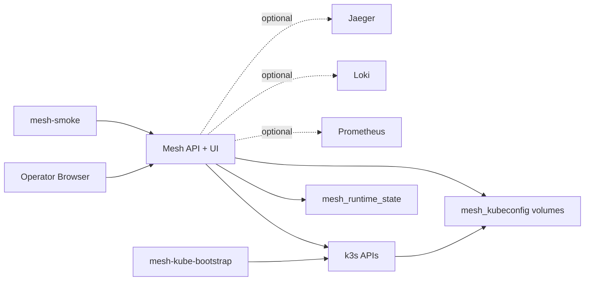

# Mesh Intelligence Architecture

## Scope

`mesh-intelligence` is an agentic incident harness and bounded remediation
control plane. It ingests operational signals, builds evidence, investigates
with read-only tools, ranks likely causes, proposes a decision, evaluates that
decision against policy, pauses for operator approval by default, executes only
bounded actions, and records feedback.

Mesh is intended to become signal-agnostic: the main loop should work for Reth
nodes, Kubernetes workloads, OTel metric regressions, webhooks, feature flags,
and unknown future signals through the same artifact and safety model. The
current implementation is partially migrated: investigation planning, evidence,
and RCA are profile-driven; ingest, trigger detection, decision, scenario
analysis, and feedback still contain monolithic per-signal branches.

Mesh is not a general autonomous infrastructure agent. The investigation loop
is read-only. Mutating actions are constrained to reviewed actuator surfaces
such as Kubernetes rollouts, feature-flag rollout changes, incident creation,
and approval-gated systemd service operations.

## Current Runtime Shape

```mermaid
flowchart LR
    raw["Raw signal, webhook, OTLP, fixture, or watcher"] --> ingest["IngestService"]
    ingest --> normalized["EventEnvelope"]
    normalized --> trigger["TriggerService"]
    trigger --> profile["SignalProfile resolution"]
    profile --> plan["InvestigationPlan"]
    profile --> evidence["EvidencePack"]
    plan --> loop["Investigation harness loop"]
    evidence --> loop
    loop --> report["InvestigationReport"]
    report --> scenario["ScenarioAnalysis"]
    evidence --> decision["DecisionService + HypothesisEngine"]
    report --> decision
    scenario --> decision
    decision --> rca["RCA report"]
    decision --> evaluation["EvaluationService"]
    evaluation --> gate["Operator/policy gate"]
    gate --> orchestrator["OrchestratorService"]
    orchestrator --> actuators["Bounded actuators"]
    orchestrator --> feedback["FeedbackService"]
    feedback --> state["Run state + event log"]
    rca --> state
    evidence --> state
    report --> state
    state --> vault["Vault + Merkle proofs"]
    state --> api["HTTP API + SSE + UI/TUI"]
```



Every meaningful run should expose these first-class artifacts:

- `normalized_event`
- `trigger`
- `investigation_plan`
- `evidence_pack`
- `investigation_report`
- `scenario_analysis`
- `ranked_hypotheses` when available
- `rca_report`
- `decision`
- `evaluation`
- `execution`
- `feedback`

## Signal Profiles

Signal profiles are the migration path from hard-coded signal branches to a
single reusable harness. A profile binds one signal type and trigger type to the
stage strategies that should handle it.

Profiles currently exist for:

| Signal | Trigger | Current profile status |
| --- | --- | --- |
| `reth_node` | `reth_node_degraded` | Specialized planner, typed evidence probes, specialized RCA |
| `kubernetes_deployment_issue` | `kubernetes_deployment_unhealthy` | Shared harness planner, structured evidence, generic RCA |
| `otel_metric_regression` | `otel_metric_regression` | Shared harness planner, structured evidence, generic RCA |
| `webhook_alert` | `webhook_alert_firing` | Shared harness planner, structured evidence, generic RCA |
| `feature_flag` | `feature_flag_performance_regression` | Shared harness planner, structured evidence, generic RCA |
| unknown / unregistered | `generic_signal_firing` | Generic evidence, generic RCA, unconditional escalation |

The profile contract is broader than the current implementation. It includes
ingest, trigger, investigation planner, evidence, RCA, decision, scenario
analysis, and feedback strategies. Today only investigation planner, evidence,
and RCA are fully dispatched through the resolved profile. The remaining
strategy slots are placeholders so the system can migrate one stage at a time
without pretending the migration is complete.

## Core Loop

### 1. Ingest

`IngestService.normalize_signal` accepts raw run payloads and produces an
`EventEnvelope`.

Supported front doors:

- `POST /api/runs` with `signal_payload`
- `POST /api/runs` with `scenario_key`
- Kubernetes watcher runs
- webhook source ingestion
- OTLP/HTTP metrics ingestion at `POST /v1/metrics`
- direct in-process `MeshRuntimeEngine.run_sync`

Known raw signals still use explicit branches inside `IngestService`.
Unrecognized raw `signal_type` values are normalized into a generic envelope
instead of falling through to feature-flag parsing.

### 2. Trigger

`TriggerService.detect` converts an envelope into a `Trigger` or returns
`None` for non-incidents. Known triggers still use explicit branches.
Unrecognized signal types emit `generic_signal_firing`, which is intentionally
safe: unknown sources may be investigated and summarized, but they may not
auto-act.

### 3. Profile Resolution

After `normalized_event` and `trigger` exist, the runtime resolves one
`SignalProfile` for the run:

1. Prefer `trigger.trigger_type`.
2. Fall back to `normalized_event.payload["signal_type"]`.
3. Fall back to the generic profile.

The same resolved profile is used for investigation planning, evidence
assembly, artifact integration names, and RCA building.

### 4. Evidence

`EvidenceService` builds an audited `EvidencePack`.

For Reth, evidence is assembled from typed read-only probes such as RPC health,
peer/sync state, consensus reachability, systemd status, disk/JWT metadata,
exposure posture, and recent logs. Each probe records source, status, latency,
redacted payload, citations, and error.

For known non-Reth profiles, evidence is structured from the normalized signal
and required field checks. Missing fields produce an insufficient pack rather
than silently passing.

For unknown signals, generic evidence is intentionally insufficient and records
the unknown signal type. This keeps the run observable while forcing
escalation.

Important boundary: engine/control-plane paths bind the signal-profile
registry into `EvidenceService`. Direct legacy callers that construct bare
`EvidenceService()` can still hit compatibility behavior and should be
migrated or guarded.

### 5. Investigation Harness

`InvestigationService` produces an `InvestigationReport` from deterministic
probes and, when configured, a read-only tool loop.

The loop has two parts:

- **Planner**: selects read-only tool calls from the registry.
- **Tool registry**: executes only registered read-only diagnostic tools.

The `LoopCritic` rejects unknown, malformed, mutating, or over-budget calls.

Always-on tool packs are registered when configured:

| Pack | Tool surface | Config |
| --- | --- | --- |
| `prometheus` | PromQL instant/range queries, label queries | `MESH_PROMETHEUS_URL` |
| `kubectl` | get, describe, logs, YAML, connectivity checks | kubeconfig + `kubectl` |
| `aws` | describe/list style calls | `MESH_AWS_TOOLS_ENABLED=1` |
| `github` | issues, PRs, file reads | `gh auth status` |
| `loki` | LogQL labels and log range queries | `MESH_LOKI_URL` |
| `jaeger` | trace search and service map | `MESH_JAEGER_URL` |
| `postgres` | SELECT-only SQL | `MESH_PG_DSN` + `psql` |
| `mcp` | external MCP tool bridges | `MESH_MCP_SERVERS` |
| `topology` | InfraGraph lineage and neighbors | always available |

Reth and CloudOps snapshot paths have native deterministic loop planners.
Other signal profiles use the generic harness path. Without an LLM planner and
registered root tools, those profiles still get deterministic investigation
artifacts but not a rich iterative tool-call loop.

### 6. Hypotheses and RCA

`HypothesisEngine` remains the deterministic RCA scorer. It is not replaced by
the LLM. The LLM/tool loop may contribute investigation candidates, but it
cannot bypass policy or choose production actions.

Current strength by domain:

- **Reth**: strongest path. Hypotheses read the enriched evidence pack and use
  typed predicates.
- **Kubernetes**: useful deterministic templates for crash loops, OOMs, image
  pull failures, probe failures, recent deploys, config/secret changes, and
  upstream symptoms.
- **Feature flag / OTel / webhook / generic**: weaker deterministic coverage.
  They rely more heavily on trigger heuristics and investigation candidates.

Every migrated profile builds an `rca_report`. Reth uses a specialized builder.
Other profiles use `HarnessDrivenRcaBuilder`, which reads ranked hypotheses
from decision reasoning, evidence-pack hypotheses, or investigation root-cause
candidates and produces a valid report with likely cause, unknowns, evidence
checked, confidence, and next step.

### 7. Decision

`DecisionService` proposes exactly one decision. It still dispatches by
`trigger.trigger_type`, which is a known migration gap.

Representative bounded decisions include:

- `no_action`
- `reduce_rollout`
- `disable_flag`
- `rollback_deployment`
- `restart_deployment`
- `scale_deployment` / `patch_resources`
- `restart_systemd_service`
- `open_incident`
- `escalate`

Unknown generic signals always escalate. LLM/planner output cannot demote
generic escalation into an auto-action.

### 8. Evaluation and Approval

`EvaluationService` checks policy, confidence, risk, credential readiness,
rollback requirements, and integration readiness. In approval-gate mode, runs
pause at `awaiting_operator` before execution.

Operator commands include:

- `approve`
- `cancel`
- `pause_after_stage`
- `resume`
- `set_auto_mode`
- `override_decision`
- `override_execution_parameters`
- `attach_note`

Overrides re-enter evaluation before execution.

### 9. Execution

`OrchestratorService` executes only after evaluation permits it. The
investigation harness cannot call mutating tools.

Supported actuator surfaces include:

- feature-flag rollout changes
- incident/ticket creation
- Kubernetes rollout restart/undo when live execution and allowlists permit
- approval-gated systemd operations for Reth/bare-metal style incidents

Kubernetes live mutation is disabled by default. Enabling it requires:

- `MESH_KUBERNETES_LIVE_EXECUTION_ENABLED=1`
- a kubeconfig/context reachable from the runtime namespace
- `MESH_KUBERNETES_ALLOWED_CONTEXTS`
- `MESH_KUBERNETES_ALLOWED_NAMESPACES`

### 10. Feedback

`FeedbackService` records post-action observations and outcome labels. The
feedback path is not yet profile-dispatched. Kubernetes and webhook have
special handling; other signals use generic metric comparison with safeguards
for missing measurements.

## Control Plane

`services/control_plane.py` owns long-lived run coordination, run queues,
operator pauses, approvals, overrides, run state, vault mirroring, watcher
registration, webhook ingestion, and deferred rechecks.

`control_plane_server.py` exposes the HTTP and SSE API. It is a stdlib
`http.server` implementation, not FastAPI.

Common entrypoints:

```bash
# Full simulated stack
docker compose -f docker-compose.stack.yml up --build

# Realtime control plane with watchers started at boot
PYTHONPATH=. uv run python -c "from control_plane_server import serve_forever; serve_forever()"

# Local API/UI development path. Watchers can be started later by API.
python3 run_server.py
curl -X POST http://127.0.0.1:8787/api/watch/start
```

Primary API routes:

| Method | Path | Role |
| --- | --- | --- |
| `GET` | `/api/health` | Liveness |
| `GET` | `/api/readiness` | Integration readiness |
| `GET` | `/api/scenarios` | Fixture scenario list |
| `POST` | `/api/runs` | Start a run from `signal_payload` or `scenario_key` |
| `GET` | `/api/runs/:id` | Run snapshot |
| `GET` | `/api/runs/:id/events` | Paged event history |
| `GET` | `/api/stream/runs/:id` | Run SSE stream |
| `GET` | `/api/stream/system` | System SSE stream |
| `POST` | `/api/runs/:id/steer` | Operator steering |
| `GET` | `/api/watchers` | Watcher inventory |
| `POST` | `/api/watch/start` | Start all registered watchers |
| `POST` | `/api/watchers/:name/start` | Start one watcher |
| `POST` | `/api/webhook-sources` | Register a webhook source |
| `POST` | `/api/webhooks/:source_id` | Receive webhook alert |
| `POST` | `/v1/metrics` | Receive OTLP/HTTP JSON metrics |
| `GET` | `/api/vault/tree` | Vault file tree |
| `GET` | `/api/vault/document?path=...` | Vault document |

## Runtime Modes

### Evaluation

- `native`: in-process trajectory checks, verifier artifacts, policy gates.
- `promptfoo`: compatibility mode for Promptfoo-backed evaluation artifacts.

### Orchestration

- `native`: in-process bounded actuators.
- `goose`: Goose review bridge before bounded actuation.
- `hermes`: Hermes review bridge before bounded actuation.

### Agent proposals

Agent mesh tasks can record read-only proposals from Goose, Hermes, Codex,
Claude Code, OpenClaw, and DeepAgents-style workers. These proposals do not get
production write access. Mesh still owns evaluation, approval, actuation, and
audit.

## Persistence Model

The default durable store is file-backed under `MESH_STATE_DIRECTORY`.

Stored artifacts include:

- run sessions and goals
- per-run event logs
- run snapshots
- evidence packs
- investigation and RCA reports
- evaluation and execution artifacts
- agent task artifacts
- deferred rechecks
- vault documents
- Merkle roots and proofs

Postgres-backed state exists behind `MESH_STATE_BACKEND=postgres` and
`MESH_DATABASE_URL`, with a process-wide connection pool. The file-backed store
remains the default local path.

## Local All-in-One Topology

`docker-compose.stack.yml` is the local whole-system topology. It runs Mesh,
embedded k3s clusters, seed workloads, bootstrap jobs, the UI, and smoke
verification.



This topology is not the production template. It intentionally uses privileged
k3s containers, repository bind mounts, local published ports, and local
kubeconfig volumes so the system can be launched from one command. Production
deployments should use externally managed kubeconfig, private networking,
reverse-proxy authentication, and narrow action allowlists.

## Contracts

JSON schemas live under `shared/mesh_runtime/schemas/` and must stay consistent
with Python contracts in `shared/mesh_runtime/contracts.py`.

Important contracts include:

- `trigger.schema.json`
- `decision.schema.json`
- `evaluation-result.schema.json`
- `execution-record.schema.json`
- `feedback-record.schema.json`
- `evidence-pack.schema.json`
- `investigation-plan.schema.json`
- `investigation-report.schema.json`
- `rca-report.schema.json`

## Current Robustness Boundary

Mesh is safer and more signal-agnostic than the original Reth/Kubernetes-only
shape, but it is not yet a no-gap universal harness.

Robust today:

- Unknown signal types reach a generic safe fallback.
- Generic signals escalate unconditionally.
- Reth, Kubernetes, OTel, webhook, feature-flag, and generic profiles emit
  investigation plan, evidence pack, investigation report, RCA report, decision,
  evaluation, execution, and feedback artifacts on the main runtime/control-plane
  path.
- Reth evidence and hypothesis ranking are typed and evidence-backed.
- K8s has meaningful deterministic hypotheses and scenario analysis.
- The investigation harness enforces read-only tool calls.

Known gaps:

- Ingest, trigger, decision, scenario analysis, and feedback are not yet fully
  profile-dispatched.
- The AI/tool loop is not guaranteed for every signal unless an LLM planner and
  diagnostic tools are configured. Reth and CloudOps snapshots have stronger
  native loop support than other signals.
- Feature-flag, OTel, webhook, and generic deterministic hypothesis coverage is
  thinner than Reth/K8s.
- `services/control_plane.py` still duplicates parts of runtime orchestration,
  which creates future drift risk.
- Direct legacy `EvidenceService()` callers without a signal-profile registry
  can still bypass the safer profile evidence path.

The next architecture hardening step is to migrate decision, scenario analysis,
and feedback into real profile strategies, add native rule-pack planners for
Kubernetes/OTel/webhook/feature-flag, and add CI assertions that every
registered signal produces the full artifact chain with either tool calls or an
explicit `no_tools_configured` finding.

## Verification

Primary local validation:

```bash
PYTHONPATH=. uvx --with-editable . --with deepagents --with pytest pytest
RUFF_CACHE_DIR=/tmp/ruff-cache uvx ruff check .
TMPDIR=/tmp MYPY_CACHE_DIR=/tmp/mypy-cache uvx --with-editable . --with deepagents --with mypy mypy --strict \
  --exclude 'deepagents/|latent-mesh/LatentMAS/|services/skills/'
```

Web build:

```bash
npm --prefix web ci
npm --prefix web run build
```

Rust validation applies only when touching `latent-mesh/LatentMAS/`.
