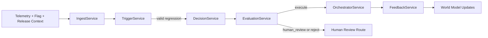

# Mesh Intelligence MVP Architecture

## Scope

`mesh-intelligence` is a bounded feature-flag remediation loop. It is not a generic autonomous
operator and it does not plan arbitrary remediation workflows.

## Runtime Shape



## Service Responsibilities

- `IngestService`: normalizes telemetry, feature-flag change data, deployment metadata, segment
  context, and post-action observations into a single event envelope.
- `TriggerService`: emits a trigger only when the flag changed recently, sample size is large
  enough, regression thresholds are crossed, persistence is proven, and suppression rules do not
  apply.
- `DecisionService`: produces exactly one bounded decision from the allowed set:
  `no_action`, `reduce_rollout`, `disable_flag`, `escalate`.
- `EvaluationService`: blocks unsafe decisions through schema validation, policy validation,
  Promptfoo-style reasoning checks, business-rule checks, and execution-readiness checks.
- `OrchestratorService`: executes only approved decisions through Goose-compatible adapters that
  touch the feature-flag provider, incident API, and audit log sink.
- `FeedbackService`: evaluates `T+10m` and `T+30m` observations, records the outcome, and emits
  world-model updates.

## Execution Boundary

Allowed side effects:

- feature-flag rollout changes
- incident or ticket creation
- audit-log writes

Disallowed side effects:

- source-code changes
- infrastructure mutation
- direct production database writes
- arbitrary shell execution against production

## Contract Files

Active shared contracts live in:

- `mesh-intelligence/scaffold/contracts/schemas/trigger.schema.json`
- `mesh-intelligence/scaffold/contracts/schemas/decision.schema.json`
- `mesh-intelligence/scaffold/contracts/schemas/evaluation-result.schema.json`
- `mesh-intelligence/scaffold/contracts/schemas/execution-record.schema.json`
- `mesh-intelligence/scaffold/contracts/schemas/feedback-record.schema.json`

## Verification

The package is verified with:

```bash
cd mesh-intelligence
python3 -m unittest discover -s tests -p 'test_*.py'
```

CLI-backed modes use subprocess runners inside the package. Persistent duplicate suppression state
defaults to `mesh-intelligence/.mesh-runtime-state/`.

The operator surface is `mesh-intelligence/run_tui.py`, which drives named scenarios through the
same pipeline and monitors the persisted run history plus duplicate-suppression state.
