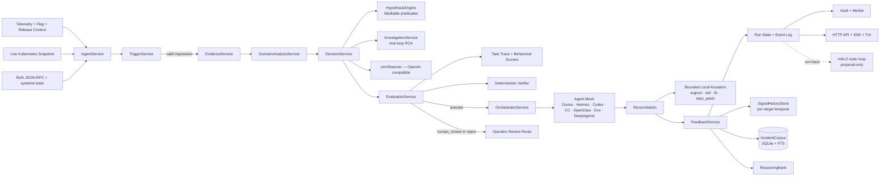
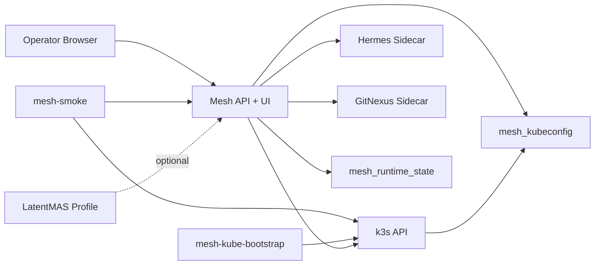
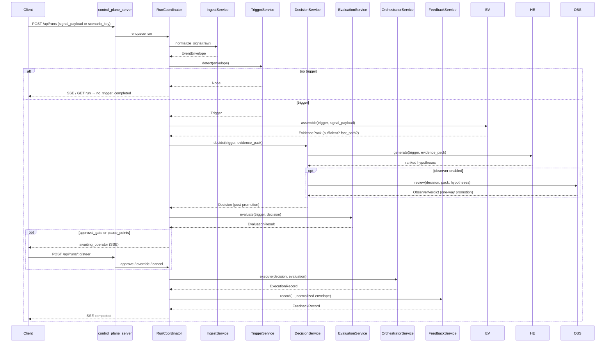

# Mesh Intelligence Architecture

## Scope

`mesh-intelligence` is an audited closed-loop SRE harness covering the full incident lifecycle:
**detect → investigate → raise → keep history**. It runs across three regression classes today:

1. **Feature-flag regressions** (latency / error / timeout deltas attributable to a flag flip).
2. **Kubernetes deployment regressions** (crash loops, OOM, image-pull failures, probe failures).
3. **Blockchain execution-node degradations** (Reth-class symptoms: peer starvation, sync stall,
   RPC degradation, consensus disconnect, JWT/exposure misconfigurations, disk pressure).

Across all three, Mesh treats an inbound alert as a *lead*, not the truth. Every run assembles an
audited evidence pack, ranks falsifiable hypotheses with a deterministic floor, optionally calls an
RCA harness for tool-loop investigation, runs an optional LLM observer, and applies a one-way
safety promotion before acting. The result is persisted with Merkle-rooted audit trails so the run
is independently replayable and provable.

It is an operator control plane with a fixed action surface, not a general autonomous platform for
arbitrary infra changes, code changes, or open-ended planning.

## Competitive positioning

Mesh sits in the "AI SRE" category alongside two reference points:

- **OpenSRE / opensre-cli** — open source SRE assistant; CLI agent for K8s troubleshooting.
  Mesh's [`services/benchmark/`](services/benchmark) plane runs head-to-head against `opensre-cli`
  as a registered provider.
- **Resolve.ai** — closed-source enterprise AI SRE; PagerDuty/Datadog ingestion, single-agent
  internal investigation, Slack/Teams escalation.

Mesh's edge over both is the harness shape itself, not the LLM:

| Capability | OpenSRE | Resolve.ai | Mesh |
|---|---|---|---|
| Multi-source ingest | Manual | Yes | Yes (webhooks + K8s watch + OTel + bare-metal) |
| Tool-calling investigation | Yes | Yes | Yes — `services/investigation/harness/` planner→critic→loop |
| Deterministic safety floor under LLM | No | No | Yes — `HypothesisEngine` falsifiable predicates |
| One-way observer safety promotion | N/A | N/A | Yes — observer can only escalate, never demote |
| Multi-agent ensemble at execution | Single agent | Single agent | Goose, Hermes, Codex, Claude Code, OpenClaw, Evo, DeepAgents |
| Reconciliation across competing agent attempts | No | No | Yes — `services/orchestrator/reconciliation.py` |
| Audit-grade run history | No | Internal-only | Yes — Merkle proofs per event, replayable |
| Long-tail incident corpus | No | Internal-only | Yes — `IncidentCorpusDatabase` + FTS, exportable |
| Per-target temporal memory | No | Limited | Yes — `services/signal_history/` (transient vs sustained) |
| Strategy memory (reasoning bank) | No | Limited | Yes — `shared/mesh_runtime/reasoning_bank.py` |
| Outer-loop self-improvement | No | No | Yes — HALO read-only run-trace consumer |
| Open source | Yes | No | Yes |

The hard differentiator is the *harness*: deterministic falsification + multi-agent ensemble +
audit-grade history. The LLMs themselves are commodity. A user can swap providers, swap agents,
swap models — the harness contracts hold.

## The four phases

Every Mesh run flows through four phases. The whole system is built around making each phase
inspectable, replayable, and bounded.

```mermaid
flowchart LR
    subgraph DETECT[1. DETECT]
        WH[Webhooks<br/>alertmanager, github, argocd]
        K8S[K8s watch + live signal]
        OTEL[OpenTelemetry]
        BARE[Bare-metal probes<br/>Reth/Lighthouse JSON-RPC]
        TRIG[TriggerService<br/>normalize → Trigger]
    end
    subgraph INVESTIGATE[2. INVESTIGATE]
        EV[EvidenceService<br/>audited pack + field_observability]
        HE[HypothesisEngine<br/>falsifiable predicates]
        INV[InvestigationService<br/>tool-loop RCA]
        SCEN[ScenarioAnalysis<br/>cross-run patterns]
        OBS[LlmObserver<br/>typed verdict, fail-open]
    end
    subgraph RAISE[3. RAISE]
        DEC[DecisionService<br/>bounded action set]
        AGM[Agent Mesh<br/>multi-agent fanout]
        REC[Reconciliation<br/>pick best attempt]
        ACT[Actuators<br/>argocd, ssh, lb, repo_patch]
        OPER[Operator pause/<br/>approve/override]
    end
    subgraph HISTORY[4. HISTORY]
        SS[(StateStore<br/>Postgres or SQLite)]
        MERKLE[Merkle proofs<br/>per event]
        VAULT[(Vault<br/>Obsidian markdown)]
        SH[SignalHistory<br/>per-target temporal]
        CORPUS[(IncidentCorpus<br/>SQLite + FTS)]
        RB[ReasoningBank<br/>strategy memory]
        HALO[HALO outer loop<br/>proposal-only patches]
    end

    DETECT ==> INVESTIGATE
    INVESTIGATE ==> RAISE
    RAISE ==> HISTORY
    HISTORY -.context.-> INVESTIGATE
    HISTORY -.proposal-only.-> DETECT
```



### 1. Detect

| Component | Source | Output |
|---|---|---|
| `services/ingest/webhook_service.py` | HTTP webhooks (alertmanager, GitHub, ArgoCD, custom) | EventEnvelope |
| `services/watchers/kubernetes.py` | K8s API watch | EventEnvelope |
| `services/ingest/kubernetes_live_signal.py` | K8s pull (cluster snapshot) | EventEnvelope |
| `services/ingest/otel_signal.py` | OpenTelemetry metrics | EventEnvelope |
| `services/ingest/bare_metal_node.py` | Reth/Lighthouse JSON-RPC + systemd | EventEnvelope |
| `services/trigger/service.py` | EventEnvelope → policy thresholds | Trigger contract |

Detection is **not** a single push endpoint. Telemetry is supplied per run via `POST /api/runs`
with `signal_payload` or `scenario_key`; the watchers and webhook service are the long-running
pumps that turn external events into `POST /api/runs` calls. There is no `/api/ingest` endpoint
by design — every detection becomes a run with a unique ID and a full event log.

### 2. Investigate

| Component | Role |
|---|---|
| `services/evidence/service.py` | Promotes the inbound signal to an audited evidence pack. Field-level observability (`observed` / `timeout` / `not_attempted`). Fast-path skip on credential/exposure signatures. |
| `services/decision/hypothesis_engine.py` | Generates ranked hypotheses from built-in templates (k8s + Reth signatures). Each hypothesis carries falsification predicates resolved against the evidence pack, AlertStore, InfraGraph, and ContextStore. **Posterior is computed only from probe-evaluated predicates** — see "Architectural invariants" below. |
| `services/investigation/service.py` + `harness/` | Tool-loop RCA via planner → critic → loop. Read-only by default; mutating tools cannot reach the registry. Bounded by `max_iterations` and `budget`. Fails non-fatally — investigation output is advisory; the deterministic decision path is authoritative. |
| `services/scenario_analysis/service.py` | Cross-run evidence, modular subdecisions, active-memory compaction. Produces a Merkle-bound advisory synthesis. |
| `services/observer/service.py` | LLM second pair of eyes. OpenAI-compatible + Anthropic native. Returns one of `approve` / `escalate` / `request_more_evidence` / `reject_unsafe`. Fail-open. |

The investigate phase is where Mesh's defense-in-depth lives: 5 distinct layers, each able to
promote toward escalation, none able to demote.

### 3. Raise

| Component | Role |
|---|---|
| `services/decision/service.py` | Produces exactly one bounded decision per signal class. Action surface enforced by `policies/autonomy.policy.json`. |
| `services/orchestrator/agent_mesh.py` | Fans the task out to multiple agents (Goose, Hermes, Codex, Claude Code, OpenClaw, Evo, DeepAgents). Each agent records a read-only proposal as an `AgentAttempt`. |
| `services/orchestrator/service_agents/registry.py` | Capability matrix — which agents can attempt which task classes. |
| `services/orchestrator/reconciliation.py` | Selects the best attempt across agents (or escalates if none meet the policy floor). |
| `services/actuators/` | Bounded side effects: `argocd.py` (GitOps), `systemd_ssh.py` (Reth restart over SSH), `load_balancer.py`, `repo_patch.py`. Gated by `policies/autonomy.policy.json`. |
| Operator surface | SSE + HTTP for pause / approve / override. Pauseable stages: `trigger_ready`, `decision_ready`, `evaluation_ready`, `feedback_ready`. |

The raise phase is where Mesh's multi-agent design lives. Resolve.ai's single-agent design has
no defense if the agent hallucinates. Mesh's reconciliation step compares attempts and rejects
ones with risk flags before any actuator fires.

### 4. History

| Component | Role |
|---|---|
| `shared/mesh_runtime/state_store_factory.py` | Selects backend at startup. Postgres is production; SQLite + JSON files is local-dev. |
| `shared/mesh_runtime/postgres_state.py` | Postgres backend. Migrations under `migrations/postgres/`. |
| `shared/mesh_runtime/control_plane_state.py` | SQLite + JSON-files backend. |
| `shared/mesh_runtime/merkle.py` | Per-event Merkle leaf hashing + snapshot building. Every run has a verifiable Merkle root and per-event inclusion proofs reachable via `/api/runs/:id/merkle/proof/:event_id`. |
| Vault | Obsidian-compatible markdown mirror — human-browsable run notes with backlinks, served at `/api/vault/...`. |
| `services/signal_history/store.py` | Per-target temporal ring buffer. Distinguishes "peer_count dipped to 1 once" (transient) from "peer_count has been at 1 for 5 ticks" (sustained partition). The decision service and the LLM observer query the same store; agreement on what "sustained" means is enforced by passing the same predicates to both. |
| `shared/mesh_runtime/corpus_store.py` | `IncidentCorpusDatabase` — SQLite + FTS-backed long-tail incident memory. Importable from JSONL exports. Project-able into the active-memory store for retrieval. |
| `shared/mesh_runtime/reasoning_bank.py` | Strategy memory across runs. Surfaces "this kind of incident usually responds to X" without prescribing it. |
| `shared/mesh_runtime/halo.py` | Outer-loop optimization sidecar. Reads run traces, produces proposal-only patches against the harness itself (path-allowlisted, never auto-merges). |

This phase is where Mesh has the strongest moat. Resolve.ai keeps history internal to its
SaaS; OpenSRE doesn't keep history at all. Mesh's history is on the customer's filesystem,
Merkle-proofed, replayable, and exportable as JSONL training data.

## Architectural invariants

Three invariants must hold for the system to be safe; every code change should be checked
against them.

1. **One-way safety promotion.** Every layer (trigger thresholds → policy → evidence sufficiency
   → hypothesis ranking → LLM observer) can only promote toward escalation. None can demote.
   A hallucinating model can therefore only make the system more conservative, never less safe.

2. **Deterministic posterior.** The hypothesis engine's posterior is computed only from
   evidence-grounded predicates — those whose `result` was set by a probe runner against the
   evidence pack. RCA-derived predicates (kind=`investigation_root_cause_candidate`) are
   excluded from posterior weight summation. RCA influence reaches the engine via:
   - synthetic `h_rca_*` hypotheses with prior anchored to the RCA confidence (visible in
     ranking + UI), and
   - the `supporting_evidence` / `disconfirming_evidence` lists (visible to operator UI and
     the observer prompt), but unweighted in `_posterior`.

   This invariant blocks LLM-confident-but-unverified RCA candidates from inflating
   non-`h_rca_*` hypotheses past the 0.55 promotion threshold via posterior math.

3. **Single-tenant by design.** A Mesh deployment monitors one operational fleet. The corpus
   stores (`corpus_store.py`, `incident_corpus.py`, `monitoring_corpus.py`) have no tenant
   predicate by design. Multi-tenant isolation would require every query in those modules
   to grow a tenant-id parameter — and that change is explicitly out of scope until a real
   multi-tenant deployment shape exists.

## Current Runtime Shape



## Main Layers

### Production boundary

- Runtime entrypoints are `run_server.py` / `control_plane_server.py` for the HTTP API and static web app, `run_tui.py` for the local TUI, `run_first_slice.py` for direct pipeline execution, and the Docker image `CMD` which runs `setup_integrations.py` before `run_server.py`.
- The static web bundle is served from `MESH_WEB_ASSET_PATH` and calls the same HTTP API under `/api/*`.
- Persistent state lives under `MESH_STATE_DIRECTORY`; autoresearch sessions live under `MESH_RESEARCH_DIRECTORY`; vault artifacts live under `MESH_VAULT_PATH`.
- Trust boundaries are explicit: external clients must be authenticated by a reverse proxy or private network because the app has no built-in auth; LLM provider keys are process/container secrets; kubeconfig is a read-only secret mount; Docker socket access is developer-only unless explicitly accepted; Hermes is an optional external integration boundary.
- Kubernetes is a foundational production path, but it has two separate requirements: the runtime must have a kubeconfig/context that passes the allowlists, and the API server endpoint inside that kubeconfig must be reachable from the container namespace. Local `localhost` kubeconfig server URLs generally fail inside containers unless rewritten to a container-reachable host, as the e2e scripts do for k3d.

### Local all-in-one topology

`docker-compose.stack.yml` is the local whole-system topology. It runs Mesh, dedicated Hermes and GitNexus sidecars, embedded k3s, a one-shot Kubernetes bootstrap job, and a one-shot smoke verifier in one Compose project.



This topology is not the production template. It intentionally uses a privileged k3s container, repository bind mounts, a Docker socket mount for the Hermes sidecar command path, and local published ports so the complete system can be launched and tested from one command. The production-like template remains `docker-compose.prod.yml`, which removes the repository bind mount and Docker socket and requires externally provided kubeconfig and allowlists.

### 1. Core remediation loop

- `IngestService` normalizes raw telemetry, flag metadata, deployment context, segment context,
  Reth/geth/Solana RPC snapshots, and post-action observations into one event envelope.
- `TriggerService` emits a trigger only when evidence is recent, persistent, above thresholds, and
  not suppressed.
- **`EvidenceService`** (in `services/evidence/`) promotes the inbound signal from a *lead* to an
  audited *evidence pack*. For Reth signals it stamps the snapshot as a separate run artifact with
  per-probe results, runs a sufficiency check (per `evidence_sufficiency` in
  `policies/reth-node.policy.json`), and short-circuits to a fast-path skip for credential or
  exposure signatures (`authrpc_exposed`, `rpc_exposed`, `jwt_missing`, `db_corruption_suspected`,
  `jwt_secret_insecure_permissions`). The pack is what every downstream stage reads — never the
  raw inbound signal directly.
- `ScenarioAnalysisService` records cross-run evidence, modular subdecisions, active-memory
  compaction, and a Merkle-bound advisory synthesis before final decision creation.
- `DecisionService` produces exactly one bounded decision from the allowed set per signal class:
  - **Feature-flag**: `no_action`, `reduce_rollout`, `disable_flag`, `escalate`,
    `investigate_and_patch`.
  - **Kubernetes**: `no_action`, `restart_deployment`, `rollback_deployment`, `patch_resources`,
    `escalate`.
  - **Reth node**: `no_action`, `restart_systemd_service` (approval-gated), `cordon_node`,
    `drain_node`, `escalate`.
  - The autonomy policy (`policies/autonomy.policy.json`) enumerates which `(system, action)`
    pairs are ever allowed; nothing else is reachable from this layer.
- `HypothesisEngine` (in `services/decision/hypothesis_engine.py`) generates ranked hypotheses
  with falsification predicates that resolve against the evidence pack, the AlertStore, the
  InfraGraph, the ContextStore, and (when present) an `InvestigationReport`. Today it carries
  templates for Kubernetes signatures (`crash_loop`, `oom_killed`, `image_pull_failure`,
  `probe_failure`) and Reth signatures (`peer_starvation`, `sync_stalled`, `rpc_degraded`).
  Output biases the deterministic decision one-way only — it can promote toward `escalate`
  but never demote an escalation.

  **Posterior math is invariant.** Posteriors are computed only from probe-evaluated
  predicates. RCA-derived predicates (`kind="investigation_root_cause_candidate"`) are
  excluded from `_posterior` weight summation. RCA candidates surface via synthetic `h_rca_*`
  hypotheses with priors anchored to RCA confidence, and via `supporting_evidence` /
  `disconfirming_evidence` lists. This blocks the confidence-laundering pathway whereby an
  LLM-confident root cause could otherwise inflate any matching deterministic hypothesis past
  the 0.55 promotion threshold without any probe support.
- `InvestigationService` (in `services/investigation/`) runs a tool-loop RCA harness when an
  evidence pack alone is insufficient to nail down the root cause. The harness has a
  planner→critic→loop shape with a registered tool catalog (`harness/registry.py`); read-only
  by default, mutating tools cannot reach the registry. Bounded by `max_iterations` and
  `budget_cost`. **Investigation output is advisory only.** If it times out, crashes, or
  fails the critic's checks, the deterministic decision path remains authoritative.
  The harness emits `InvestigationReport` carrying ranked `RcaCandidate` rows; those flow
  into `HypothesisEngine.generate(investigation_report=...)` and surface as synthetic
  hypotheses without inflating the deterministic posterior. CloudOps and Reth domain
  ports are wired in (`services/investigation/cloudops_*.py`, `services/investigation/reth_*.py`).
- `LlmObserver` (in `services/observer/`) is an optional second-opinion layer that reviews the
  deterministic decision and emits a typed verdict. See *AI reasoning layer* below.
- `EvaluationService` merges policy and business gates with Mesh-native trajectory scoring:
  `task -> trace -> verifier -> scorer -> memory`.
- `OrchestratorService` executes only approved actions and attaches Goose-backed review artifacts.
- `FeedbackService` evaluates `T+10m` and `T+30m` outcomes and writes bounded world-model updates.

### 2. Control plane

- `services/control_plane.py` coordinates long-lived runs, operator pauses, overrides, approvals,
  and run lifecycle state.
- `control_plane_server.py` exposes HTTP APIs plus SSE streams for run and system updates.
- `run_server.py` serves the browser UI; `run_tui.py` exposes the same system through the TUI.
- Runs persist to `.mesh-runtime-state/` and are mirrored into the Obsidian-compatible vault with
  Merkle roots and proofs.

#### HTTP API (singular calls)

There is **no** standalone `/api/ingest` route. **Telemetry** is supplied as JSON on run creation:
either `signal_payload` (full raw signal) or `scenario_key` (loads a fixture under
`fixtures/signals/`). When a run reaches the `ingesting` stage, `IngestService.normalize_signal`
runs **in-process** on that payload, then `TriggerService` and the rest of the loop execute.

| Method | Path | Role |
| --- | --- | --- |
| `GET` | `/api/health` | Liveness probe |
| `GET` | `/api/readiness` | Integration readiness (Promptfoo, Goose, Hermes, etc.) |
| `GET` | `/api/scenarios` | List fixture-backed scenario keys |
| `GET` | `/api/goals` | List goals |
| `POST` | `/api/goals` | Create a goal |
| `GET` | `/api/runs` | List runs |
| `POST` | `/api/runs` | **Start a run** — body includes goal, modes, and **`signal_payload` or `scenario_key`** (ingest input) |
| `GET` | `/api/runs/:id` | Run snapshot |
| `POST` | `/api/runs/:id/steer` | Operator command (`approve`, `cancel`, overrides, etc.) |
| `GET` | `/api/runs/:id/events` | Paged run events (`?after=` sequence) |
| `GET` | `/api/runs/:id/merkle` | Merkle snapshot for the run |
| `GET` | `/api/runs/:id/merkle/proof/:event_id` | Proof for one event |
| `GET` | `/api/vault/tree` | Vault path tree |
| `GET` | `/api/vault/document?path=...` | Read one vault document |
| `GET` | `/api/stream/runs/:id` | **SSE** — live run events |
| `GET` | `/api/stream/system` | **SSE** — system-wide updates |

Static assets under the same server serve the browser operator UI (see `README.md` for defaults).

#### Telemetry in, services out (end-to-end flow)

Telemetry is **not** pushed service-by-service over HTTP. One **`POST /api/runs`** (or the equivalent action in the UI) carries the **raw signal** JSON (`signal_payload` or fixture from `scenario_key`). A background worker then runs **`MeshRuntimeEngine`** in-process inside `RunCoordinator._execute_run` (`services/control_plane.py`), which chains the same calls as `MeshRuntimeEngine.run_sync` (`services/runtime.py`).

**1. HTTP: admit work**

| Step | Caller → callee | What moves |
| --- | --- | --- |
| Start run | Client → `POST /api/runs` | Body: `goal_id`, `evaluation_mode`, `orchestration_mode`, `steering_mode`, optional `pause_points`, and **`signal_payload`** *or* **`scenario_key`** |
| Observe | Client → `GET /api/stream/runs/:id` (SSE) | Server pushes run events as stages advance |
| Inspect | Client → `GET /api/runs/:id`, `GET /api/runs/:id/events` | Snapshots and paged history |
| Steer | Client → `POST /api/runs/:id/steer` | `approve`, `cancel`, `override_*`, `resume`, etc., when the run is at `awaiting_operator` |

**2. In-process pipeline (single thread per run, after queue)**

| Order | Service / method | Input → output | Run stage surfaced |
| --- | --- | --- | --- |
| 1 | `IngestService.normalize_signal` | Raw signal dict → `EventEnvelope` | `ingesting` |
| 2 | `TriggerService.detect` | Envelope → `Trigger` or `None` | `trigger_ready` or `no_trigger` (then terminal if no trigger) |
| 3 | `EvidenceService.assemble` | `Trigger` + signal payload → `EvidencePack` (audited) | `evidence_pack_ready` (emits per-probe events) |
| 4 | `ScenarioAnalysisService.analyze` | `Trigger` + recent run/memory context → `ScenarioAnalysis` | `scenario_analysis_ready` |
| 5 | `DecisionService.decide` | `Trigger` + analysis + `EvidencePack` → `Decision` | `decision_ready` (calls `HypothesisEngine` and, if enabled, `LlmObserver`) |
| 6 | `EvaluationService.evaluate` | `Trigger`, `Decision` → `EvaluationResult` plus `task_trace`, `trajectory_score`, `verifier_output`, `phoenix_spans` | `evaluation_ready` |
| — | *Operator gate* | If approval mode or failed auto conditions: **`awaiting_operator`** until `POST .../steer` | `awaiting_operator` |
| 7 | `OrchestratorService.execute` | `Decision`, `EvaluationResult` → `ExecutionRecord` | `executing` (may invoke Goose bridge when not `native`) |
| 8 | `FeedbackService.record` | Trigger, decision, execution, envelope → `FeedbackRecord` | `feedback_ready` (optional pause same as step 6) |
| 9 | Control plane | Session + artifacts + vault/Merkle | `completed` / `failed` / `cancelled` |

Overrides (`override_decision`, `override_execution_parameters`) cause **re-evaluation**: `decide` is not re-run from scratch in all cases, but evaluation is run again with the updated decision path before execution resumes.

The evidence stage is the only one that may emit *multiple* run events for one logical step:
`evidence_pack_assembling` (entry), one `evidence_probe_completed` per probe run, then
`evidence_pack_ready`. This makes the audit trail show exactly what was looked up and how long
each lookup took, even when the pack is built from the inbound signal alone (the no-op probe
runner case).

**3. Non-HTTP entry (same pipeline)**

`run_first_slice.py` and tests call `MeshRuntimeEngine.run_sync(raw_signal, ...)` directly: same method chain as rows 1–6 above, without `POST /api/runs` or operator pauses.



(The `EV` participant is `EvidenceService`; `HE` is `HypothesisEngine`; `OBS` is `LlmObserver`.
Both `HE` and `OBS` are called inside `DecisionService.decide` rather than as separate stages on
the run timeline — they are *part of the decision*, not standalone gates, and their outputs are
stamped onto `decision.reasoning` for audit.)

### 3. Multi-agent ensemble + reconciliation

The orchestrator is **not** a single-agent design. `services/orchestrator/agent_mesh.py` fans
each task out to multiple agents and `services/orchestrator/reconciliation.py` selects the
best attempt (or escalates if no attempt clears the policy floor).

| Adapter | Module | Capability |
|---|---|---|
| Goose | `goose_adapter.py`, `goose_bridge.py` | Code-review-style structured response + bounded actuation |
| Hermes | `hermes_adapter.py`, `hermes_bridge.py` | NousResearch Hermes agent runtime |
| Claude Code | `cli_executor.py` (`adapter="claudecode"`) | Anthropic CLI agent |
| Codex | `cli_executor.py` (`adapter="codex"`) | OpenAI Codex CLI |
| OpenClaw | `cli_executor.py` (`adapter="openclaw"`) | Open-source claw agent |
| Evo | `evo_launcher.py` (`adapter="evo"` / `"native_contract"`) | Evolutionary plan search |
| DeepAgents | `deepagents_adapter.py` | DeepAgents harness (subagent topology) |
| LatentMAS | `latentmas_adapter.py`, `latentmas_server.py` | Rust sidecar for low-latency latent inference |

`services/orchestrator/service_agents/registry.py` carries the capability matrix —
which agents are eligible for which task class. The reconciliation step compares each
attempt's `recommended_action`, `risk_flags`, and `selected_attempt_id`, then either
promotes one winner or escalates.

This is the headline differentiation against Resolve.ai's single-agent design. A hallucinating
single agent has no defense; an ensemble + reconciliation has multiple distinct attempts to
disagree.

### 3a. Evaluation bridges

- `native` mode (default) keeps everything local and in-process using `services/evaluation/mesh_eval/`.
- `promptfoo` mode uses `services/evaluation/promptfoo_bridge.py` to run real `promptfoo eval`,
  parse exported JSON, and return structured evaluation artifacts.
- `goose` mode uses `services/orchestrator/goose_bridge.py` to run a real Goose review step,
  capture structured review metadata, and then perform bounded local actuation.
- Agent mesh tasks use `services/orchestrator/agent_mesh.py` and `shared/mesh_runtime/agent_workers.py`
  to record read-only worker proposals for Goose, Hermes, Codex, Claude Code, OpenClaw, Evo, and native
  orchestration platform lanes for Airflow, Temporal, Dagster, Prefect, Flyte, Luigi, Oozie, Kubernetes,
  and n8n. These artifacts let agents and external orchestrators plug into Mesh without getting production
  write access; Mesh still owns evaluation, tests, audit, Kubernetes actuation, and promotion gates.

### 3b. Memory layer (history that informs future runs)

| Module | Role |
|---|---|
| `services/signal_history/store.py` | Per-target ring buffer of recent envelopes + `Trend` extractor. Distinguishes transient from sustained at the data layer (`duration_below_floor_seconds`, `sustained_below_floor`). |
| `shared/mesh_runtime/active_memory.py` | Active retrieval scope used by ScenarioAnalysisService and the LLM observer. |
| `shared/mesh_runtime/reasoning_bank.py` | Strategy memory across runs — which approaches have worked for similar incident patterns. |
| `shared/mesh_runtime/corpus_store.py` (`IncidentCorpusDatabase`) | SQLite + FTS-backed long-tail incident memory. Importable from JSONL exports; project-able into active memory. |
| `shared/mesh_runtime/incident_corpus.py` | Normalizes Mesh run artifacts into corpus rows. |
| `shared/mesh_runtime/monitoring_corpus.py` | Catalog of public + private monitoring datasets used as bootstrap material. |
| `shared/mesh_runtime/memory_lifecycle.py`, `memory_scoring.py`, `memory_verifier.py` | Compaction, scoring, and verification of memory entries. |

The memory layer is single-tenant by design — see invariant 3 above. It is also append-only
at the run level: every run writes new events, never mutates old ones. Replay is therefore
deterministic.

### 3c. Benchmark plane (head-to-head against competitors)

`services/benchmark/` is a benchmark harness that lets Mesh run side-by-side against
**registered competitor providers** on the same scenario set. The runner accepts:

| Provider | Backend behavior |
|---|---|
| `mesh` | Mesh's full pipeline, native mode |
| `mesh-control-plane` | Mesh via the HTTP control plane (round-trip through `POST /api/runs`) |
| `mesh-agentic` | Mesh with the agent ensemble enabled (DeepAgents fabric) |
| `opensre-cli` | OpenSRE CLI as an external subprocess |
| `sregym` | SREGym MCP-style server (`services/benchmark/sregym_agent.py`) |
| `cloudopsbench` | CloudOpsBench scenarios (Microsoft's benchmark suite, imported via `cloudopsbench_import.py`) |

Subcommands:

- `run` — execute a suite against a backend; emit per-scenario scorecards
- `gate` — run + apply gate thresholds; non-zero exit on regression
- `compare` — diff two run directories
- `gaps` — generate a capability gap report (what does provider X get wrong that Mesh gets right?)
- `extract-loghub` — pull scenarios from a local Loghub corpus

The benchmark plane is what makes "compete with OpenSRE" a falsifiable claim, not marketing.
A nightly run produces `benchmarks/benchmark_gates.json` with regression-capped scoring.

### 4. AI reasoning layer (LLM observer)

The deterministic engine is the safety floor; the AI observer is a second pair of eyes.

- **Modular and provider-neutral.** The observer in `services/observer/` speaks two protocols:
  the OpenAI `/v1/chat/completions` shape (works with OpenAI, vLLM, Ollama, Together, Groq,
  OpenRouter, llama.cpp's OpenAI shim) and Anthropic's native `/v1/messages` API. Switching
  providers is a config change — `MESH_OBSERVER_PROVIDER`, `MESH_OBSERVER_BASE_URL`,
  `MESH_OBSERVER_MODEL`, `MESH_OBSERVER_API_KEY`. Disabled by default.
- **Typed verdict.** The observer reads the trigger, the evidence pack, the ranked hypotheses,
  and the deterministic decision-in-progress, then returns one of four verdicts:
  - `approve` — the decision is grounded and safe; no change.
  - `escalate` — route to a human even if the engine proposed an automated action.
  - `request_more_evidence` — pack is too sparse to defend the action.
  - `reject_unsafe` — proposed action is unsafe given the node's state (validator mid-attestation,
    DB at corruption risk on shutdown, etc.).
- **One-way safety promotion.** Verdicts can only push the decision toward more conservative
  outcomes (`approve` ≤ `escalate` ≤ `reject_unsafe`/`request_more_evidence`). The observer can
  promote a `restart_systemd_service` to `escalate`; it cannot demote an `escalate` to `approve`.
  A hallucinating model can therefore only make the system more conservative, never less safe.
- **Fail-open.** Provider down, timeout, malformed JSON, unknown verdict — every failure mode
  collapses to `verdict=approve` with the failure stamped on `error`, and the deterministic
  decision stands. The observer cannot block the pipeline.
- **Prompt caching.** The static prefix (system instructions, policy file, action allowlist,
  hypothesis-template descriptions) is structured to be cache-prefix-stable. On Anthropic the
  observer sends an explicit `cache_control: ephemeral` marker on the system block. Per-run
  evidence is the only uncached portion, keeping repeat-call latency and cost low.
- **Defense in depth.** The observer is layer 5 of a 5-layer architecture: (1) trigger
  thresholds, (2) deterministic policy match, (3) evidence sufficiency check, (4) hypothesis
  ranking with falsification predicates, (5) LLM observer. Each layer can promote toward
  escalation; none can demote.

## Run Lifecycle

Each run advances through explicit stages:

1. `queued`
2. `ingesting`
3. `trigger_ready` or `no_trigger`
4. `evidence_pack_ready` (Reth signals; no-op pass-through for other types)
5. `scenario_analysis_ready`
6. `decision_ready`
7. `evaluation_ready`
8. `awaiting_operator`
9. `executing`
10. `feedback_ready`
11. `completed`, `failed`, or `cancelled`

The control plane records typed run events for these transitions and stores artifact metadata such
as `artifact_key`, `integration_name`, and `status` so the existing event log can later back a real
event bus or projection layer.

Per-stage events of note:

- `evidence_pack_assembling`, `evidence_probe_completed` (one per probe), `evidence_pack_ready`
- `hypothesis_ranked` (when the engine produces a non-empty ranking)
- `decision_ready` carries the observer verdict on `decision.reasoning.observer_verdict` when
  the observer is enabled

Pauseable stages (when `default_steering_mode=approval_gate` or operator-set pause points):
`trigger_ready`, `decision_ready`, `evaluation_ready`, `feedback_ready`. The evidence stage is
**not** pauseable — it's fast, audited, and not a decision point.

## Persistence Model

The current durable backbone is local file-backed state under `.mesh-runtime-state/`:

- run sessions and goal records
- per-run event logs
- run snapshots
- duplicate-evaluation suppression state
- integration readiness snapshots
- vault documents and Merkle proofs

This is intentionally the short-term persistence layer. It is replay-friendly, but it is not yet a
broker/database-backed production event system.

## Execution Boundary

Allowed side effects:

- feature-flag rollout changes
- incident or ticket creation
- audit-log writes
- approval-gated `systemctl restart` of allowlisted blockchain-node services on allowlisted hosts
  via the SSH adapter (see `MESH_SSH_*` env vars + `policies/reth-node.policy.json`)
- approval-gated Kubernetes `rollout restart`, `rollback`, and `patch` on allowlisted contexts and
  namespaces (see `MESH_KUBERNETES_*` env vars + `policies/autonomy.policy.json`)

Disallowed side effects:

- source-code changes
- infrastructure mutation outside the allowlists above
- direct production database writes
- arbitrary shell execution against production
- any of the actions in `policies/reth-node.policy.json#forbidden_automated_actions`
  (delete datadir, restore snapshot, rewrite JWT, change pruning mode, client up/downgrade)

## Contracts

Active shared contracts live in:

- `shared/mesh_runtime/schemas/trigger.schema.json`
- `shared/mesh_runtime/schemas/decision.schema.json` (now permits
  `reasoning.ranked_hypotheses` and `reasoning.observer_verdict`)
- `shared/mesh_runtime/schemas/evaluation-result.schema.json`
- `shared/mesh_runtime/schemas/execution-record.schema.json`
- `shared/mesh_runtime/schemas/feedback-record.schema.json`
- `shared/mesh_runtime/schemas/reth-node-signal.schema.json` (also serves as the evidence pack
  shape — signal and pack are intentionally byte-compatible)
- `shared/mesh_runtime/schemas/kubernetes-signal.schema.json`
- `shared/mesh_runtime/schemas/otel-metric-signal.schema.json`

Policy files in `policies/` carry the operator-tunable thresholds:

- `autonomy.policy.json` — allowed `(system, action)` pairs, idempotent flags
- `reth-node.policy.json` — restartable vs escalation signatures, `evidence_sufficiency` block,
  forbidden automated actions, restart-rate limits
- `metric-actions.policy.json` — OTel signal → action mappings (~40 rules)
- `protected-scope.policy.json` — services / endpoints off-limits for autonomy
- `rollback.policy.json` — rollback-frequency caps

These schemas back the Python contract models in `shared/mesh_runtime/contracts.py`.

## Operator Surfaces

- Browser control plane: primary interface for goals, scenarios, run inspection, readiness, vault
  browsing, and Merkle proofs.
- TUI: terminal-native scenario runner and run-history inspector.
- Synchronous runner: `run_first_slice.py` for stdin/stdout execution of the same bounded loop.

## What Is Real Today

### Detect

- Webhook ingest + auto-run wiring: **yes**
- Kubernetes watch daemon (`services/watchers/kubernetes.py`): **yes**
- Kubernetes pull-based live signal: **yes**
- OpenTelemetry metric ingest: **yes**
- Bare-metal Reth/Lighthouse JSON-RPC ingester: **yes**
- TriggerService with thresholds, persistence, suppression: **yes**

### Investigate

- Audited evidence pack stage (all signal types): **yes**
- Field-level observability (`observed` / `timeout` / `not_attempted`): **yes**
- Fast-path skip on credential/exposure signatures: **yes**
- Hypothesis engine with falsification predicates: **yes** (k8s + Reth templates wired; Solana /
  geth / archive-specific templates pending)
- Investigation/RCA tool-loop harness (`services/investigation/harness/`): **yes** (CloudOps and
  Reth domain ports wired; planner→critic→loop with budget bounds; read-only by design)
- RCA candidates wired into hypothesis ranking with deterministic-posterior invariant: **yes**
- ScenarioAnalysisService for cross-run patterns + Merkle-bound advisory synthesis: **yes**
- Modular OpenAI-compatible + Anthropic-native LLM observer with one-way safety promotion and
  prompt caching (`cache_control: ephemeral` on system block, default `prompt_cache_mode=explicit`):
  **yes**
- DeepEval-backed offline observer-quality regression (`simulation/eval_observer.py`): **yes**
- Live JSON-RPC probe runner driven by the evidence service: **no** — current evidence path
  passes through the inbound signal; probes happen via the existing `RethNodeIngester` for
  cron-driven flows. Pluggable `probe_runner` parameter is wired but no production runner is
  yet attached.
- Diagnostic-action class (operator-approvable read-only probes that run as audited actions):
  **no** — phase 3 work
- Validator attestation-duty awareness for execution-node restarts: **no** — phase 3 work; needs
  CL-client-specific probes (Lighthouse REST, Prysm gRPC, …)

### Raise

- Multi-agent ensemble (Goose, Hermes, Codex, Claude Code, OpenClaw, Evo, DeepAgents,
  LatentMAS sidecar): **yes** for the adapter shells; per-agent CLI/runtime availability is
  per-environment
- Reconciliation across competing agent attempts: **yes**
- Service-agent capability registry: **yes**
- ArgoCD GitOps actuator: **yes**
- systemd-SSH actuator with allowlist + approval gate: **yes**
- Load balancer actuator: **yes**
- Repo-patch actuator (creates a config patch PR): **yes**
- Operator pause / approve / override via SSE + HTTP: **yes**
- Real Promptfoo CLI-backed evaluation bridge: **yes**
- Real Goose CLI-backed review bridge: **yes**

### History

- Postgres state-store backend: **yes**
- SQLite + JSON-files state-store backend: **yes**
- Per-event Merkle proofs reachable via `/api/runs/:id/merkle/proof/:event_id`: **yes**
- Vault mirroring with Obsidian-compatible markdown + backlinks: **yes**
- SignalHistoryStore with `sustained_below_floor` predicates shared between decision and
  observer: **yes**
- IncidentCorpusDatabase (SQLite + FTS) with JSONL import + retrieval: **yes**
- ReasoningBank strategy memory: **yes**
- HALO outer-loop optimization (read-only run-trace consumer, proposal-only patches,
  path-allowlisted): **yes**
- Memory lifecycle / scoring / verification: **yes**
- External message bus or database projection: **no**
- Durable world-model store beyond bounded feedback updates: **no**
- Open-ended diagnosis/planning or arbitrary execution: **no** (intentionally)

### Benchmarking + simulation

- Fault-injection simulation harness (`simulation/`) with 26 scenarios + Reth/Lighthouse Docker
  demo (`docker-compose.reth-demo.yml`) + chaos injector: **yes**
- Benchmark plane runner with provider matrix (mesh, mesh-control-plane, mesh-agentic,
  opensre-cli, sregym, cloudopsbench): **yes**
- Gate profiles + threshold overrides: **yes**
- Cross-run comparison + capability gap reports: **yes**
- CloudOpsBench scenario import: **yes**
- Loghub scenario extraction: **yes**

## Verification

Primary verification command:

```bash
python3 -m unittest discover -s tests -v
```

Secondary verification — fault-injection harness with the AI observer engaged:

```bash
export ANTHROPIC_API_KEY=sk-ant-...
MESH_OBSERVER_MODEL=claude-haiku-4-5-20251001 python -m simulation
# or for a sustained noise burst:
MESH_OBSERVER_MODEL=claude-haiku-4-5-20251001 python -m simulation --mode cron --duration 600 --interval 15
```

The simulation drives 26 fault scenarios through `MeshRuntimeEngine.run_sync` and produces a
markdown report in `.mesh-runtime-state/simulation/` scoring observer behavior (verdict
distribution, evidence-citation rate, escalation precision) alongside deterministic accuracy.

Key test coverage includes:

- contract validation
- pipeline behavior (ingest → trigger → evidence → decision → evaluation → orchestrator → feedback)
- integration bridge parsing
- control-plane HTTP flows
- TUI/controller behavior
- evidence service: policy override loading, fast-path skip, sufficiency check
- LLM observer: verdict parsing, fail-open behavior, retry budget bounding, JSON extraction
  from fenced responses
- hypothesis engine: Reth template ranking, cascade-case ordering (consensus_disconnect must
  outrank local_isolation when EAPI is down)
- decision service: one-way safety promotion, fast-path force-escalate
- investigation harness: planner / critic / loop termination / tool registry / RCA candidate
  scoring (substring-tightened — `_evidence_kind_matches` token-subset prevents false positives
  like `oom` matching `boom`)
- benchmark harness: provider matrix, gate thresholds, scoring, comparison, gap reports

## Competitive deep-dive

Mesh is positioned to displace OpenSRE for self-hosted SRE teams and Resolve.ai for teams that
care about audit, multi-agent defense, or open-source data ownership. This section is the
honest version — what each competitor has that Mesh doesn't, and where Mesh wins.

### vs OpenSRE / opensre-cli

OpenSRE is an open-source CLI agent for K8s troubleshooting. It's a **single-shot tool**: you
invoke it, it reads cluster state, it suggests an action. No history, no event log, no
multi-agent ensemble, no audit trail.

Where OpenSRE wins:
- Lower bar to install (single binary)
- Simpler mental model (one tool, one process)
- Faster cold start

Where Mesh wins:
- Closed-loop remediation, not just diagnosis
- Audit-grade history with Merkle proofs (regulated environments need this)
- Multi-agent ensemble + reconciliation (defense vs hallucination)
- Falsifiable hypothesis engine (deterministic floor)
- LLM observer with one-way safety promotion (extra layer of defense)
- Long-tail incident corpus (gets smarter over time)
- Per-target temporal memory (transient vs sustained)
- Bench plane that can run OpenSRE itself as a registered provider — Mesh literally races OpenSRE
  on the same scenarios and emits the comparison report

The benchmark gap report (`services/benchmark/gaps.py`) is specifically designed to surface
"what does provider X get wrong that Mesh gets right?" — turning the comparison into actionable
gap categories.

### vs Resolve.ai

Resolve.ai is a closed-source SaaS SRE assistant. It's well-funded and has polished UX for
PagerDuty/Slack integration. The architectural shape is different from Mesh in three ways
that matter for trust:

| | Resolve.ai | Mesh |
|---|---|---|
| Investigation agent | Single proprietary agent | Ensemble: 7+ agent adapters + reconciliation |
| Where data lives | Resolve's SaaS | Customer's filesystem / Postgres |
| Audit trail | Internal (you trust them) | Merkle-rooted, customer-verifiable |
| Hypothesis layer | LLM-only | Deterministic falsification engine + LLM |
| Open source | No | Yes |

Where Resolve wins:
- Slack/Teams polish and onboarding flow
- Hosted infra — nothing to operate
- A sales team
- Better marketing surface; more enterprise logos

Where Mesh wins:
- You own your incident data; you can export the corpus as JSONL
- Multi-agent ensemble = defense in depth against any single agent's hallucinations
- Falsifiable hypothesis engine = deterministic safety floor under the LLM
- One-way safety promotion at every layer = a hallucinating model can only escalate, never auto-act
- Replayable runs with cryptographic audit trails = SOC2 / FedRAMP / on-prem-regulated friendly
- HALO outer loop = the harness improves itself from your run history (proposal-only patches)

### What Mesh is NOT trying to be

This is as important as the differentiation. Mesh deliberately doesn't compete on:

- **Open-ended autonomy.** Mesh's action set is bounded by `policies/autonomy.policy.json`.
  No arbitrary `kubectl exec`, no shell-out-and-figure-it-out. If you want that, you want
  Cursor agents in production, which is a different (and dangerous) product.
- **Multi-cloud breadth.** Mesh today is K8s + bare-metal Reth + feature-flag tooling. Adding
  AWS Lambda / Cloud Run / serverless requires real work — not a plugin point that's "almost
  there."
- **Pure RCA tools without remediation.** That's OpenSRE's space. Mesh doesn't ship an RCA
  CLI; it ships a closed-loop harness where RCA is one stage of many.
- **Multi-tenant SaaS.** Mesh is single-tenant by design (invariant 3). Adding multi-tenancy
  is a fork, not a feature flag.

### Roadmap pressure points

Real gaps that competitors will exploit until closed:

1. **Detection breadth.** OpenTelemetry ingest works but the trigger thresholds are tuned for
   Reth/K8s. Generic webapp microservice signatures (`p99_latency_above`,
   `error_rate_step_change`, `traffic_drop`) need real templates.

2. **Probe runner.** The `EvidenceService` accepts a `probe_runner` callable but no production
   runner is attached. Currently Mesh consumes inbound signal as the "evidence." Production
   needs a probe runner that can call `kubectl get`, `kubectl logs`, JSON-RPC, etc., on
   demand from the evidence stage.

3. **Validator-duty awareness.** For Reth restarts, Mesh needs to query the consensus client
   (Lighthouse / Prysm) to confirm no attestation is imminent before allowing restart. Wired
   in policy but no live probe yet.

4. **PagerDuty / Slack escalation actuator.** Today escalations terminate at "operator
   review" via SSE. A production deploy needs a registered actuator that fires the alert
   into PagerDuty / Slack / OpsGenie with a deep link back to the run.

5. **Diagnostic-action class.** Some operations (Reth `eth_syncing`, `kubectl get events`)
   are read-only but operationally meaningful. They should be a separate action class —
   approvable like a remediation, but recorded and time-bounded — rather than embedded in
   the probe runner.

6. **Multi-agent SLAs.** With 7+ agent adapters, agent latency variance becomes a tail risk.
   Reconciliation needs an explicit timeout per agent + a budget for the ensemble as a whole.

These are not blockers. They are the items the next reviewer will ask about, and the team
should ship them before scaling beyond friendly users.
