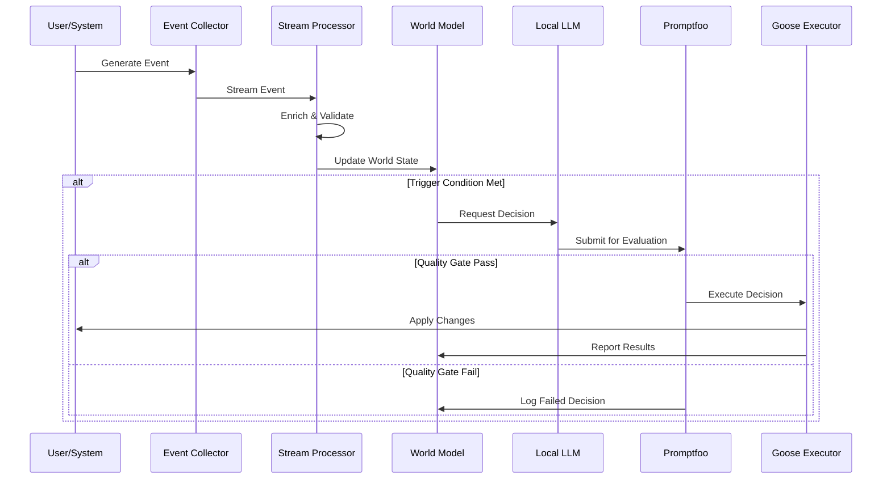

# Mesh Intelligence Data Flows & Component Interactions

## Data Flow Patterns

### 1. Real-Time Event Processing Flow



### 2. Decision Generation Flow

```mermaid
graph LR
    subgraph "Trigger Detection"
        A[Event Stream] --> B[Pattern Matcher]
        B --> C[Threshold Monitor]
        C --> D[Anomaly Detector]
    end
    
    subgraph "Context Building"
        D --> E[Context Aggregator]
        E --> F[Historical Lookup]
        F --> G[User Segmentation]
        G --> H[Business Rules Engine]
    end
    
    subgraph "Decision Generation"
        H --> I[LLM Prompt Builder]
        I --> J[Local LLM]
        J --> K[Decision Parser]
        K --> L[Confidence Scorer]
    end
    
    subgraph "Quality Assurance"
        L --> M[Security Scanner]
        M --> N[Impact Predictor]
        N --> O[Business Logic Validator]
        O --> P[Quality Gate]
    end
    
    subgraph "Execution"
        P -->|Pass| Q[Goose Executor]
        P -->|Fail| R[Human Review Queue]
        Q --> S[Action Results]
        R --> S
    end
```



## Component Interaction Patterns

### 1. Event Collection & Enrichment

#### Raw Event Ingestion
```python
class EventCollector:
    def collect(self, raw_event: dict) -> Event:
        # Validate event schema
        validated = self.schema_validator.validate(raw_event)
        
        # Enrich with metadata
        enriched = self.enrichment_engine.enrich(validated)
        
        # Route to appropriate stream
        self.router.route(enriched)
        
        return Event(enriched)

class EnrichmentEngine:
    def enrich(self, event: dict) -> dict:
        enrichments = {
            'user_context': self.user_service.get_context(event.get('user_id')),
            'session_state': self.session_tracker.get_state(event.get('session_id')),
            'feature_flags': self.feature_service.get_flags(event.get('user_id')),
            'ab_experiments': self.experiment_service.get_assignments(event.get('user_id')),
            'system_health': self.health_monitor.current_status()
        }
        
        return {**event, **enrichments}
```

#### Stream Processing Pipeline
```python
class StreamProcessor:
    def __init__(self):
        self.processors = [
            ValidationProcessor(),
            EnrichmentProcessor(),
            AggregationProcessor(),
            TriggerDetectionProcessor()
        ]
    
    def process(self, event_stream: Iterator[Event]) -> Iterator[ProcessedEvent]:
        for event in event_stream:
            processed = event
            for processor in self.processors:
                processed = processor.process(processed)
                if processed is None:  # Filtered out
                    break
            
            if processed:
                yield processed

class TriggerDetectionProcessor:
    def __init__(self):
        self.triggers = [
            UserChurnRiskTrigger(),
            PerformanceDegradationTrigger(),
            FeatureAdoptionTrigger(),
            SecurityAnomalyTrigger()
        ]
    
    def process(self, event: ProcessedEvent) -> ProcessedEvent:
        for trigger in self.triggers:
            if trigger.should_trigger(event):
                event.add_trigger(trigger.create_trigger_context())
        
        return event
```

### 2. World Model Updates

#### Continuous Learning Pattern
```python
class WorldModelUpdater:
    def __init__(self, product_model, business_model):
        self.product_model = product_model
        self.business_model = business_model
        self.update_queue = asyncio.Queue()
    
    async def continuous_update(self):
        while True:
            events = await self.collect_batch()
            
            # Update models in parallel
            await asyncio.gather(
                self.product_model.update(events),
                self.business_model.update(events)
            )
            
            # Trigger downstream updates
            await self.notify_subscribers(events)
    
    async def collect_batch(self, batch_size: int = 100) -> List[Event]:
        batch = []
        while len(batch) < batch_size:
            try:
                event = await asyncio.wait_for(
                    self.update_queue.get(), timeout=1.0
                )
                batch.append(event)
            except asyncio.TimeoutError:
                break  # Process partial batch
        return batch
```

#### Model State Synchronization
```python
class ModelStateSynchronizer:
    def __init__(self):
        self.vector_store = VectorStore()
        self.time_series = TimeSeriesDB()
        self.graph_db = GraphDB()
    
    def sync_user_model(self, user_id: str, events: List[Event]):
        # Update vector embeddings
        behavior_vector = self.compute_behavior_embedding(events)
        self.vector_store.upsert(f"user:{user_id}", behavior_vector)
        
        # Update time series metrics
        metrics = self.extract_metrics(events)
        self.time_series.write(f"user_metrics:{user_id}", metrics)
        
        # Update graph relationships
        relationships = self.extract_relationships(events)
        self.graph_db.update_relationships(user_id, relationships)
```

### 3. Decision Generation & Evaluation

#### Context-Aware Decision Generation
```python
class ContextAwareDecisionGenerator:
    def __init__(self, llm_client, context_builder):
        self.llm = llm_client
        self.context_builder = context_builder
        self.prompt_templates = PromptTemplateManager()
    
    async def generate(self, trigger: TriggerContext) -> Decision:
        # Build comprehensive context
        context = await self.context_builder.build_context(trigger)
        
        # Select appropriate prompt template
        template = self.prompt_templates.get_template(trigger.type)
        
        # Generate decision
        prompt = template.render(context=context, trigger=trigger)
        response = await self.llm.generate(prompt)
        
        # Parse and structure decision
        decision = self.parse_decision(response, context)
        
        return decision
    
    def parse_decision(self, llm_response: str, context: dict) -> Decision:
        parsed = json.loads(llm_response)
        
        return Decision(
            action_type=parsed['action_type'],
            parameters=parsed['parameters'],
            reasoning=parsed['reasoning'],
            expected_outcome=parsed['expected_outcome'],
            confidence=parsed['confidence'],
            risk_level=self.assess_risk(parsed, context),
            execution_plan=self.create_execution_plan(parsed)
        )
```

#### Multi-Stage Evaluation Pipeline
```python
class EvaluationPipeline:
    def __init__(self):
        self.stages = [
            SecurityEvaluationStage(),
            QualityEvaluationStage(),
            ImpactEvaluationStage(),
            BusinessLogicEvaluationStage()
        ]
    
    async def evaluate(self, decision: Decision) -> EvaluationResult:
        results = {}
        
        for stage in self.stages:
            stage_result = await stage.evaluate(decision)
            results[stage.name] = stage_result
            
            if stage_result.is_blocking_failure():
                return EvaluationResult.failed(results)
        
        return EvaluationResult.passed(results)

class SecurityEvaluationStage:
    def __init__(self, promptfoo_client):
        self.promptfoo = promptfoo_client
    
    async def evaluate(self, decision: Decision) -> StageResult:
        # Run promptfoo security scans
        security_result = await self.promptfoo.run_security_scan(
            prompt=decision.reasoning,
            output=decision.action_type,
            parameters=decision.parameters
        )
        
        return StageResult(
            passed=security_result.is_safe(),
            details=security_result.details,
            recommendations=security_result.recommendations
        )
```

### 4. Execution & Feedback

#### Autonomous Execution Pattern
```python
class AutonomousExecutor:
    def __init__(self, goose_client, safety_monitor):
        self.goose = goose_client
        self.safety_monitor = safety_monitor
        self.execution_tracker = ExecutionTracker()
    
    async def execute(self, decision: Decision) -> ExecutionResult:
        execution_id = self.execution_tracker.start(decision)
        
        try:
            # Pre-execution safety check
            if not await self.safety_monitor.pre_execution_check(decision):
                return ExecutionResult.rejected("Safety check failed")
            
            # Execute through Goose
            result = await self.goose.execute(decision.execution_plan)
            
            # Post-execution monitoring
            await self.safety_monitor.post_execution_monitor(
                decision, result, duration=300  # 5 minutes
            )
            
            self.execution_tracker.complete(execution_id, result)
            return ExecutionResult.success(result)
        
        except Exception as e:
            await self.safety_monitor.handle_execution_failure(decision, e)
            self.execution_tracker.failed(execution_id, str(e))
            return ExecutionResult.error(str(e))
```

#### Feedback Integration Loop
```python
class FeedbackIntegrator:
    def __init__(self, world_model, metrics_collector, model_trainer):
        self.world_model = world_model
        self.metrics = metrics_collector
        self.trainer = model_trainer
    
    async def process_feedback(self, decision: Decision, execution_result: ExecutionResult):
        # Collect post-execution metrics
        feedback_window = decision.expected_impact_window or timedelta(hours=1)
        post_metrics = await self.metrics.collect_window(
            start=execution_result.timestamp,
            duration=feedback_window
        )
        
        # Analyze impact
        impact = self.analyze_impact(decision, execution_result, post_metrics)
        
        # Update world model
        await self.world_model.incorporate_feedback(decision, impact)
        
        # Train models if needed
        if self.should_retrain(impact):
            await self.trainer.schedule_retraining(decision, impact)
    
    def analyze_impact(self, decision: Decision, result: ExecutionResult, metrics: dict) -> Impact:
        return Impact(
            predicted_outcome=decision.expected_outcome,
            actual_outcome=self.extract_outcome(metrics),
            success_rate=self.calculate_success_rate(decision, metrics),
            side_effects=self.detect_side_effects(decision, metrics),
            user_satisfaction=self.measure_user_satisfaction(metrics),
            business_impact=self.calculate_business_impact(metrics)
        )
```

## Data Consistency & Synchronization

### Event Sourcing Pattern
```python
class EventStore:
    def __init__(self):
        self.streams = {}
        self.snapshots = {}
        self.projections = {}
    
    def append_events(self, stream_id: str, events: List[Event]):
        if stream_id not in self.streams:
            self.streams[stream_id] = []
        
        self.streams[stream_id].extend(events)
        
        # Update projections
        self.update_projections(stream_id, events)
    
    def replay_stream(self, stream_id: str, from_version: int = 0) -> Iterator[Event]:
        events = self.streams.get(stream_id, [])
        return iter(events[from_version:])
    
    def create_snapshot(self, stream_id: str, state: dict, version: int):
        self.snapshots[stream_id] = Snapshot(state, version, datetime.utcnow())
```

### CQRS Implementation
```python
class CommandQuerySeparation:
    def __init__(self):
        self.command_handlers = {}
        self.query_handlers = {}
        self.read_models = {}
    
    async def handle_command(self, command: Command) -> CommandResult:
        handler = self.command_handlers[command.type]
        events = await handler.handle(command)
        
        # Append to event store
        await self.event_store.append(command.aggregate_id, events)
        
        return CommandResult.success(events)
    
    async def handle_query(self, query: Query) -> QueryResult:
        handler = self.query_handlers[query.type]
        read_model = self.read_models[query.model_name]
        
        result = await handler.handle(query, read_model)
        return QueryResult(result)
```

## Performance & Scalability Patterns

### Horizontal Scaling Strategy
```python
class HorizontalScaler:
    def __init__(self):
        self.load_balancer = LoadBalancer()
        self.auto_scaler = AutoScaler()
        self.health_monitor = HealthMonitor()
    
    async def scale_decision_generators(self, load_metrics: dict):
        current_instances = await self.get_current_instances('decision-generator')
        target_instances = self.calculate_target_instances(load_metrics)
        
        if target_instances > current_instances:
            await self.scale_up('decision-generator', target_instances - current_instances)
        elif target_instances < current_instances:
            await self.scale_down('decision-generator', current_instances - target_instances)
    
    def calculate_target_instances(self, metrics: dict) -> int:
        # Calculate based on decision latency, queue depth, CPU usage
        decision_latency = metrics['avg_decision_latency']
        queue_depth = metrics['decision_queue_depth']
        cpu_usage = metrics['avg_cpu_usage']
        
        if decision_latency > 5.0 or queue_depth > 100 or cpu_usage > 80:
            return min(self.current_instances * 2, self.max_instances)
        elif decision_latency < 1.0 and queue_depth < 10 and cpu_usage < 30:
            return max(self.current_instances // 2, self.min_instances)
        
        return self.current_instances
```

This comprehensive data flow design ensures the mesh intelligence system can process events in real-time, make informed decisions, and execute actions while maintaining consistency, reliability, and scalability.