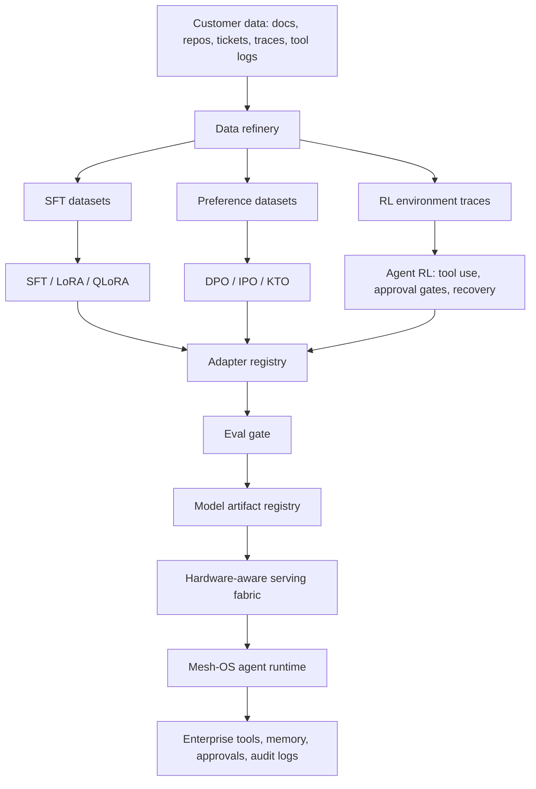
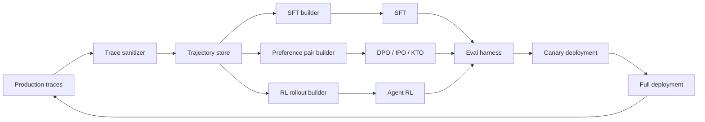
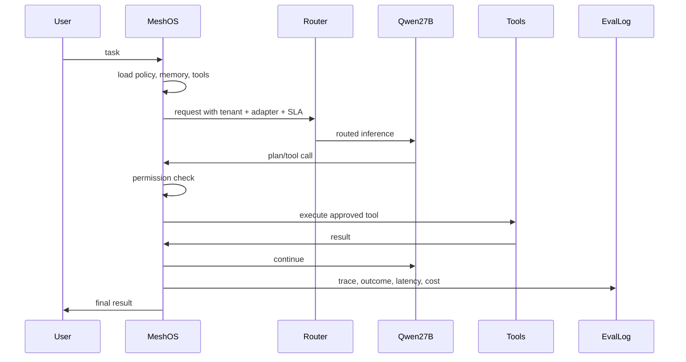

Built architecture should be **hardware-tiered**, not one serving path.

Use the HTML as a repo map: [sota_llm_inference_repos_by_hardware (1).html](/Users/shaanp/Documents/GitHub/mesh/sota_llm_inference_repos_by_hardware%20(1).html:56).

**Target Product**
**Mesh Brain** = Qwen 27B + posttraining/RL suite + hardware-aware inference fabric + Mesh-OS agent runtime.

**Core Architecture**

**Serving Fabric**

Primary backend split:

| Hardware | Default Engine | Role |
|---|---|---|
| NVIDIA datacenter H100/H200/B200/GB200 | `SGLang` or `vLLM`, optionally `TensorRT-LLM` | Production multi-tenant serving |
| NVIDIA large enterprise cluster | `ai-dynamo/dynamo` or `llm-d` | Disaggregated prefill/decode, autoscaling, KV routing |
| NVIDIA consumer RTX/A-series | `vLLM`, `SGLang`, `llama.cpp` fallback | Small deployments, demos, departmental installs |
| AMD ROCm / MI300X | `vLLM`, `SGLang`, `llama.cpp`, `GPTQModel` | Non-NVIDIA enterprise buyers |
| Apple Silicon | `mlx`, `vllm-mlx`, `llama.cpp` | Local private assistant, developer appliance |
| CPU / edge | `llama.cpp` | Offline fallback, edge, low-volume private mode |

Source mapping: vLLM/SGLang/TensorRT-LLM are listed as serving engines with PagedAttention, RadixAttention, FlashInfer, speculative decoding, batching, quantization, prefix caching, chunked prefill, CUDA graph, and KV reuse in the local HTML at lines [58](/Users/shaanp/Documents/GitHub/mesh/sota_llm_inference_repos_by_hardware%20(1).html:58), [68](/Users/shaanp/Documents/GitHub/mesh/sota_llm_inference_repos_by_hardware%20(1).html:68), and [88](/Users/shaanp/Documents/GitHub/mesh/sota_llm_inference_repos_by_hardware%20(1).html:88).

**Inference Stack**

Layer it like this:

1. **API Gateway**
   - OpenAI-compatible API
   - Anthropic-compatible shim where needed
   - tenant routing
   - auth, quotas, rate limits
   - request classification: chat, tool-call, coding, retrieval, long-context, batch

2. **Router**
   - routes by hardware, tenant, adapter, latency SLA, context length, privacy tier
   - separates prefill-heavy from decode-heavy workloads
   - chooses engine:
     - `SGLang` for agentic/structured workloads because the HTML highlights RadixAttention prefix reuse and structured workload throughput claims at [68-73](/Users/shaanp/Documents/GitHub/mesh/sota_llm_inference_repos_by_hardware%20(1).html:68)
     - `vLLM` for broad compatibility and stable high-throughput serving at [58-63](/Users/shaanp/Documents/GitHub/mesh/sota_llm_inference_repos_by_hardware%20(1).html:58)
     - `TensorRT-LLM` for NVIDIA-only high-performance compiled paths at [88-93](/Users/shaanp/Documents/GitHub/mesh/sota_llm_inference_repos_by_hardware%20(1).html:88)

3. **KV/Prefix Layer**
   - prefix cache for company system prompts, policy, schemas, tool descriptions, repo summaries
   - KV-aware routing using `dynamo` pattern
   - CPU/S3/blob KV offload for long-running enterprise sessions
   - disaggregated prefill/decode for long-context agent calls

4. **Model Execution**
   - Qwen 27B base
   - customer LoRA adapters
   - task adapters: coding, support, SRE, SOC, finance ops
   - quantized variants:
     - FP8/NVFP4 for NVIDIA datacenter
     - INT4/AWQ/GPTQ for cheaper deployments
     - GGUF for `llama.cpp`
     - MLX 4-bit/8-bit for Apple Silicon

5. **Inference-Time Scaling**
   - speculative decoding for latency
   - two-pass verification for high-risk actions
   - mixture-of-agents only for premium workflows, not default path
   - constrained decoding for JSON/tool calls
   - grammar sampling for strict local runtimes

**Posttraining Suite**

This is the moat. Architecture:

Posttraining targets:

- **SFT:** customer vocabulary, tool signatures, output schemas, workflow templates.
- **Preference tuning:** answer quality, escalation decisions, refusal boundaries, concise vs detailed behavior.
- **Agent RL:** tool ordering, retry logic, approval timing, state recovery, long-horizon task completion.
- **QAT/compression:** use `NVIDIA/Model-Optimizer` and `GPTQModel` style flows for deployable artifacts. Relevant entries are at [98-103](/Users/shaanp/Documents/GitHub/mesh/sota_llm_inference_repos_by_hardware%20(1).html:98) and [158-163](/Users/shaanp/Documents/GitHub/mesh/sota_llm_inference_repos_by_hardware%20(1).html:158).

**Mesh-OS Runtime**

Do not let the model be the product. The runtime is the product.

Runtime modules:

- tool registry
- permission engine
- policy engine
- memory layer
- retrieval layer
- workflow state machine
- human approval gates
- audit log
- rollback and replay
- eval collector
- customer-specific adapter selector

Agent loop:

**Concrete Repo Roles**

- `vllm-project/vllm`: default compatibility backend.
- `sgl-project/sglang`: premium agentic serving backend.
- `NVIDIA/TensorRT-LLM`: compiled NVIDIA performance lane.
- `ai-dynamo/dynamo`: large NVIDIA cluster orchestration.
- `llm-d/llm-d`: Kubernetes-native disaggregated serving.
- `flashinfer-ai/flashinfer`: kernel layer leveraged through vLLM/SGLang.
- `NVIDIA/Model-Optimizer`: FP8/NVFP4/QAT/compression for NVIDIA.
- `modelcloud/GPTQModel`: GPTQ/AWQ/FP8 export across NVIDIA/AMD/CPU.
- `llama.cpp`: universal private/offline/edge runtime.
- `mlx` and `vllm-mlx`: Apple Silicon local deployment.
- `optillm`: optional inference-time compute proxy for verification/MoA.
- inference research lists: roadmap tracking, not production dependencies.

**Product Tiers**

1. **Mesh Brain Local**
   - Apple Silicon / RTX / CPU
   - `llama.cpp`, `mlx`, `vllm-mlx`
   - single team, local privacy

2. **Mesh Brain Private Cloud**
   - vLLM/SGLang on NVIDIA or AMD
   - customer VPC
   - LoRA adapters
   - eval-gated releases

3. **Mesh Brain Datacenter**
   - SGLang/vLLM/TensorRT-LLM
   - Dynamo or llm-d orchestration
   - disaggregated prefill/decode
   - KV-aware routing
   - autoscaling
   - regulated enterprise controls

4. **Mesh Brain Posttraining Platform**
   - SFT, DPO, RL, evals, reward models
   - production feedback loop
   - adapter registry
   - compliance reports

**Main Design Decision**

Use **SGLang as the agentic fast path** and **vLLM as the compatibility fast path**. Add **TensorRT-LLM only for NVIDIA customers who care enough about perf to tolerate compiler complexity**. Use **llama.cpp/MLX** for local private deployments. Use **Dynamo/llm-d** only once customers need multi-node disaggregated serving.

That creates a real architecture instead of a generic “fine-tuned Qwen” wrapper.