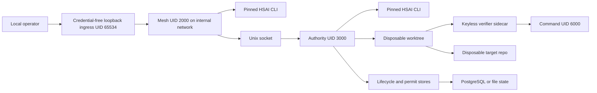

# Evidence-Carrying Agent Actions Threat Model

## Executive summary

The closed-beta repo-patch path has a credible local authority boundary only
under its narrow deployment contract: one trusted host, loopback ingress,
deterministic native review, a disposable non-secret repository, distinct Linux
UIDs, and a fixed verification command. Repository-controlled verification no
longer executes in the authority process or asset namespace: the authority hands
a manifest-bound worktree to a minimal, network-none verifier sidecar, the root
supervisor signs terminal receipts with a verifier-only Ed25519 key, and the
sidecar drops each command to keyless UID 6000. The highest residual risks are same-UID
CLI agents recovering the client signing key if re-enabled, the trusted root
verifier supervisor and shared per-service PID/mount namespace, missing verifier
identity in the unchanged HSAI v2 receipt, and host/Docker/authority compromise. Those
boundaries block production claims.

## Scope and assumptions

In scope:

- `docker-compose.repo-patch-beta.yml`,
  `services/orchestrator/beta_loopback_ingress.py`, and
  `scripts/compose_mesh_entrypoint.sh`;
- `services/orchestrator/service.py` and the repo-patch authority client;
- `services/actuators/repo_patch_authority_service.py` and
  `services/actuators/repo_patch_workspace.py`;
- `services/actuators/repo_patch_verifier_service.py` and
  `shared/mesh_runtime/repo_patch_verifier.py`;
- `shared/mesh_runtime/repo_patch_authority*.py`,
  `shared/mesh_runtime/repo_patch_permits.py`, and
  `shared/mesh_runtime/repo_patch_test_policy.py`;
- migration 006, authority tests, the Linux UID proof, and the PostgreSQL
  rehearsal.

Assumptions:

- The beta is single-tenant and runs in one operator-controlled Docker
  environment using Linux containers. Host root and Docker-daemon compromise
  are out of scope.
- Port 8787 is published to loopback only by a credential-free fixed-upstream
  proxy. The Mesh container stays on an internal network without external
  egress. An independently authenticated reverse proxy is required before any
  non-loopback exposure.
- The target repository is disposable and contains no secrets. The authority
  state, target, keys, and HSAI executable are provisioned by a trusted operator.
- Mesh UID 2000 and authority UID 3000 are distinct. The socket group is
  operator-configured and distinct from Mesh's primary GID; only Mesh among
  non-authority services joins it.
- The beta uses `native_hermes`; Goose, Hermes, and Evo subprocess commands are
  empty. The only verification command remains `python3 -c pass`, but it now
  executes as UID 6000 in the verifier sidecar.
- HSAI returns admission evidence at an `Attested`-or-lower claim ceiling. It
  does not confer execution authority or semantic correctness.

Out of scope: multi-host orchestration, managed key custody, arbitrary
repository compatibility, per-job OCI or microVM isolation, managed-database
availability, internet-facing authentication, malicious host administrators,
and formal verification.

Open questions that change risk ranking:

- Which managed key or signing service will replace bind-mounted client and
  authority keys?
- Which production verifier substrate will add per-job PID/mount namespaces,
  immutable image admission, and managed signing-key custody?
- Which authenticated ingress and tenant-isolation model will precede any
  external or multi-tenant deployment?

The user directed uninterrupted end-to-end execution, so this report proceeds
with the explicit assumptions above instead of pausing for an answer.

## System model

### Primary components

- Mesh control plane: accepts the bounded run, evaluates policy, obtains
  preflight evidence, invokes HSAI, records deterministic review, and signs an
  authority request. Evidence: `services/orchestrator/service.py` /
  `OrchestratorService.execute`.
- Beta loopback ingress: exposes only `127.0.0.1:8787`, carries no volumes or
  credentials, rejects absolute-form, chunked, and oversized requests, and can
  forward only to `mesh:8787`. Evidence:
  `services/orchestrator/beta_loopback_ingress.py`.
- HSAI Phase 747 CLI: independently invoked by Mesh and the authority using a
  caller-pinned executable digest and policy id. Evidence:
  `services/orchestrator/hsai_bridge_adapter.py` /
  `PinnedRustEvidenceV2HsaiAdmissionAdapter`.
- Repo-patch authority: authenticates the client signature and kernel peer UID,
  owns lifecycle and permit state, recomputes preflight, and signs the response.
  Evidence: `services/actuators/repo_patch_authority_service.py` /
  `RepoPatchAuthorityService`.
- Worktree manager: validates a stage-zero Git blob, prepares a detached
  worktree, independently verifies the one-file diff after sidecar verification,
  and promotes bytes descriptor-relatively.
  Evidence: `services/actuators/repo_patch_workspace.py` /
  `RepoPatchWorkspaceManager` and `PreparedRepoPatch`.
- Isolated verifier: accepts a peer-UID-pinned, digest-bound request through a
  separate Unix socket, copies a bounded regular-file handoff without Git
  metadata, rechecks executable/command/image/profile identities, streams
  bounded output, signs every terminal v2 receipt, and executes as capability-free
  UID 6000. Its signing key is staged into a Linux-owned volume before startup
  and is unreadable by the command UID. It has no authority keys, state,
  target, HSAI binary, authority socket, database URL, network, or Docker socket.
  Evidence: `shared/mesh_runtime/repo_patch_verifier.py` and
  `services/actuators/repo_patch_verifier_service.py`.
- Durable stores: file or PostgreSQL CAS lifecycle plus an HMAC-bound permit
  ledger, backups, terminal replay, and root fencing. Evidence:
  `shared/mesh_runtime/repo_patch_authority_store.py` and
  `shared/mesh_runtime/repo_patch_permits.py`.

### Data flows and trust boundaries

- Operator or local API → beta ingress → Mesh: decision, evaluation, target
  path, exact text replacement, and test-command strings cross HTTP or
  in-process control-plane interfaces. Loopback-only publication, a
  credential-free fixed-upstream proxy, Mesh policy, action-schema checks, and
  bounded parameters constrain this flow. The proxy has external networking
  but no mounts or secrets; Mesh has credentials but only the internal control
  network. Evidence: `docker-compose.repo-patch-beta.yml`;
  `services/orchestrator/beta_loopback_ingress.py`;
  `services/orchestrator/service.py` / `_repo_patch_parameter_contract_failure`.
- Mesh → authority: signed JSON request and preflight/execute operation cross a
  length-prefixed Unix socket. Ed25519 signatures, schema validation, duplicate
  key rejection, TTLs, kernel peer credentials, frame bounds, and idempotency
  checks protect the boundary. Evidence: `shared/mesh_runtime/repo_patch_authority.py`;
  `services/actuators/repo_patch_authority_service.py` /
  `_authenticate_request`.
- Mesh and authority → HSAI CLI: canonical evidence-v2 JSON crosses stdin/stdout
  to the same pinned executable. Exact path, SHA-256, argument profile, timeout,
  schema, policy, request, decision, candidate, and nonclaim validation fail
  closed. Evidence: `services/orchestrator/hsai_bridge_adapter.py`.
- Authority → disposable worktree: operator-controlled Git content plus proposed
  bytes cross a filesystem boundary. Clean-tree checks, stage-zero regular-blob
  checks, descriptor-relative no-follow opens, hard-link rejection, one-file
  diff validation, and pre/postimage digests constrain it. Evidence:
  `services/actuators/repo_patch_workspace.py`.
- Authority → isolated verifier: a read-only, manifest-bound regular-file
  handoff plus exact command, executable, candidate, image, and sandbox-profile
  digests crosses a separate Unix socket and tmpfs volume. The verifier pins the
  authority peer UID, records idempotent terminal jobs, drops the command UID,
  streams output under a 64 KiB limit, and rejects timeout, nonzero exit,
  workspace mutation, replay drift, and interrupted jobs. The authority then
  independently rechecks its canonical worktree. Evidence:
  `repo_patch_verifier.py`, `repo_patch_verifier_service.py`, and
  `PreparedRepoPatch.accept_verifier_results`.
- Authority → target repository: only verified bytes cross during promotion.
  Current HEAD/tree/preimage checks, second preflight, HSAI recheck, internal
  permit, descriptor-relative staging, atomic replace, and fsync protect
  integrity. Evidence: `services/actuators/repo_patch_authority_service.py` /
  `_execute_authorized_patch`; `services/actuators/repo_patch_workspace.py` /
  `_promote_contained_regular_file`.
- Authority → file/PostgreSQL state: lifecycle bindings, leases, fencing tokens,
  event hashes, terminal results, permit transitions, and backup metadata cross
  local file locks or parameterized PostgreSQL transactions. CAS version checks,
  row locking, an append-only trigger, terminal reconciliation, and event-chain
  validation protect consistency. Evidence:
  `shared/mesh_runtime/repo_patch_authority_store.py` and
  `migrations/postgres/006_repo_patch_authority_store.sql`.

#### Diagram

## Assets and security objectives

| Asset | Why it matters | Security objective (C/I/A) |
|---|---|---|
| Authority private key | Forged terminal responses destroy attribution | C, I |
| Mesh client private key | Forged client requests bypass orchestrator provenance | C, I |
| Permit HMAC key and ledger | Unauthorized or replayed mutation becomes possible | C, I |
| Lifecycle records and event chain | Recovery and idempotency depend on exact durable state | I, A |
| Target repository | Incorrect mutation can corrupt deployed code or evidence | I, A |
| HSAI executable, digest, and policy id | Admission integrity depends on the pinned evaluator | I, A |
| Preflight and terminal receipts | Evidence must stay bound to the exact action and bytes | I |
| Authority socket | Unauthorized access or starvation can forge or block actions | I, A |
| Backups and fenced-root state | Crash recovery must restore or stop safely | I, A |

## Attacker model

### Capabilities

- Supplies or influences a proposed repo path, target path, text replacement,
  action evidence, and repository contents within the disposable beta target.
- Replays, tampers with, truncates, duplicates keys in, or slow-sends Unix-socket
  messages if code running as the allowed Mesh UID is compromised.
- Causes process crashes at lifecycle transition boundaries and concurrent
  duplicate requests.
- Creates Git symlinks, hard links, untracked files, hostile filenames, and
  repository-controlled test code in generalized deployments.
- Reads local beta API responses as a same-host caller able to reach loopback.

### Non-capabilities

- Cannot become host root, control the Docker daemon, alter operator-provisioned
  keys, or write authority-owned target/state paths under the beta assumptions.
- Cannot reach the authority network because it has `network_mode: none`.
- Cannot obtain a key from the loopback proxy because it has no volumes or
  secret-bearing environment. A proxy compromise can still reach the Mesh API.
- Cannot run Goose, Hermes, or Evo CLI subprocesses in the beta configuration.
- Cannot choose arbitrary verification argv in the beta; the overlay fixes one
  command. Even generalized exact commands execute outside the authority asset
  namespace, subject to the verifier's bounded regular-file contract.
- Cannot claim HSAI admission as proof, semantic correctness, global identity,
  or production authorization.

## Entry points and attack surfaces

| Surface | How reached | Trust boundary | Notes | Evidence (repo path / symbol) |
|---|---|---|---|---|
| Beta ingress | Loopback TCP 8787 | Local caller → credential-free proxy → Mesh | Fixed upstream only; external exposure requires separate authenticated ingress | `docker-compose.repo-patch-beta.yml`; `beta_loopback_ingress.py` |
| Authority socket | Unix socket with configured authority group | Mesh UID → authority UID | Signed frames plus `SO_PEERCRED` | `repo_patch_authority.py`; `RepoPatchAuthorityService._peer_credentials` |
| HSAI subprocess | stdin/stdout | Mesh or authority → pinned executable | Exact digest and policy identity | `hsai_bridge_adapter.py` / `PinnedRustEvidenceV2HsaiAdmissionAdapter` |
| Git target | Authority bind mount | Repository bytes → privileged worktree logic | Symlink, hard-link, path, clean-tree, and blob-mode checks | `repo_patch_workspace.py` / `prepare` |
| Verification command | Exact argv | Repository/worktree → signed verifier supervisor → keyless command UID | Separate minimal image, no authority assets/network, signed terminal receipts, streamed output and timeout bounds | `repo_patch_verifier_service.py`; beta Compose environment |
| File lifecycle store | Authority state mount | Authority process → durable file | Locked, fail-closed JSON; host storage trusted | `repo_patch_authority_store.py` / `FileRepoPatchAuthorityStore` |
| PostgreSQL store | Database connection | Authority → database | Parameterized SQL, CAS, row locks, append-only trigger | `PostgresRepoPatchAuthorityStore`; migration 006 |
| Key files | Read-only bind mounts plus Linux-volume staging for the verifier signer | Operator provisioning → process identity | Ownership and mode checks; the verifier host key is exposed only to the one-shot initializer and its staged copy is read-only to the supervisor; no managed custody | `repo_patch_authority_adapter.py` / `_read_key_file`; beta Compose key initializer |

## Top abuse paths

1. Re-enable a same-UID model CLI → CLI scans `/run/secrets` → steals the Mesh
   client key → connects directly to the socket → submits a forged reviewed
   action. Impact: orchestrator provenance bypass. The beta prevents step one.
2. Author a tracked parent symlink → target a file outside the repository →
   cause preflight to write through the symlink before admission. Impact:
   authority-state corruption. Stage-zero blob and descriptor-relative no-follow
   checks now stop this before any write.
3. Generalize the command allowlist to `pytest`, `pnpm`, or `cargo` → commit
   hostile test/build code → verifier command attempts to read keys, target,
   state, sockets, or network. Current result: those assets are absent or
   inaccessible and failures do not authorize promotion. Residual impact:
   verifier-service denial of service or a container/kernel escape.
4. Crash after promotion and permit commit but before lifecycle completion →
   replay the request → receive an incorrect unknown result. Terminal permit
   reconciliation now returns the exact committed or aborted outcome.
5. Slow-send an authenticated frame repeatedly → monopolize the single-threaded
   authority connection loop → delay all actions. Impact: local availability
   loss; no integrity bypass.
6. Produce excessive verifier output, fork descendants, or sleep past the
   deadline → consume verifier resources. Output is streamed under a hard bound,
   process groups and runner-UID descendants are killed, and Compose caps PIDs,
   memory, and CPU; the serial verifier remains an availability bottleneck.
7. Compromise the PostgreSQL owner or host path → alter/drop integrity controls
   and rewrite lifecycle evidence → induce false recovery decisions. Impact:
   audit and recovery corruption; database owner remains trusted.

## Threat model table

| Threat ID | Threat source | Prerequisites | Threat action | Impact | Impacted assets | Existing controls (evidence) | Gaps | Recommended mitigations | Detection ideas | Likelihood | Impact severity | Priority |
|---|---|---|---|---|---|---|---|---|---|---|---|---|
| TM-001 | Local model CLI or plugin | CLI mode re-enabled in Mesh UID namespace | Read client key and call authority directly | Bypass review provenance | Client key, receipts, target | Beta empties CLI commands and uses native review; read-only root and distinct authority UID (`docker-compose.repo-patch-beta.yml`) | Same-UID CLI isolation is not solved generically | Run model CLIs in separate worker containers with no key/socket mounts; use a signing proxy or managed signer | Alert if beta mode is not native or CLI command variables are nonempty | Low in beta; high if re-enabled | High | high |
| TM-002 | Malicious Git repository | Repository contains a symlinked parent or component-swap attempt | Redirect preflight/promotion outside the repo | Corrupt authority state or arbitrary authority-writable file | Target, lifecycle, keys | Stage-zero blob requirement and descriptor-relative `O_NOFOLLOW` operations (`repo_patch_workspace.py`) | Backup recovery still assumes trusted authority-owned target path against hostile host races | Reuse the descriptor-relative helper for all restoration paths; consider Linux `openat2` with `RESOLVE_BENEATH` | Record path-containment rejection codes and external digest invariants | Low | High | low |
| TM-003 | Repository-controlled test code | Generalized command policy authorizes a build/test runner | Execute hostile code in the verifier command identity | Verifier DoS or container escape; authority assets remain outside the service | Verifier availability; indirectly target admission | Minimal network-none sidecar, keyless command UID, Linux-volume-staged signer key inaccessible to UID 6000, read-only input/root, exact command/image/profile digests, signed receipts, output/timeout limits, descendant cleanup, authority recheck (`repo_patch_verifier*`; Docker proof) | Root supervisor and command share the verifier service PID/mount namespace; no per-job OCI/microVM | Add one-shot rootless OCI/microVM jobs, immutable image admission, and per-job cgroups/seccomp | Audit effective mounts/caps/image; alert on restarts, descendants, limits, signer-key access, and unexpected verifier files | Low in fixed beta; medium if generalized | High | medium |
| TM-004 | Crash or replay | Crash after permit terminal state but before lifecycle terminal state | Convert known mutation into permanent unknown | Incorrect recovery and operator decisions | Lifecycle, target, receipt | Binding-validated terminal permit reconciliation before unknown (`RepoPatchAuthorityService._reconcile_dispatched_terminal_permit`) | No deterministic answer remains possible before permit terminalization | Fence root on unresolved state; require explicit operator reconciliation | Metric for dispatched-without-terminal and reconciliation result | Low | High | low |
| TM-005 | Executable or image drift | Tool changes while argv remains allowed | Admit evidence not bound to exact verifier identity | Evidence ambiguity | Preflight, HSAI decision | Verifier request binds executable path/digest, command digest, image digest, sandbox-profile digest, candidate, and manifests; signed v2 receipt binds those results and is exported in Mesh execution refs (`repo_patch_verifier.py`) | The exact HSAI v2 preflight receipt still carries output digests but not verifier image, sandbox, or signer identity | Add a separately authorized HSAI schema version before carrying those identities; keep HSAI v2 unchanged | Compare internal digests at both preflights; alert on configured-versus-runtime image drift and signer mismatch | Medium outside digest-pinned beta images | Medium | medium |
| TM-006 | Authenticated local client or hostile verifier command | Allowed UID can connect or command consumes resources | Slow-send frames, fork, sleep, or emit output | Authority or verifier denial of service | Socket and service availability | Frame/timeout bounds, streamed 64 KiB output, process-group and runner-UID cleanup, target cap, Compose CPU/memory/PID limits | Authority and verifier each serve one connection at a time; no per-UID quota or per-job cgroup | Add bounded concurrency, quotas, and one-shot job cgroups | Connection duration, timeout, output-limit, restart, RSS, and descendant counters | Medium | Medium | medium |
| TM-007 | Misconfiguration with multiple clients | More than one UID/key becomes allowed | Use any accepted key from any accepted UID | Client attribution ambiguity | Client identity and audit | Single beta UID and key, signature plus peer UID checks | UID and key id are not explicitly paired | Configure and enforce key-id → UID/GID mapping | Log peer UID, GID, key id, and mismatch counters | Low under beta | Medium | low |
| TM-008 | Host root, Docker daemon, or authority process compromise | Trusted infrastructure boundary fails | Read keys, alter mounts/state/target, forge evidence | Full system compromise | All assets | Distinct UIDs, read-only roots, dropped capabilities, no-new-privileges, network-none authority | Same host and Docker daemon remain root of trust | Managed key custody, hardened host, rootless/runtime isolation, independent log anchoring | Host integrity monitoring, Docker event audit, key-use audit | Low by assumption | High | high |
| TM-009 | Database owner or storage administrator | Production store operator is malicious or compromised | Drop trigger or rewrite lifecycle/event state | False recovery and audit history | Lifecycle and event chain | Parameterized SQL, row locks, CAS, append-only trigger, event hash chain (migration 006) | Database owner can alter controls; hashes are not externally anchored | Least-privilege roles, immutable external audit sink, signed checkpoints, backup/restore and failover tests | Alert on DDL, trigger changes, chain failure, unexpected version jumps | Low by assumption | High | medium |
| TM-010 | Untrusted same-host process | Can connect to host loopback | Submit actions to the unauthenticated Mesh API through the fixed proxy | Trigger otherwise-valid actions or consume local capacity | Target and Mesh availability | Loopback-only publication, fixed upstream, body limits, no proxy credentials, full downstream policy/review/HSAI/authority checks | Loopback is not client authentication; proxy compromise can reach Mesh | Use a Unix socket with peer checks or authenticated local ingress; require mTLS or signed operator tokens before broader exposure | Audit caller identity at authenticated ingress and alert on unexpected action volume | Low under single-operator host assumption | High | medium |

## Criticality calibration

- Critical: an unauthenticated external caller or ordinary proposal agent can
  cause arbitrary authority mutation, extract authority signing material, or
  compromise multiple tenants. Examples: internet-exposed unauthenticated
  mutation; model worker mounted with authority keys and target write access.
- High: a realistic local or repository attacker can bypass one independent
  boundary or fully compromise authority integrity. Examples: same-UID CLI key
  theft after re-enablement; repository test code executing with authority
  secrets; host/Docker compromise.
- Medium: attacks mainly affect availability, attribution strength, or recovery
  evidence and require an authenticated local client or trusted-operator
  failure. Examples: slow-frame starvation; missing verifier digest in carried
  evidence; database-owner event rewriting.
- Low: the abuse path is closed by current beta controls or requires an
  out-of-scope race by host root. Examples: tracked parent-symlink escape after
  descriptor hardening; committed-permit replay after lifecycle reconciliation;
  UID/key ambiguity with only one configured client.

## Focus paths for security review

| Path | Why it matters | Related Threat IDs |
|---|---|---|
| `docker-compose.repo-patch-beta.yml` | Defines effective identities, mounts, secrets, ingress, network separation, command policy, and resource limits | TM-001, TM-003, TM-006, TM-008, TM-010 |
| `services/orchestrator/beta_loopback_ingress.py` | Fixed-upstream loopback publication without Mesh credentials or external Mesh egress | TM-006, TM-010 |
| `scripts/compose_mesh_entrypoint.sh` | Must initialize state without regaining root or weakening ownership | TM-001, TM-008 |
| `services/actuators/repo_patch_authority_service.py` | Central authentication, lifecycle, reconciliation, HSAI recheck, and mutation coordinator | TM-004, TM-006, TM-007 |
| `services/actuators/repo_patch_workspace.py` | Handles attacker-influenced Git paths, subprocesses, and atomic promotion | TM-002, TM-003, TM-005, TM-006 |
| `services/actuators/repo_patch_verifier_service.py` | Owns command UID separation, scratch copies, bounded execution, fsync-ordered replay state, and cleanup | TM-003, TM-005, TM-006, TM-008 |
| `shared/mesh_runtime/repo_patch_verifier.py` | Defines request/receipt bindings, manifests, schema validation, and verifier peer identity | TM-003, TM-005, TM-006 |
| `shared/mesh_runtime/repo_patch_authority.py` | Signed frame parsing, TTL, idempotency, and response verification | TM-006, TM-007 |
| `shared/mesh_runtime/repo_patch_test_policy.py` | Defines executable identity and exact command authorization | TM-003, TM-005 |
| `shared/mesh_runtime/repo_patch_permits.py` | Owns internal authorization, backups, recovery, fencing, and terminal replay | TM-002, TM-004, TM-008 |
| `shared/mesh_runtime/repo_patch_authority_store.py` | File/PostgreSQL CAS lifecycle and event-chain implementation | TM-004, TM-009 |
| `migrations/postgres/006_repo_patch_authority_store.sql` | Database constraints and append-only trigger are recovery-critical | TM-009 |
| `services/orchestrator/repo_patch_authority_adapter.py` | Loads the client key and establishes the Mesh-side identity boundary | TM-001, TM-008 |
| `services/orchestrator/goose_adapter.py` | Same-UID subprocess path must remain beta-disabled | TM-001 |
| `services/orchestrator/hermes_adapter.py` | Same-UID subprocess path must remain beta-disabled | TM-001 |
| `scripts/repo_patch_authority_os_proof.py` | Materialized Linux identity and negative-boundary proof | TM-001, TM-002, TM-008 |
| `scripts/repo_patch_verifier_os_proof.py` | Exercises hostile code against the effective Docker verifier runtime | TM-003, TM-005, TM-006, TM-008 |
| `tests/test_repo_patch_isolated_verifier.py` | Contract, replay, restart, timeout, output, mutation, symlink, and executable-drift regressions | TM-003, TM-005, TM-006 |
| `tests/test_repo_patch_authority_preflight.py` | Crash/replay, terminal reconciliation, and no-repromotion regressions | TM-004 |
| `tests/test_repo_patch_workspace.py` | Symlink, hard-link, side-effect, drift, and race regressions | TM-002, TM-003 |

Quality check: all discovered in-scope entry points and trust boundaries appear
in the threat table; runtime behavior is separated from test/CI evidence;
assumptions and unanswered production-context questions are explicit; no secret
values are included.
