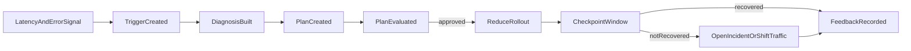

# First Vertical Slice

Historical note: this document predates the current MVP implementation. The active runtime now uses
`trigger -> decision -> evaluation -> execution -> feedback` and does not ship the earlier
diagnosis or remediation-plan stages.

## Goal

Define the first end-to-end slice that proves the closed-loop platform works for infrastructure healing without taking on the full domain surface at once.

## Slice Name

`search_latency_regression_remediation`

## Domain

Infrastructure healing

## Why This Slice First

- it is strongly aligned with the closed-loop contract already documented
- the signals are operationally measurable within minutes
- the actuator surface can stay narrow and reversible
- it exercises trigger, diagnosis, plan, evaluation, execution, and feedback in one loop

## Included Signals

The slice should ingest and normalize:

- p95 latency for a named service and endpoint
- error rate for the same scope
- recent deploy metadata
- recent feature-flag rollout changes
- recent incident history for the same service

## Excluded Signals For The First Slice

These should wait until the scaffold is stable:

- deep business outcomes
- customer messaging signals
- arbitrary config drift across the whole fleet
- multi-region traffic balancing

## Trigger Definition

Emit a trigger when:

- p95 latency worsens materially against baseline
- error rate is also degraded or the latency regression persists long enough
- the affected scope can be tied to a recent deploy or feature-flag change
- there is no already-active loop for the same service and endpoint

## Diagnosis Scope

The diagnosis stage should gather:

- baseline versus observed latency and error windows
- recent deploy in the affected window
- recent feature-flag changes in the affected window
- historical incidents with similar symptom signatures
- dependency latency if available

Expected diagnosis result:

- a ranked hypothesis set with a likely deploy or rollout cause
- candidate remediations limited to approved actuator categories

## Allowed Plan Actions

The first slice should allow only:

- reduce a feature-flag rollout
- disable a feature flag
- open or update an incident
- optionally trigger a bounded traffic-shift action if already supported by policy

The first slice should not allow:

- source code changes
- arbitrary service restarts
- direct database writes
- customer-facing interventions

## Example Stepwise Flow

## Expected Loop Artifacts

The slice is complete only if it emits:

- one `Trigger`
- one `Diagnosis`
- one `RemediationPlan`
- one `EvaluationResult`
- one `ExecutionRecord`
- one `FeedbackRecord`

## Success Criteria

This slice should be considered scaffold-complete when:

- a synthetic or replayed signal can move through every loop stage
- every stage produces a valid object matching the shared schemas
- the execution stage simulates or performs only approved actions
- a feedback record can decide whether the slice recovered, partially recovered, or escalated

## Implementation Order Inside The Slice

1. Normalize signal inputs and produce `Trigger`.
2. Build diagnosis evidence pack and emit `Diagnosis`.
3. Generate bounded `RemediationPlan`.
4. Run evaluation and policy checks.
5. Execute the approved first step.
6. Run checkpoint verification.
7. Record `ExecutionRecord` and `FeedbackRecord`.
