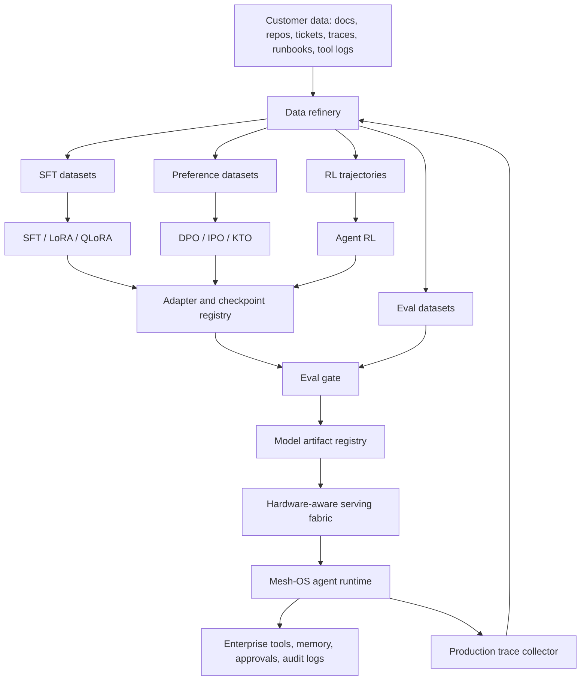
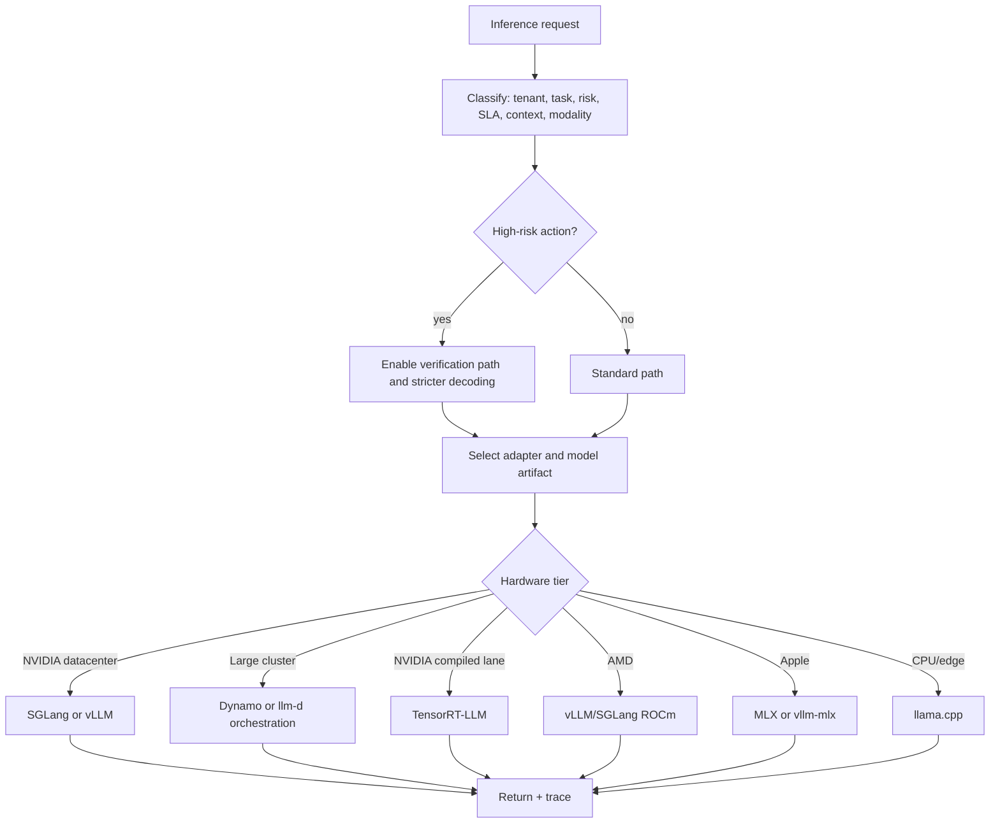
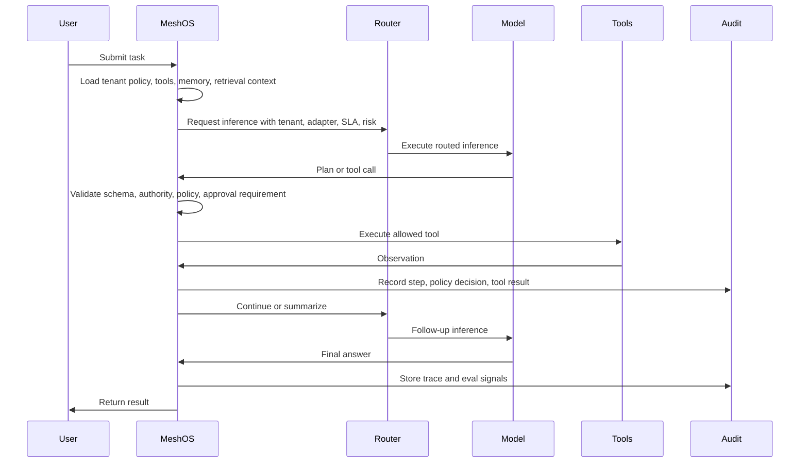

# Mesh Brain PRD

## Summary

Mesh Brain is a private enterprise agent platform built around an optimized Qwen 27B-class model, a posttraining and reinforcement learning suite, a hardware-aware inference fabric, and the Mesh-OS supervised agent runtime.

The product is not a fine-tuned chatbot. It is an operating layer for private enterprise agents:

- posttrain customer-specific model behavior;
- serve the model efficiently across NVIDIA, AMD, Apple Silicon, and CPU/edge deployments;
- run agents through bounded tools, memory, policies, approval gates, and audit logs;
- collect traces for eval-gated continual improvement.

The core product claim is:

> Mesh Brain posttrains and operates private enterprise agents with hardware-aware serving economics and audit-grade runtime control.

## Goals

- Provide a private deployable model brain for enterprise agent workflows.
- Make Qwen 27B-class dense models practical through quantization, adapter routing, prefix reuse, KV cache management, batching, and speculative decoding.
- Create a repeatable posttraining pipeline that turns customer traces into SFT datasets, preference datasets, RL trajectories, eval suites, and deployable adapters.
- Integrate model behavior with Mesh-OS controls: bounded tools, policy checks, operator approval, memory, audit, and replay.
- Support multiple hardware tiers without forcing one inference engine everywhere.
- Prove reliability with task-specific evals before model artifacts reach production.

## Non-Goals

- Do not build a generic hosted chatbot competitor.
- Do not require all customers to run one hardware stack.
- Do not let model output bypass Mesh policy, approval, or audit controls.
- Do not sell RL as a way to exceed the base model's capability ceiling.
- Do not ship customer-specific adapters without regression evals and rollback metadata.
- Do not make inference-time scaling the default for every request. Use it only when task risk or value justifies cost.

## Target Users

| User | Need |
|------|------|
| Platform engineering leader | Private agent platform with controlled tool use and predictable cost. |
| SRE or operations team | Agents that investigate, propose, remediate, and escalate through approval gates. |
| Security operations team | Private triage agents with strict audit and bounded action. |
| Engineering organization | Repo-aware coding and maintenance agents with internal context. |
| Regulated enterprise buyer | VPC/on-prem deployment, policy evidence, traceability, and model governance. |

## Primary Use Cases

1. Private coding agent for large internal repos.
2. AI CROPS agent for cloud, reliability, ops, platform, and security workflows.
3. Internal support agent over docs, tickets, runbooks, and service catalogs.
4. SOC or compliance triage agent with strict action boundaries.
5. Local/private departmental assistant for teams that cannot use external APIs.

## Product Shape

Mesh Brain has five planes:

1. Data plane: ingestion, sanitization, labeling, trace storage, synthetic data generation.
2. Posttraining plane: SFT, LoRA/QLoRA, preference tuning, RL, compression-aware tuning.
3. Eval plane: task evals, policy evals, red-team evals, latency/cost evals, regression gates.
4. Serving plane: hardware-aware inference routing and model execution.
5. Agent runtime plane: Mesh-OS memory, tools, policy, approval, audit, replay, and feedback.

## Architecture Requirements

### Data Plane

The data plane converts enterprise signals into training and eval assets.

Inputs:

- internal docs;
- repo files and pull request history;
- issue trackers;
- incident reports;
- runbooks;
- service catalogs;
- operator approvals and overrides;
- agent tool traces;
- failed tool calls;
- user corrections;
- support transcripts;
- policy outcomes.

Core services:

- connector ingestion;
- PII and secret redaction;
- tenant isolation;
- deduplication;
- document chunking;
- trace normalization;
- tool-call schema extraction;
- outcome labeling;
- synthetic task generation;
- dataset versioning.

Required outputs:

- `sft.jsonl`: instruction, context, expected response.
- `preference_pairs.jsonl`: chosen/rejected responses with rationale labels.
- `rl_trajectories.jsonl`: state, action, observation, reward, terminal outcome.
- `eval_cases.jsonl`: task, fixtures, expected tool calls, expected policy route, scorer config.
- `red_team_cases.jsonl`: injection, authority, exfiltration, unsafe-action, and jailbreak tests.

Acceptance criteria:

- Every dataset row includes tenant, source, timestamp, redaction status, license/usage class, and provenance pointer.
- No training row can include raw secrets.
- Dataset builds are reproducible by dataset version and source manifest.
- A dataset can be excluded from training while remaining available for audit.

### Posttraining Plane

The posttraining plane produces deployable model artifacts and adapters.

Training methods:

- SFT for domain format, vocabulary, tool signatures, and workflow patterns.
- LoRA/QLoRA for tenant-specific and task-specific adaptation.
- DPO, IPO, or KTO for preferences around escalation, refusal, structure, and answer quality.
- Agent RL for tool order, retry logic, approval timing, recovery behavior, and completion quality.
- Quantization-aware training where deployment requires aggressive compression.

Artifact types:

- base model reference;
- tenant adapter;
- task adapter;
- policy adapter;
- quantized checkpoint;
- draft model for speculative decoding;
- reward model;
- judge model configuration;
- eval report;
- rollback manifest.

Training constraints:

- Keep tenant adapters isolated by default.
- Use shared adapters only after explicit customer and legal approval.
- Maintain an immutable lineage graph from model artifact back to dataset versions and training code version.
- Require eval pass before canary deployment.
- Require rollback metadata for every promoted artifact.

Acceptance criteria:

- A training run produces a signed artifact manifest.
- A promoted adapter is linked to eval results and dataset manifests.
- A failed eval blocks deployment automatically.
- A rollback can restore the previous artifact and routing config.

### Eval Plane

The eval plane is the quality gate between training and deployment.

Eval families:

- instruction following;
- tool-call correctness;
- JSON and schema validity;
- retrieval-grounded answer quality;
- coding task completion;
- SRE and ops workflow completion;
- security and policy boundary tests;
- refusal and escalation correctness;
- latency, throughput, and cost;
- regression against previous model artifact;
- red-team prompt injection;
- long-context stability;
- adapter interference.

Scoring dimensions:

- task success;
- policy correctness;
- tool precision;
- tool recall;
- invalid tool-call rate;
- approval route correctness;
- unsafe autonomous action rate;
- structured output validity;
- hallucinated citation rate;
- latency p50/p95/p99;
- tokens per second;
- cost per completed task.

Release gates:

- zero critical policy regressions;
- no increase in unsafe autonomous action rate;
- no schema-validity regression for production tool calls;
- latency and cost within tier budget;
- task success above configured threshold for the target workflow;
- canary pass before full promotion.

### Serving Plane

The serving plane routes requests to the right engine and artifact based on hardware, tenant, SLA, context length, risk, and task type.

The local reference file `sota_llm_inference_repos_by_hardware (1).html` maps the relevant inference repositories and techniques:

- `vllm-project/vllm`: PagedAttention, FlashAttention/FlashInfer, speculative decoding, continuous batching, quantization, prefix caching, chunked prefill, CUDA graph, tensor/pipeline parallelism.
- `sgl-project/sglang`: RadixAttention prefix reuse, FlashInfer kernels, piecewise CUDA graph, prefill/decode disaggregation, speculative decoding, structured/agentic workload optimization.
- `ai-dynamo/dynamo`: disaggregated prefill/decode, KV-aware routing, SLA-based GPU autoscaling, low-latency transfer, multi-tier KV offload, multi-node orchestration.
- `NVIDIA/TensorRT-LLM`: FP8, NVFP4, INT8, INT4, in-flight batching, CUDA graph, speculative decoding, KV cache reuse.
- `NVIDIA/Model-Optimizer`: NVFP4/FP8 PTQ, QAT, Medusa speculative decoding, pruning, distillation, EoRA, export to SGLang/vLLM/TRT-LLM.
- `flashinfer-ai/flashinfer`: block-sparse KV cache, JIT kernels, GQA/MLA/MQA kernels, CUDA graph compatibility.
- `llm-d/llm-d`: Kubernetes-native disaggregated serving, KV connector interfaces, CPU memory tiering, prefix cache offload.
- `ggml-org/llama.cpp`: GGUF quantization, Metal/ROCm/Vulkan/SYCL, speculative decoding, grammar sampling, CPU SIMD.
- `ml-explore/mlx`: Apple unified memory, Metal kernels, 4-bit/8-bit quantization, rotating KV cache, prompt caching.
- `waybarrios/vllm-mlx`: vLLM-style serving on Apple Silicon, continuous batching, PagedAttention, prefix caching, SSD-tiered KV, KV quantization.
- `modelcloud/GPTQModel`: GPTQ, AWQ, QQQ, FP8, GGUF, EXL3, JIT CUDA kernels, Marlin/Machete kernels, vLLM/SGLang export.
- `codelion/optillm`: inference-time scaling proxy with mixture-of-agents, two-pass verification, load balancing, and OpenAI-compatible proxying.

Default engine strategy:

| Hardware tier | Default engine | Secondary engine | Use |
|---------------|----------------|------------------|-----|
| NVIDIA datacenter | SGLang | vLLM, TensorRT-LLM | Agentic production serving, structured workloads, high throughput. |
| NVIDIA large cluster | Dynamo over SGLang/vLLM/TRT-LLM | llm-d | Disaggregated prefill/decode, KV-aware routing, autoscaling. |
| NVIDIA consumer | vLLM | SGLang, llama.cpp | Departmental installs, demos, small private clusters. |
| AMD ROCm | vLLM | SGLang, llama.cpp | Non-NVIDIA private cloud. |
| Apple Silicon | MLX or vllm-mlx | llama.cpp | local private assistant and developer appliance. |
| CPU/edge | llama.cpp | none | offline fallback and low-volume private mode. |

Serving requirements:

- OpenAI-compatible API.
- Tenant-aware adapter routing.
- Per-request risk classification.
- Prefix cache for stable system prompts, policies, tool schemas, and customer context.
- Continuous batching for shared serving.
- Chunked prefill for long prompts.
- Speculative decoding for latency-sensitive flows.
- Constrained decoding for JSON/tool calls.
- KV-aware routing for repeated agent sessions.
- Multi-tier KV offload for long-context sessions where hardware supports it.
- Separate prefill and decode pools for large deployments.
- Canary routing and rollback.

Routing policy:

### Agent Runtime Plane

Mesh-OS owns actions. The model proposes; the runtime controls.

Runtime modules:

- tool registry;
- permission engine;
- policy engine;
- memory layer;
- retrieval layer;
- workflow state machine;
- human approval gate;
- audit log;
- replay engine;
- evaluation collector;
- adapter selector;
- runtime feedback collector.

Agent loop:

Runtime acceptance criteria:

- No tool execution occurs without schema validation and policy evaluation.
- High-risk actions route to approval unless explicitly allowlisted.
- Every model call, tool call, policy decision, approval, and final output is traceable.
- Production traces can be replayed into eval and posttraining pipelines.
- Memory writes are proposed, reviewed, and versioned.

## Functional Requirements

### Model and Adapter Management

- Register base model artifacts.
- Register tenant adapters.
- Register task adapters.
- Register quantized variants.
- Track artifact lineage.
- Support canary, promote, rollback, and retire states.
- Route requests by tenant, task, hardware tier, and SLA.

### Training Jobs

- Launch SFT jobs.
- Launch LoRA/QLoRA jobs.
- Launch DPO/IPO/KTO jobs.
- Launch RL rollout jobs.
- Launch quantization and QAT jobs.
- Track dataset versions, code version, hyperparameters, metrics, and outputs.
- Emit signed model cards and deployment manifests.

### Eval Jobs

- Run evals against any model artifact.
- Compare candidate artifact against current production artifact.
- Run tool-use evals in sandbox.
- Run policy and red-team evals.
- Run latency/cost evals per hardware tier.
- Produce release decision: block, canary, promote, or manual review.

### Serving

- Expose OpenAI-compatible chat/completions API.
- Support streaming.
- Support structured output.
- Support tool calls.
- Support adapter hot-swap.
- Support tenant isolation.
- Support request tracing.
- Support per-tenant quotas.
- Support engine-level metrics.

### Mesh-OS Agent Controls

- Select tools by tenant, user, role, and task.
- Validate tool-call schemas.
- Enforce policy before execution.
- Require approval for protected actions.
- Record audit events.
- Persist replayable traces.
- Feed traces into eval and training datasets.

## Non-Functional Requirements

| Dimension | Requirement |
|-----------|-------------|
| Privacy | Customer data stays in configured deployment boundary. |
| Isolation | Tenant datasets, adapters, logs, and traces are isolated by default. |
| Auditability | Every promoted model artifact has lineage, eval report, and rollback path. |
| Reliability | Serving layer supports health checks, canary routing, rollback, and degraded fallback. |
| Latency | Interactive agent calls meet configured p95 budgets per hardware tier. |
| Cost | Cost per completed task is tracked, not only cost per token. |
| Portability | Support NVIDIA datacenter, NVIDIA consumer, AMD ROCm, Apple Silicon, and CPU/edge tiers. |
| Security | Tool execution is bounded by Mesh policy and approval gates. |
| Observability | Metrics include model, adapter, engine, tenant, task type, token counts, cache hit rate, eval outcome, and policy route. |

## MVP

The MVP should prove a narrow but real enterprise workflow.

Recommended MVP workflow:

- private AI CROPS assistant for SRE/platform tasks;
- Qwen 27B-class model served through vLLM or SGLang on one NVIDIA host;
- LoRA adapter for Mesh runbooks, incidents, and tool schemas;
- eval-gated release process;
- Mesh-OS tool-call approval and audit loop;
- production trace collection into a replayable dataset.

MVP capabilities:

- one base model;
- one tenant;
- one GPU serving backend;
- one adapter;
- one eval suite;
- one agent workflow;
- one canary path;
- one rollback path.

MVP excluded:

- full RL training;
- multi-node disaggregated serving;
- Apple/AMD/CPU production support;
- marketplace of adapters;
- multi-provider mixture-of-agents;
- automatic policy learning.

MVP acceptance criteria:

- Model serves through OpenAI-compatible endpoint.
- Mesh-OS can call the model as a worker lane.
- Tool calls are schema-valid and policy-gated.
- At least 50 golden eval cases cover the MVP workflow.
- Candidate adapter cannot deploy without eval pass.
- Runtime traces are stored and can be converted into dataset rows.
- Rollback restores prior adapter and routing config.

## Phase Plan

### Phase 0: Research and Baseline

Deliverables:

- benchmark Qwen 27B-class base model on vLLM and SGLang;
- measure latency, throughput, memory, batch behavior, context scaling, and tool-call validity;
- define initial eval taxonomy;
- select first workflow and hardware target.

Exit criteria:

- baseline model report;
- serving engine decision for MVP;
- first 50 eval cases;
- target p50/p95/p99 latency budgets.

### Phase 1: Inference MVP

Deliverables:

- OpenAI-compatible serving endpoint;
- adapter loading;
- request tracing;
- prefix cache configuration;
- continuous batching configuration;
- structured output mode;
- Mesh-OS model worker integration.

Exit criteria:

- successful end-to-end Mesh task with model call, tool proposal, policy gate, and audited final answer;
- reproducible local deployment instructions;
- baseline throughput and latency report.

### Phase 2: SFT and Preference Tuning

Deliverables:

- dataset refinery for docs, runbooks, traces, and tool schemas;
- LoRA/QLoRA training job;
- DPO/IPO/KTO job;
- artifact registry;
- eval-gated promotion;
- rollback flow.

Exit criteria:

- tuned adapter improves MVP eval suite over base model;
- no critical policy regressions;
- adapter lineage is complete;
- canary and rollback tested.

### Phase 3: Agent RL

Deliverables:

- sandbox RL environment for tool-use trajectories;
- reward functions for task completion, policy correctness, approval correctness, invalid tool-call penalty, and recovery quality;
- rollout collector;
- RL training job;
- RL eval suite.

Exit criteria:

- RL improves tool-use success without increasing unsafe action rate;
- reward hacking tests pass;
- failed rollouts are retained for analysis;
- RL artifacts follow the same registry and eval gates as SFT artifacts.

### Phase 4: Multi-Hardware Serving

Deliverables:

- vLLM compatibility path;
- SGLang agentic path;
- TensorRT-LLM optional NVIDIA performance path;
- llama.cpp local/edge path;
- MLX or vllm-mlx Apple path;
- GPTQ/AWQ/GGUF artifact export flow;
- routing policies by hardware tier.

Exit criteria:

- at least three hardware tiers pass serving smoke tests;
- each tier has documented supported features and unsupported features;
- quantized artifact quality loss is measured against eval baseline.

### Phase 5: Datacenter Scale

Deliverables:

- disaggregated prefill/decode architecture;
- KV-aware routing;
- multi-tier KV offload;
- autoscaling policy;
- Kubernetes deployment profiles;
- tenant quotas and isolation.

Exit criteria:

- long-context workloads show measurable benefit from disaggregation or prefix reuse;
- autoscaling respects SLA and budget;
- failure and rollback tests pass.

### Phase 6: Enterprise Hardening

Deliverables:

- VPC/on-prem deployment guides;
- security review;
- model governance reports;
- admin UI for artifacts, evals, traces, and approvals;
- compliance export;
- customer onboarding runbook.

Exit criteria:

- customer pilot can deploy without engineering intervention from core team;
- eval, audit, and model-lineage exports satisfy enterprise review.

## Key Technical Decisions

### SGLang vs vLLM

Use SGLang as the default for structured, agentic, prefix-heavy workloads. Use vLLM as the compatibility and stable general serving path. Do not force the product to choose only one.

### TensorRT-LLM

Use TensorRT-LLM for high-value NVIDIA deployments where maximum throughput justifies compiler and artifact complexity. Do not make it the MVP default.

### Dynamo and llm-d

Use Dynamo or llm-d only after multi-node scaling pressure appears. Premature disaggregated serving will slow the MVP.

### llama.cpp and MLX

Use llama.cpp for portability and local fallback. Use MLX/vllm-mlx for Apple Silicon local deployment. Treat these as lower-throughput private modes, not the main enterprise cluster path.

### RL Scope

Do not start with open-ended RL. Start with bounded agent RL in sandbox environments where rewards are observable:

- correct tool call;
- correct approval route;
- correct final state;
- invalid action penalty;
- unsafe action hard failure;
- excessive retries penalty;
- successful recovery bonus.

## Product Metrics

Primary metrics:

- task success rate;
- safe autonomy pass rate;
- correct pause/escalation rate;
- invalid tool-call rate;
- unsafe autonomous action rate;
- policy-gate false negative rate;
- cost per completed task;
- latency p95 per workflow;
- adapter promotion success rate;
- rollback frequency;
- trace-to-training conversion rate.

Secondary metrics:

- prefix cache hit rate;
- KV cache hit rate;
- tokens per second;
- time to first token;
- p99 latency;
- GPU utilization;
- batch occupancy;
- canary failure rate;
- red-team pass rate;
- customer eval pass rate.

## Risk Register

| Risk | Impact | Mitigation |
|------|--------|------------|
| Base model ceiling | Some tasks remain beyond 27B capability. | Narrow workflows, strong tools, retrieval, verification, and escalation. |
| Commodity inference stack | Serving optimization alone is copyable. | Build moat in posttraining, evals, runtime traces, and Mesh-OS controls. |
| RL reward hacking | Model optimizes reward without reliable behavior. | Sandbox rollouts, adversarial evals, manual review, hard policy failures. |
| Bad customer data | Training degrades behavior. | Dataset quality gates, provenance, redaction, eval holdouts. |
| Quantization quality loss | Cheap serving harms task reliability. | Per-artifact evals and deployment-tier quality budgets. |
| Enterprise trust concerns | Buyers reject model provenance or deployment story. | VPC/on-prem, audit, governance reports, model choice abstraction. |
| Multi-engine complexity | Too many backends slow delivery. | MVP with one backend, add engines by tier only after demand. |
| Adapter interference | Task or tenant adapters degrade general behavior. | Isolated adapters, regression evals, canary routing. |
| Tool misuse | Model proposes unsafe actions. | Mesh policy, schema validation, approval gates, replayable audit. |
| Cost overrun | Inference-time scaling becomes too expensive. | Risk-based routing and cost per completed task budgets. |

## Open Architecture Questions

- Which Qwen 27B-class checkpoint is the first production baseline?
- Which workflow becomes the first paid pilot: SRE, coding, SOC, or internal support?
- Which hardware tier is first-class for MVP: H100/H200, RTX, or customer VPC GPU?
- Which posttraining framework is used for SFT/DPO/RL orchestration?
- Which artifact registry signs and stores model/adapters?
- Which eval runner becomes the canonical release gate?
- What customer data classes are approved for training vs retrieval only?
- What policy routes require human approval by default?

## Initial Build Backlog

### Epic 1: Model Serving Baseline

- Add model gateway service.
- Add OpenAI-compatible endpoint.
- Add vLLM or SGLang deployment profile.
- Add request tracing.
- Add adapter loading.
- Add structured output support.
- Add baseline benchmark script.

### Epic 2: Mesh-OS Integration

- Add Mesh model worker lane.
- Add tool-call schema validation.
- Add policy-gated model actions.
- Add audit event emission for model/tool/policy steps.
- Add replay artifact for model-assisted runs.

### Epic 3: Dataset Refinery

- Add trace sanitizer.
- Add docs/runbook ingestion.
- Add tool-schema dataset builder.
- Add SFT row builder.
- Add preference-pair builder.
- Add eval-case builder.

### Epic 4: Training Pipeline

- Add LoRA/QLoRA training job.
- Add DPO/IPO/KTO job.
- Add artifact manifest.
- Add artifact registry integration.
- Add rollback manifest.

### Epic 5: Eval Gate

- Add golden task suite.
- Add tool-call scorer.
- Add policy-route scorer.
- Add red-team suite.
- Add latency and cost scorer.
- Add candidate-vs-production comparison report.

### Epic 6: RL Sandbox

- Add sandbox environment interface.
- Add trajectory schema.
- Add reward function registry.
- Add rollout runner.
- Add RL training job.
- Add RL-specific evals.

### Epic 7: Multi-Hardware Expansion

- Add quantization export flow.
- Add llama.cpp smoke path.
- Add MLX/vllm-mlx smoke path.
- Add TensorRT-LLM optional profile.
- Add routing policy by hardware.

## Release Readiness Checklist

- Model artifact lineage complete.
- Dataset manifests complete.
- Eval report passes required gates.
- Rollback tested.
- Canary tested.
- Serving metrics visible.
- Policy audit visible.
- Tool-call traces replayable.
- Red-team suite passes.
- Customer deployment runbook complete.
- Public utilities changed by this work are documented.

## Suggested First Slice

Build the smallest vertical slice:

1. Serve Qwen 27B-class model through SGLang or vLLM.
2. Connect Mesh-OS to the endpoint as a supervised worker lane.
3. Run one AI CROPS task through model planning, tool proposal, policy gate, approval, and audit.
4. Collect the trace.
5. Convert the trace into an eval row.
6. Fine-tune one LoRA adapter from curated runbook and trace data.
7. Run eval comparison against base model.
8. Canary the adapter.
9. Roll back successfully.

That slice proves the business-critical loop: private model, supervised agent runtime, posttraining, eval gate, deployment, and feedback.
