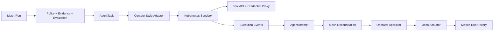

Use Centaur as a **source-input architecture kit**, not as a subtree. Mesh stays the authority. Centaur contributes sandbox/runtime/workflow/credential patterns.

Current caveat: `lusis-mesh` has existing dirty/untracked changes in package and lock/workspace files. Any implementation run must preserve those and stage narrowly.

**Source Truth**
Centaur local source: `/Users/shaanp/Documents/venture/source-inputs/centaur`, commit `7627e5f8afb2f584e2c542441e44426b8bf22c45`, clean tree. License is `Apache-2.0 OR MIT` at [LICENSE](/Users/shaanp/Documents/venture/source-inputs/centaur/LICENSE:6).

Mesh already has the right seam: proposal lanes are non-authoritative in [agent_mesh.py](/Users/shaanp/Documents/venture/lusis-mesh/services/orchestrator/agent_mesh.py:113), attempts are captured as `AgentAttempt` in [control_plane_models.py](/Users/shaanp/Documents/venture/lusis-mesh/shared/mesh_runtime/control_plane_models.py:157), and DeepAgents is already proposal-only in [deepagents_adapter.py](/Users/shaanp/Documents/venture/lusis-mesh/services/orchestrator/deepagents_adapter.py:512). Centaur’s matching primitives are sandboxed execution, durable lifecycle, tools, workflows, and credential egress in [README.md](/Users/shaanp/Documents/venture/source-inputs/centaur/README.md:18) and [architecture.mdx](/Users/shaanp/Documents/venture/source-inputs/centaur/docs/pages/architecture.mdx:16).

**Non-Negotiables**
- Do not vendor Centaur wholesale.
- Do not create a second Mesh control plane.
- Do not let Centaur own policy, approval, actuation, final run state, Merkle proof, or promotion.
- Every copied/adapted file gets provenance comments or a doc entry.
- Every mutation names its state slice before edit.
- Use `pnpm`, not `npm`.
- No temporary files, dead source trees, or half-copied modules.

**Target Architecture**


**Phase 0: Provenance And Inventory**
State slice: `mesh.centaur_source_input.v1`

Create one source-input record, probably `docs/centaur-source-input.md`, with:
- source path and commit;
- license;
- copied/adapted file inventory;
- excluded directories;
- authority boundary;
- validation commands.

Inventory first:
- `services/api/api/runtime_control.py`: durable agent execution lifecycle.
- `services/api/api/sandbox/`: backend abstraction and Kubernetes implementation.
- `services/sandbox/harness_adapter.py`: harness protocol translation.
- `services/api/api/tool_manager.py` and `centaur_sdk/tool_sdk.py`: plugin/tool pattern.
- `services/api/api/workflow_engine.py`: durable workflow checkpoints.
- `services/api/api/iron-proxy.base.yaml` and docs security model: credential egress.
- `contrib/chart`: deployment patterns, not direct copy.

Done: source-input doc says exactly what is reused and what is excluded.

**Phase 1: Agent Attempt Thread Contract**
State slice: `mesh.agent_attempt_thread.v1`

Adapt Centaur’s lifecycle from [architecture.mdx](/Users/shaanp/Documents/venture/source-inputs/centaur/docs/pages/architecture.mdx:31):
- spawn/reuse runtime;
- persist message;
- execute;
- stream/replay events;
- release.

Mesh implementation:
- add dataclasses near `AgentAttempt`, not a new service authority;
- add schema `shared/mesh_runtime/schemas/agent-attempt-thread.schema.json`;
- add event projection into existing `RunEvent` payloads;
- keep `AgentAttempt.output.thread` as the compatibility bridge first.

Files likely touched:
- `shared/mesh_runtime/control_plane_models.py`
- `shared/mesh_runtime/agent_workers.py`
- `services/orchestrator/agent_mesh.py`
- tests around agent task serialization.

Done: existing native/deepagents attempts can include durable thread metadata without changing behavior.

**Phase 2: Centaur-Style Sandbox Adapter**
State slice: `mesh.agent_sandbox_runtime.v1`

Build `services/orchestrator/centaur_adapter.py`. It should mirror Centaur’s sandbox lifecycle, but output only `AgentAttempt`.

Behavior:
- reads `AgentTask`, `Trigger`, `Decision`, `EvaluationResult`;
- creates a sandbox request;
- sends Anthropic-shaped or text prompt;
- records event stream;
- maps result to `AgentAttempt`;
- fails closed with risk flags.

Centaur source patterns:
- Kubernetes sandbox runtime is explicit in [architecture.mdx](/Users/shaanp/Documents/venture/source-inputs/centaur/docs/pages/architecture.mdx:64).
- Harness translation behavior is documented in [AGENTS.md](/Users/shaanp/Documents/venture/source-inputs/centaur/AGENTS.md:180).

Mesh integration:
- add `MESH_AGENT_FABRIC_MODE=centaur`;
- add runtime config fields: endpoint, API key env name, timeout, allowed harnesses;
- update `_attempt_specs()` to route proposal lanes through `centaur_adapter`.

Done: one local fake client test proves Mesh can submit a task, receive events, and store a failed/completed proposal.

**Phase 3: Tool Plugin Registry**
State slice: `mesh.investigation_tool_registry.v1`

Centaur tools expose public client methods as REST endpoints and require `secret()` for credentials ([architecture.mdx](/Users/shaanp/Documents/venture/source-inputs/centaur/docs/pages/architecture.mdx:81), [AGENTS.md](/Users/shaanp/Documents/venture/source-inputs/centaur/AGENTS.md:303)). Mesh already has a read-only investigation `ToolRegistry` in [registry.py](/Users/shaanp/Documents/venture/lusis-mesh/services/investigation/harness/registry.py:56).

Plan:
- keep Mesh’s typed `ToolDefinition`;
- add auto-discovery only for `read_only` tools first;
- expose a narrow internal API for sandbox agents;
- require tool metadata: mutation class, citations kind, redaction status, credential policy;
- reject soft/hard mutation tools unless they return proposals.

First tools:
- run evidence lookup;
- Kubernetes events read-only;
- Reth RPC read-only;
- GitHub checks read-only;
- log search read-only.

Done: sandboxed agent can call tools, but cannot mutate Mesh or target infra.

**Phase 4: Credential Egress Boundary**
State slice: `mesh.credential_egress_policy.v1`

Centaur’s security model is the strongest reusable part: sandbox isolation, default-deny policy, proxy-mediated egress, placeholder credentials, host-bound substitution ([security.mdx](/Users/shaanp/Documents/venture/source-inputs/centaur/docs/pages/security.mdx:36), [deploying-in-production.mdx](/Users/shaanp/Documents/venture/source-inputs/centaur/docs/pages/deploying-in-production.mdx:76)).

Mesh should implement this in two levels:
- Level 1: contract and readiness proof only. No raw keys in sandbox configs.
- Level 2: optional compose proxy or Kubernetes credential-proxy service with adapter egress constrained to the proxy.

Required records:
- secret name;
- allowed hosts;
- allowed header/query/path location;
- sandbox can see placeholder only;
- egress audit event id;
- proof that no raw credential appeared in `AgentAttempt.output`.

Done: connector certification marks Centaur lane blocked unless credential egress policy passes.

**Phase 5: Durable Workflows**
State slice: `mesh.durable_workflow_run.v1`

Centaur’s workflow engine has checkpoint/replay, sleep, wait-for-event, child workflows, and child agents ([AGENTS.md](/Users/shaanp/Documents/venture/source-inputs/centaur/AGENTS.md:354)). Mesh should not replace `RunSession`. Add workflow as orchestration around runs.

First workflows:
- recurring readiness sweep;
- delayed evidence refresh;
- wait-for-approval expiration;
- postmortem follow-up;
- nightly connector certification check.

Implementation:
- file-backed first if Postgres is unavailable;
- Postgres-backed when `MESH_STATE_BACKEND=postgres`;
- workflows create or annotate Mesh runs;
- workflow state references `run_id`, never owns remediation.

Done: one workflow can sleep/replay and attach an event to a Mesh run without altering the run stage machine.

**Phase 6: Slack And Operator Ingress**
State slice: `mesh.operator_agent_ingress.v1`

Centaur’s Slack model is useful, but should be late. Mesh already has product UI and operator auth. Slack should become another operator ingress, not a separate command authority.

Rules:
- Slack can request investigation;
- Slack can show progress;
- Slack can attach notes;
- Slack cannot approve actuation unless mapped to Mesh operator identity and role policy;
- Slack signatures and channel/user scopes become evidence.

Done: Slack-originated request creates a Mesh run or agent proposal with identity context, not direct execution.

**Phase 7: Product UI**
State slice: `meshapp.agent_fabric_observability.v1`

Add UI visibility after backend contracts are stable:
- agent sandbox status;
- event stream replay;
- selected harness;
- tool calls;
- egress policy posture;
- risk flags;
- final proposal;
- “Mesh approved/executed” versus “agent proposed” separation.

Files:
- `meshapp/frontend/src/product/*`
- `meshapp/frontend/src/types.ts`
- `web/src/types.ts` if control-plane contract changes.

Done: operator can inspect the full agent attempt without confusing proposal with actuation.

**Phase 8: Deployment**
State slice: `mesh.centaur_deployment_profile.v1`

Do not copy Centaur’s Helm chart directly. Extract patterns:
- sandbox namespace;
- service account;
- default-deny network policy;
- per-sandbox labels;
- warm-pool optional;
- proxy service optional;
- health endpoints.

Mesh deployment paths:
- local compose: disabled by default, fake adapter available;
- k8s: real sandbox runtime;
- preview/prod: blocked until credential proof and namespace policy pass.

Done: `docker compose ... config --quiet` passes, k8s deployment docs are explicit, no live execution claim without proof.

**Validation Ladder**
Use this order:
```bash
git status --short --branch
pnpm run lint:fast
pnpm run verify:contracts
pnpm run test:focused
pnpm run verify:full
git diff --check
```

Additional gates by slice:
- adapter: fake Centaur API unit tests;
- sandbox: k8s manifest render/config check;
- tools: read-only registry tests;
- egress: no-secret-leak fixture test;
- workflow: crash/replay checkpoint test;
- UI: `pnpm --dir meshapp/frontend run test`.

**Implementation Order**
1. `mesh.centaur_source_input.v1`
2. `mesh.agent_attempt_thread.v1`
3. fake `centaur_adapter` producing `AgentAttempt`
4. real Centaur API adapter behind `MESH_AGENT_FABRIC_MODE=centaur`
5. read-only tool registry bridge
6. credential egress proof contract
7. durable workflows
8. UI observability
9. Slack ingress
10. k8s deployment profile

This order avoids the trap: copying the exciting sandbox code before Mesh has contracts to contain it.

**Definition Of Fully Improved**
Mesh is improved end to end when:
- Centaur-derived sandbox agents can investigate real Mesh runs;
- all agent work is replayable through Mesh run history;
- tool access is read-only or proposal-only by contract;
- credentials never enter sandbox env/output/log artifacts;
- workflows can sleep/resume/retry without losing Mesh state;
- operator UI shows every boundary clearly;
- Mesh alone still approves and executes remediation.

**Current Implementation Audit**
State slice: `mesh.centaur_source_input.v1`

Implemented:
- source-input provenance and exclusion record;
- durable agent attempt thread contract and run-event projection;
- fake, mocked HTTP, and loopback HTTP Centaur adapter paths that return only `AgentAttempt` proposals;
- Mesh-owned Centaur-compatible runtime adapter implementing `POST /agent/execute`, `GET /agent/executions/:id`, and `POST /agent/threads/:thread/release`;
- Mesh run-history proof for a Centaur-compatible loopback HTTP execution with no raw secret in `AgentAttempt.output`;
- read-only sandbox tool bridge with mutation-class enforcement and per-call audit records;
- credential egress proof contract, local env-specific proxy/audit policy, raw-secret leak checks for sandbox env/logs/outputs/exports, and Centaur readiness blocker that requires proxy runtime proof;
- file-backed and MeshState-backed workflow checkpoint/replay with Mesh run event attachment;
- operator ingress records projected to Mesh-owned proposal tasks without direct actuation;
- product UI attempt/thread observability;
- opt-in local compose profile for adapter plus credential proxy proof;
- disabled-by-default Kubernetes deployment profile with local/preview/prod overlays, default-deny namespace policy, adapter-to-proxy-only egress policy, per-sandbox labels, cleanup policy, and separate credential proxy service pattern.

Proof status:
- local end-to-end Mesh proof uses real loopback HTTP servers and the Mesh-owned runtime adapter endpoints; it proves the Mesh integration path without requiring a target Centaur Kubernetes cluster;
- target-cluster Centaur execution remains gated by deployment-specific namespace, credential proxy service, and live egress audit proofs;
- workflow state can persist through the selected Mesh state backend via `MeshStateWorkflowStore`; Postgres deployments inherit that path through `PostgresStateStore` without workflows owning remediation.
