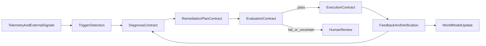

# Comprehensive Closed Loop Contract

## Purpose

This document defines a single closed-loop contract for mesh intelligence systems that must do more than label a signal as good or bad.

The loop is designed to:

- detect meaningful symptoms from telemetry and external events
- diagnose likely causes using richer operational and business context
- produce bounded multi-step remediation plans
- evaluate both the overall plan and each execution step
- execute through controlled actuator surfaces with checkpoints and rollback
- measure outcomes and learn from both successes and failures

## System Intent

The system is not just a feature watchdog. It is an autonomous operator with guardrails.

Its job is to turn raw signals such as latency spikes, error bursts, deploy changes, customer distress signals, or churn indicators into a managed loop:

`observe -> diagnose -> plan -> evaluate -> execute -> verify -> learn`

## Contract Summary



## Core Principles

- every loop instance must be tied to a durable `trigger_id`
- every diagnosis must be evidence-backed and auditable
- every plan must be bounded, explicit, and reversible where possible
- every execution step must be evaluated before it runs
- every outcome must update the world model and future decision priors
- autonomy is earned through narrow actuator surfaces, not through unconstrained planning

## 1. Trigger Contract

### Objective

Create a decision opportunity only when the system observes a meaningful symptom cluster that deserves diagnosis.

### Evidence Inputs

The trigger layer may combine:

- request and service metrics such as `latency_ms`, `error_rate`, `timeout_rate`, saturation, queue depth
- traces and dependency timings
- structured logs and incident annotations
- deployment and config-change metadata
- feature-flag exposure and rollout events
- ticket volume, support sentiment, and customer-tier context
- business signals such as conversion drop, churn-risk increase, or revenue degradation

### Trigger Types

The system should support a common shape across multiple domains:

- `performance_regression`
- `reliability_incident`
- `dependency_degradation`
- `customer_distress_signal`
- `churn_risk_increase`

### Trigger Conditions

A trigger should be emitted when all of the following are true:

1. A symptom crosses a domain-specific threshold or anomaly score.
2. The symptom persists long enough to avoid noise.
3. Minimum sample size or evidence quality thresholds are met.
4. The scope can be identified, such as service, endpoint, customer segment, account cohort, or dependency.
5. No active suppression or duplicate incident already owns the same scope.

### Trigger Output Contract

```json
{
  "trigger_id": "trg_01J2...",
  "trigger_type": "performance_regression",
  "triggered_at": "2026-04-06T10:30:00Z",
  "scope": {
    "environment": "production",
    "service": "api-gateway",
    "endpoint": "POST /search",
    "segment": "enterprise_us"
  },
  "symptoms": [
    {
      "metric": "p95_latency_ms",
      "baseline": 420,
      "observed": 615,
      "delta_pct": 46.4
    },
    {
      "metric": "error_rate",
      "baseline": 0.012,
      "observed": 0.026,
      "delta_pct": 116.7
    }
  ],
  "related_changes": {
    "release_id": "rel_2026_04_06_01",
    "flag_changes": ["semantic_search_v2:50"],
    "config_changes": []
  },
  "evidence_quality": {
    "sample_size": 1840,
    "trace_coverage_pct": 82,
    "log_coverage_pct": 96
  },
  "dedupe_key": "prod:api-gateway:POST/search:enterprise_us"
}
```

### Trigger Rejection Rules

Do not emit a trigger when:

- the evidence set is too weak to support diagnosis
- the symptom is already owned by an active loop or human incident
- the condition is explained by a known external event already under mitigation
- the signal falls below the minimum persistence or sample thresholds

## 2. Diagnosis Contract

### Objective

Convert a validated trigger into a bounded diagnostic picture of what is likely happening, where it is happening, and which remediations are plausible.

### Diagnosis Inputs

The diagnosis layer should pull together:

- trigger payload
- current world model state
- recent deploy and config history
- dependency health and topology
- trace spans and bottleneck breakdowns
- structured log clusters
- prior similar incidents and prior successful remediations
- business and customer context for the affected scope

### Diagnosis Outputs

Each diagnosis must include:

- a symptom summary
- affected scope and blast radius estimate
- ranked root-cause hypotheses
- confidence score for each hypothesis
- supporting and conflicting evidence
- candidate remediations and expected side effects

### Diagnosis Output Contract

```json
{
  "diagnosis_id": "diag_01J2...",
  "trigger_id": "trg_01J2...",
  "summary": "Search latency regression is most likely caused by the semantic_search_v2 request path and secondarily amplified by vector-db saturation.",
  "affected_scope": {
    "services": ["api-gateway", "vector-query-service"],
    "customer_segments": ["enterprise_us"],
    "blast_radius": "medium"
  },
  "hypotheses": [
    {
      "hypothesis_id": "hyp_1",
      "statement": "semantic_search_v2 increased downstream vector query cost",
      "confidence": 0.82,
      "supporting_evidence": [
        "latency increase started after rollout change",
        "trace spans show vector query time up 63%",
        "similar prior incident resolved by reducing rollout"
      ],
      "conflicting_evidence": []
    },
    {
      "hypothesis_id": "hyp_2",
      "statement": "vector-db cluster saturation is independently causing degradation",
      "confidence": 0.41,
      "supporting_evidence": [
        "cpu saturation increased on vector-query-service"
      ],
      "conflicting_evidence": [
        "non-search endpoints remain healthy"
      ]
    }
  ],
  "candidate_remediations": [
    "reduce feature rollout",
    "disable feature rollout",
    "shift traffic away from degraded dependency",
    "restart a degraded worker pool",
    "escalate to human operator"
  ]
}
```

### Diagnosis Invariants

- diagnosis must never claim certainty when evidence is mixed
- every hypothesis must carry both confidence and cited evidence
- candidate remediations must map to allowed actuator categories
- diagnosis may recommend escalation instead of action

## 3. Remediation Plan Contract

### Objective

Turn the diagnosis into an explicit, bounded plan with ordered steps, checkpoints, risks, and rollback instructions.

### Plan Semantics

The system may generate:

- `no_action` plans when evidence is insufficient or the condition self-resolves
- single-step plans when one clear mitigation exists
- multi-step plans when safe mitigation requires sequencing
- `escalate` plans when autonomy boundaries are exceeded

### Step Categories

Allowed step categories should be enumerated and policy-controlled:

- `feature_flag_change`
- `traffic_shift`
- `config_revert`
- `service_restart`
- `incident_open`
- `customer_intervention`
- `human_approval`

### Remediation Plan Output Contract

```json
{
  "plan_id": "plan_01J2...",
  "trigger_id": "trg_01J2...",
  "diagnosis_id": "diag_01J2...",
  "plan_type": "multi_step_remediation",
  "autonomy_tier": "autonomous",
  "goal": "Restore search latency and error rate to within acceptable bounds without causing broader customer disruption.",
  "primary_hypothesis_id": "hyp_1",
  "confidence": 0.84,
  "risk": {
    "level": "medium",
    "blast_radius": "two_services_one_segment",
    "customer_impact_if_wrong": "temporary feature degradation"
  },
  "steps": [
    {
      "step_id": "step_1",
      "category": "feature_flag_change",
      "description": "Reduce semantic_search_v2 rollout from 50 to 10 percent for enterprise_us.",
      "system": "feature_flag_service",
      "action": "set_rollout",
      "parameters": {
        "flag_key": "semantic_search_v2",
        "environment": "production",
        "segment": "enterprise_us",
        "rollout_pct": 10
      },
      "success_checkpoint": {
        "type": "metric_window",
        "window": "10m",
        "target": "p95_latency_ms <= 500"
      },
      "rollback": {
        "type": "restore_previous_value",
        "value": 50
      }
    },
    {
      "step_id": "step_2",
      "category": "traffic_shift",
      "description": "Shift 20 percent of vector-query traffic away from the most saturated pool if step_1 fails.",
      "depends_on": ["step_1"],
      "run_if": "checkpoint_failed",
      "system": "traffic_controller",
      "action": "rebalance_pool",
      "parameters": {
        "service": "vector-query-service",
        "shift_pct": 20
      },
      "success_checkpoint": {
        "type": "metric_window",
        "window": "10m",
        "target": "error_rate <= 0.015"
      },
      "rollback": {
        "type": "restore_previous_distribution"
      }
    }
  ],
  "stop_conditions": [
    "risk level escalates to high",
    "customer impact broadens beyond declared scope",
    "two consecutive checkpoints fail without improvement"
  ],
  "human_handoff_conditions": [
    "conflicting hypotheses remain unresolved",
    "plan requires disallowed actuator",
    "business-critical accounts are disproportionately affected"
  ]
}
```

### Plan Invariants

- every plan must have an explicit goal and bounded scope
- every step must have a rollback or an explanation for why rollback is not possible
- every step must define a verification checkpoint
- plans may branch conditionally, but only through explicit `run_if` rules
- free-form code mutation is out of scope for the initial implementation boundary

## 4. Evaluation Contract

### Objective

Block unsafe, low-confidence, or non-compliant plans before execution, then re-check each step just before it runs.

### Evaluation Layers

The system should evaluate both the full plan and each step.

Plan-level evaluation:

- `schema_validation`
- `policy_validation`
- `promptfoo_quality`
- `business_rule_validation`
- `risk_and_blast_radius_review`
- `rollback_completeness`

Step-level evaluation:

- actuator readiness
- credential availability
- current-state drift check
- idempotency check
- checkpoint definition validity

### Pass Criteria

All of the following must be true before autonomous execution:

- plan schema is valid
- all steps use allowed categories and approved systems
- `confidence >= 0.75`
- `risk.level` is not `high`
- every executable step has rollback and checkpoint definitions
- no plan-level blocking policy is violated

### Evaluation Output Contract

```json
{
  "evaluation_id": "eval_01J2...",
  "plan_id": "plan_01J2...",
  "passed": true,
  "final_recommendation": "execute_stepwise",
  "plan_results": {
    "schema_validation": { "passed": true },
    "policy_validation": { "passed": true },
    "promptfoo_quality": {
      "passed": true,
      "score": 0.92,
      "notes": ["plan aligns with cited evidence", "all branches are explicit"]
    },
    "business_rule_validation": {
      "passed": true,
      "notes": ["scope bounded to enterprise_us", "no protected account policy conflict"]
    },
    "rollback_completeness": { "passed": true }
  },
  "step_results": {
    "step_1": {
      "passed": true,
      "notes": ["feature flag credentials available", "idempotency key valid"]
    },
    "step_2": {
      "passed": true,
      "notes": ["traffic controller available", "depends_on condition unresolved until checkpoint"]
    }
  },
  "blocking_reasons": [],
  "review_route": null
}
```

### Evaluation Failure Routing Rules

- send to `human_review` when evidence is mixed and the system cannot justify a clear primary hypothesis
- send to `human_review` when blast radius is larger than declared autonomy policy
- reject the plan when any step uses a disallowed actuator or lacks rollback/checkpoint definitions
- suppress duplicate evaluations when the same plan hash is already active

## 5. Execution Contract

### Objective

Execute an approved plan step by step, verify after each step, and stop immediately when risk, drift, or poor outcomes exceed policy.

### Allowed Execution Surface

The execution layer may call only approved actuators such as:

- feature-flag provider API
- traffic-control API
- config-management API
- service orchestration API for bounded restarts
- incident and ticketing API
- audit-log sink
- customer engagement systems for bounded outreach actions

It may not:

- modify application source code in production
- run arbitrary shell commands against production
- make direct destructive writes to production data stores
- expand to new tools or systems without policy enrollment

### Execution Preconditions

- the plan passed evaluation
- the current step passed step-level readiness checks
- the live state still matches the assumptions used in evaluation
- an idempotency key and audit record exist before side effects occur

### Execution Semantics

The execution engine must:

- execute at most one step at a time
- verify the checkpoint after each step
- continue only if the checkpoint passes or a branch rule explicitly says to continue
- rollback or escalate if stop conditions are met

### Execution Output Contract

```json
{
  "execution_id": "exe_01J2...",
  "plan_id": "plan_01J2...",
  "status": "step_1_succeeded_step_2_skipped",
  "started_at": "2026-04-06T10:31:02Z",
  "completed_at": "2026-04-06T10:44:10Z",
  "executor": "goose",
  "step_history": [
    {
      "step_id": "step_1",
      "status": "succeeded",
      "idempotency_key": "plan_01J2:step_1",
      "external_refs": {
        "flag_change_id": "ffchg_88219",
        "audit_log_id": "audit_71102"
      },
      "checkpoint_result": {
        "window": "10m",
        "passed": true
      }
    },
    {
      "step_id": "step_2",
      "status": "skipped",
      "reason": "step_1 checkpoint passed"
    }
  ],
  "failure": null
}
```

### Execution Failure Rules

- retry transient actuator failures only within policy-defined retry budgets
- if drift invalidates the current step assumptions, pause and re-run diagnosis
- if an irreversible step fails midway, open an incident and route to human review
- if audit logging fails, do not execute the step

## 6. Feedback And Learning Contract

### Objective

Measure whether the plan actually improved the system, whether the diagnosis was directionally correct, and how future loops should behave.

### Observation Windows

Use multiple windows based on the domain and actuator:

- `immediate`: seconds to minutes for execution correctness
- `stabilization`: 10 to 30 minutes for operational recovery
- `outcome`: hours to days for business effects
- `retrospective`: days to weeks for pattern learning

### Feedback Inputs

- trigger payload
- diagnosis and hypothesis set
- evaluated plan
- execution history
- post-action telemetry in the same scope
- business and customer outcomes
- human override events and incident notes

### Feedback Output Contract

```json
{
  "feedback_id": "fb_01J2...",
  "trigger_id": "trg_01J2...",
  "plan_id": "plan_01J2...",
  "execution_id": "exe_01J2...",
  "measured_at": "2026-04-06T11:01:04Z",
  "window": "stabilization",
  "outcome": "successful",
  "metric_comparison": {
    "baseline_p95_latency_ms": 420,
    "post_action_p95_latency_ms": 452,
    "baseline_error_rate": 0.012,
    "post_action_error_rate": 0.014
  },
  "diagnosis_accuracy": {
    "primary_hypothesis_id": "hyp_1",
    "supported_by_outcome": true,
    "confidence_adjustment": 0.07
  },
  "plan_effectiveness": {
    "steps_executed": 1,
    "steps_skipped": 1,
    "time_to_effect": "8m",
    "side_effects": []
  },
  "recommended_follow_up": "increase_prior_for_feature_flag_rollout_mitigation",
  "world_model_updates": {
    "causal_link_strength": 0.84,
    "service_incident_pattern": "semantic_search_v2_rollout_correlates_with_vector_query_saturation",
    "actuator_success_prior": {
      "feature_flag_change": 0.79
    }
  }
}
```

### Success And Escalation Rules

Mark the loop as `successful` only when:

- target symptoms materially improve within the declared stabilization window
- customer harm does not spread beyond the declared blast radius
- no stop condition was violated during execution

Escalate or reopen diagnosis when:

- checkpoints fail repeatedly without directional improvement
- recovery in one metric causes unacceptable degradation elsewhere
- the executed plan contradicts the leading diagnosis

### Learning Writes

After feedback is recorded, the system should update:

- trigger dedupe and suppression knowledge
- diagnosis priors and causal-link confidence
- actuator success and rollback priors
- protected-scope and business-risk policies
- prompt and evaluation fixtures used by the quality gate

## 7. Domain Abstraction

### What Stays Constant Across Domains

These parts of the loop should be shared:

- durable event and audit identifiers
- trigger, diagnosis, plan, evaluation, execution, and feedback object shapes
- evidence-based reasoning requirements
- per-step checkpoints and rollback semantics
- human-handoff and escalation pathways

### What Changes By Domain

These parts are domain-specific:

- trigger thresholds and anomaly rules
- evidence sources
- allowed actuator categories
- success metrics
- business-risk policies

### Example Domains

Infrastructure healing:

- signals: latency, errors, saturation, dependency failures, deploy drift
- actions: rollout reduction, config revert, traffic shift, restart, incident open
- success: service recovery with bounded blast radius

Churn prevention:

- signals: usage decline, failed journeys, support distress, billing friction, account health score drop
- actions: outreach, offer selection, workflow change, task creation, human escalation
- success: improved retention signals without harming customer trust or margin

## 8. Initial Implementation Boundary

This contract is comprehensive, but the first implementation should still start with a constrained subset.

The initial build should support:

- operational triggers in performance and reliability domains
- diagnosis using metrics, traces, deploy metadata, and incident history
- bounded actuator categories such as feature flags, traffic control, config revert, restart, and incident creation
- multi-step plans with checkpoints and rollback

The initial build should not yet support:

- arbitrary source-code remediation in production
- open-ended infrastructure mutation
- unconstrained outbound customer messaging
- autonomous expansion into new actuator surfaces without policy review

## 9. Development Plan

### Workstream 1: Telemetry And World Model Enrichment

Build ingestion and normalization for:

- metrics, logs, traces, deploys, config changes, feature flags
- dependency graph and service topology
- incident history and prior remediation outcomes
- customer and business context needed for protected-scope decisions

### Workstream 2: Trigger And Diagnosis Engine

Implement:

- symptom detection and deduplication
- evidence aggregation for the affected scope
- root-cause hypothesis ranking
- diagnosis objects that cite supporting and conflicting evidence

### Workstream 3: Remediation Planner

Implement:

- bounded plan generation with ordered steps
- explicit `depends_on`, `run_if`, checkpoint, and rollback semantics
- autonomy-tier assignment based on risk and blast radius

### Workstream 4: Evaluation And Policy Framework

Implement:

- plan-level schema and policy validation
- prompt-quality checks for diagnosis and planning outputs
- step-level readiness checks
- protected-scope, actuator-scope, and business-risk policies

### Workstream 5: Execution Orchestrator

Implement:

- stepwise execution through approved actuators
- checkpoint verification between steps
- stop-condition handling, rollback, and human handoff
- auditable execution history with idempotency keys

### Workstream 6: Feedback And Learning

Implement:

- immediate and stabilization-window verification
- outcome scoring for diagnosis accuracy and plan effectiveness
- world-model updates that improve priors for future loops

### Workstream 7: Domain Onboarding Pattern

Create a repeatable way to add domains by defining:

- trigger taxonomy
- evidence adapters
- allowed actuator catalog
- domain-specific success metrics
- risk policies and approval thresholds

Infrastructure healing should be the first fully supported domain. Churn prevention should follow only after the shared loop machinery and governance model are stable.
