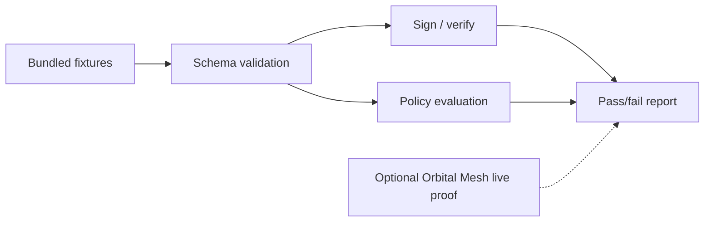

# mesh-darkharness-sdk

Standalone **Darkharness Perennial SDK** for validating, signing, and evaluating governance export packets outside the Orbital Mesh control plane.

Darkharness packets are read-only audit artifacts. They wrap pilot scope, readiness, go/no-go posture, allowed/denied action proofs, Merkle evidence, and Perennial shadow records. This SDK lets you validate those packets offline, attach integrity proofs, and evaluate policy boundaries before handing evidence to security, compliance, or customer stakeholders.

## What problem this solves

Orbital Mesh can export Darkharness packets from live runs (`GET /api/runs/{id}/darkharness-packet`, `GET /api/darkharness/pilot-packet`). This repository is the **portable contract layer** for that export:

- JSON Schema source of truth under `src/mesh_darkharness/schemas/perennial/`
- Packet validation and policy evaluation
- HMAC and Ed25519 signing helpers
- Bundled allowed/denied/boundary fixtures for regression testing

## Quick start

```bash
git clone https://github.com/LusisLabs/mesh-darkharness-sdk.git
cd mesh-darkharness-sdk
python3 -m pip install -e .
mesh-darkharness verify-e2e
```

Without installing, from a checkout:

```bash
make verify
# or
PYTHONPATH=src python3 -m mesh_darkharness verify-e2e
```

## Architecture



### Authority boundaries

| Property | Value |
| --- | --- |
| Raw reservoir egress | deny |
| External model calls | deny by default |
| Production actions | approval required |
| Packet mutates runtime | never |

See [HANDOVER.md](./HANDOVER.md) for CTO handoff boundaries.

## CLI reference

Entry points:

- Console script: `mesh-darkharness`
- Module: `python -m mesh_darkharness`

| Command | Purpose |
| --- | --- |
| `verify-e2e` | Run bundled schema, HMAC, and policy checks |
| `verify-packet PATH` | Validate one pilot packet JSON file |
| `sign PATH --secret SECRET [--output proof.json]` | Create HMAC signature proof |
| `sign PATH --ed25519-key-pem PATH_OR_PEM` | Create Ed25519 signature proof |
| `verify-signature PACKET PROOF --secret SECRET` | Verify HMAC proof |
| `evaluate-policy allowed\|denied` | Evaluate bundled policy fixtures |
| `list-schemas` | List bundled Perennial schemas |
| `verify-mesh-live [--orbital-root PATH]` | Run Orbital Mesh control-plane live proof |

All commands accept `--json` for machine-readable output.

### Examples

Validate a fixture-backed packet:

```bash
mesh-darkharness verify-packet fixtures/perennial/allowed_action.json
```

Sign and verify:

```bash
mesh-darkharness sign fixtures/perennial/allowed_action.json \
  --secret 'local-dev-secret' \
  --output /tmp/dh-proof.json

mesh-darkharness verify-signature \
  fixtures/perennial/allowed_action.json \
  /tmp/dh-proof.json \
  --secret 'local-dev-secret'
```

Optional live Mesh integration:

```bash
export MESH_ORBITAL_ROOT=/path/to/lusis-mesh
mesh-darkharness verify-mesh-live --json
# or
mesh-darkharness verify-e2e --with-mesh-live
```

## Repository layout

```text
fixtures/perennial/          Allowed, denied, boundary demo fixtures
src/mesh_darkharness/
  schemas/perennial/         JSON Schema contracts
  perennial/                 Materialization, signing, policy
  cli.py                     CLI entry point
  verify_e2e.py              Bundled verification pipeline
verify-e2e.sh                Shell wrapper for CI
HANDOVER.md                  Integration and non-claims
```

## Verification gates

| Gate | Command | Expected |
| --- | --- | --- |
| Package E2E | `mesh-darkharness verify-e2e` | `status: pass` |
| Packet schema | `mesh-darkharness verify-packet fixtures/perennial/allowed_action.json` | `pass` |
| Mesh live (optional) | `mesh-darkharness verify-mesh-live` | Requires Orbital Mesh checkout |

## Orbital Mesh integration

When Mesh is deployed:

1. Confirm `/api/pilot/go-no-go` is `go`.
2. Export `GET /api/darkharness/pilot-packet`.
3. Validate exported JSON with `mesh-darkharness verify-packet`.
4. Optionally sign the packet for external distribution.

Mesh remains authoritative for run state. This SDK never writes runtime state.

## Explicit non-claims

- Not production pilot clearance by itself
- Not a replacement control plane
- Not raw reservoir egress
- PQC/ZK fields remain proposed hooks until real providers are configured

## Development

```bash
make install
make verify
mesh-darkharness --help
```

Upstream sync: exported from [Orbital Mesh](https://github.com/LusisLabs/orbital-mesh) via `scripts/export_handover_repos.py`.
