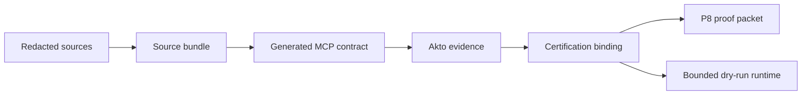

# mesh-praxis

**Praxis** is a source-to-MCP certification pipeline extracted from Orbital Mesh. It turns redacted API sources into candidate MCP tool contracts, imports advisory Akto security evidence, binds Mesh connector certification semantics, and exercises a bounded dry-run runtime — without granting production authority.

## Authority model

| Lane | Role |
| --- | --- |
| **Praxis** | Generates candidate MCP contracts and manifests |
| **Akto** | Advisory security evidence only |
| **ACP** | Supervised operator session artifacts |
| **Mesh** | Policy, certification, approval, audit, revocation |

Generated tools are **candidates** until Mesh connector certification admits exact scopes. Mutating tools default to `denied` or `approval_required` with explicit blockers.

## Quick start

```bash
git clone https://github.com/LusisLabs/mesh-praxis.git
cd mesh-praxis
python3 -m pip install -e .
mesh-praxis verify-e2e
```

```bash
make verify
make demo
```

## Pipeline



Bundled demo sources under `fixtures/praxis/`:

- OpenAPI (redacted)
- Postman collection (redacted)
- SOP markdown (redacted)
- Traffic reference (redacted)
- Akto results fixture

## CLI reference

| Command | Purpose |
| --- | --- |
| `verify-e2e` | Contracts + P8 proof + ingest + managed runtime chain |
| `verify-contracts` | Validate P1 contract fixtures only |
| `build-proof-packet [--output PATH]` | Emit deterministic P8 proof packet |
| `demo-pipeline` | Run source→contract→Akto→binding in memory |
| `demo-runtime` | Run bounded dry-run runtime chain with revocation |

All commands accept `--json`.

### Examples

```bash
mesh-praxis verify-contracts --json
mesh-praxis build-proof-packet --output dist/p8_proof_packet.json
mesh-praxis demo-pipeline --json
mesh-praxis demo-runtime --json
```

### Managed runtime chain (P10 handoff)

`demo-runtime` and `verify-e2e` exercise:

1. Create generation request from demo sources
2. Import Akto evidence (advisory only)
3. Build certification binding
4. Start bounded dry-run MCP endpoint
5. Allow certified read-only tool call
6. Deny uncertified mutation call
7. Revoke generated connector

State is file-backed under a temp directory during verification; nothing is deployed to production.

## Repository layout

```text
fixtures/praxis/             Demo sources, contracts, P8 proof packet
src/mesh_praxis/
  schemas/praxis/            JSON Schema contracts
  praxis.py                  Pipeline + managed runtime store
  cli.py                     CLI entry point
```

## Verification gates

| Gate | Command | Expected |
| --- | --- | --- |
| Full E2E | `mesh-praxis verify-e2e` | `status: pass` |
| Contracts | `mesh-praxis verify-contracts` | `status: pass` |
| P8 packet | `mesh-praxis build-proof-packet` | `status: complete` |

## Explicit non-claims

- Not hosted MCP marketplace
- Not live DAST by default
- Akto/ACP never grant runtime authority alone
- Production MCP hosting requires Mesh certification + operator approval

See [HANDOVER.md](./HANDOVER.md).

## Orbital Mesh integration

Praxis logic originates from `shared/mesh_runtime/praxis.py` in Orbital Mesh. Mesh remains the authority for connector certification, policy, and revocation.
